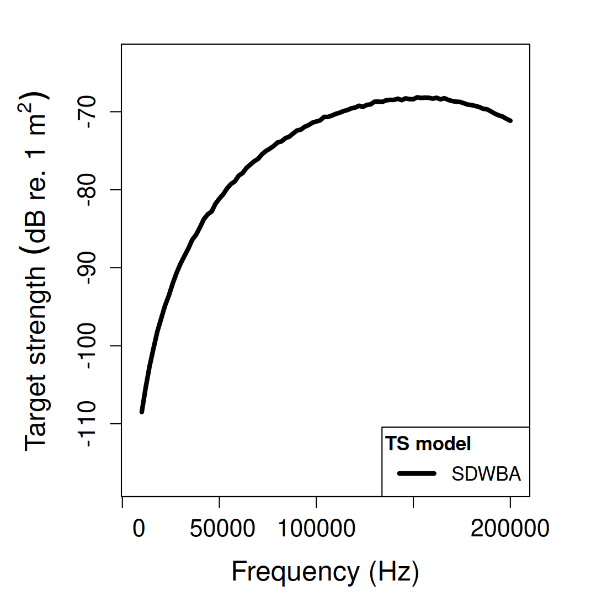
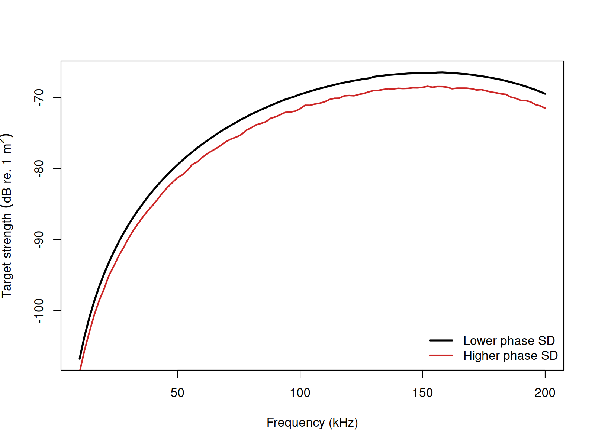

# acousticTS implementation

```{r model_family_header, echo=FALSE, results='asis'}
acousticTS:::.model_family_header(
  family = "sdwba",
  pages = c(
    Overview = "index.html",
    Theory = "sdwba-theory.html",
    Implementation = "sdwba-implementation.html",
    Benchmarks = "sdwba-benchmarks.html",
    Validation = "sdwba-validation.html"
  )
)
```


These pages connect krill-body DWBA models to phase variability, orientation effects, and practical survey use [@Demer_2003_1; @Demer_2003_2; @Conti_2006; @Demer_2005].

The acousticTS package uses object-based scatterers so the same implementation pattern carries across models: create a scatterer, run `target_strength()`, inspect the stored model output, and then compare a small set of physically important inputs. For SDWBA, the required object class is still `FLS`, but `target_strength()` also receives stochastic controls for phase variability and resampling.

The important implementation point is that the SDWBA does not replace the underlying DWBA geometry. It uses the same fluid-like target description and then layers a stochastic phase model onto the segment contributions. In practice, that means the object-building step remains deterministic, while the model call is where unresolved variability is introduced.

## Fluid-like scatterer object generation

```{r}
library(acousticTS)

cylinder_shape <- cylinder(
  length_body = 15e-3,
  radius_body = 2e-3,
  n_segments = 50
)

stochastic_scatterer <- fls_generate(
  shape = cylinder_shape,
  g_body = 1.058,
  h_body = 1.058,
  theta_body = pi / 2
)

stochastic_scatterer
```

## Calculating deterministic and stochastic TS

The example below runs both `dwba` and `sdwba` so the stochastic averaging can be compared directly with the baseline deterministic response.

```{r}
frequency <- seq(50e3, 200e3, by = 10e3)

stochastic_scatterer <- target_strength(
  object = stochastic_scatterer,
  frequency = frequency,
  model = c("dwba", "sdwba"),
  n_iterations = 30,
  n_segments_init = 14,
  phase_sd_init = sqrt(2) / 2,
  length_init = 15e-3,
  frequency_init = 120e3
)
```

This paired run is useful because it keeps the target fixed while changing only the coherence assumption. The `DWBA` result shows what the segmented body would predict if every segment phase were known exactly. The `SDWBA` result shows what happens when unresolved phase variability is allowed to soften that deterministic interference pattern through repeated stochastic realizations.

The stochastic controls should be read together rather than independently. `n_iterations` controls how well the ensemble average is approximated numerically. `n_segments_init`, `phase_sd_init`, `length_init`, and `frequency_init` define the reference scale from which the segmentation and phase variability are propagated over the actual run conditions. Those arguments therefore encode the stochastic interpretation of the target, not just the cost of the calculation.

## Extracting model results

Model results can be extracted either visually or directly through `extract()`.

### Plotting results

```{r echo=FALSE, out.width='49%', fig.align='center', fig.alt='Pre-rendered SDWBA example plot showing the stored stochastic target-strength spectrum.'}

```

### Accessing results

```{r}
dwba_results <- extract(stochastic_scatterer, "model")$DWBA
sdwba_results <- extract(stochastic_scatterer, "model")$SDWBA

head(dwba_results)
head(sdwba_results)
```

The SDWBA results include the same main fields as DWBA plus `TS_sd`, which summarizes how much the stochastic realizations vary at each frequency.

That additional field is important for interpretation. A smoothed mean `TS` curve by itself does not tell the reader whether the stochastic realizations were tightly clustered or broadly dispersed. `TS_sd` provides that missing context and helps distinguish between a stable partially incoherent prediction and one that is still strongly realization-dependent.

## Comparison workflows

### Phase-disorder sensitivity

One practical way to tune the SDWBA is to compare a smaller and larger phase standard deviation while keeping the geometry fixed.

```{r echo=FALSE, out.width='85%', fig.align='center', fig.alt='Pre-rendered SDWBA comparison showing how the spectrum changes when the phase-disorder standard deviation is increased.'}

```

In practical krill-style applications, `phase_sd_init`, `length_init`, and `frequency_init` should be treated as a linked parameterization rather than as independent tuning knobs.

This comparison is best interpreted as a change in phase disorder rather than a change in gross target-strength mechanism. The geometry and material contrasts are the same in both runs. What changes is how strongly unresolved variability suppresses the coherent cross terms. A larger `phase_sd_init` therefore does not mean the target has become physically larger or more reflective. It means the model is allowing more stochastic phase scrambling across segment contributions.

For practical SDWBA work, the first controls to revisit are usually:

1. `phase_sd_init`, because it sets the reference strength of phase disorder,
2. `n_iterations`, because too few realizations can leave the ensemble average noisy,
3. `n_segments_init`, `length_init`, and `frequency_init`, because together they define the scale-invariant reference for segmentation and phase variability, and
4. the underlying `FLS` geometry itself, because the stochastic phase model does not compensate for a poorly chosen deterministic target description.

### Evidence references

For SDWBA evidence, use:

- [SDWBA benchmarks](sdwba-benchmarks.html)
- [SDWBA validation](sdwba-validation.html)
