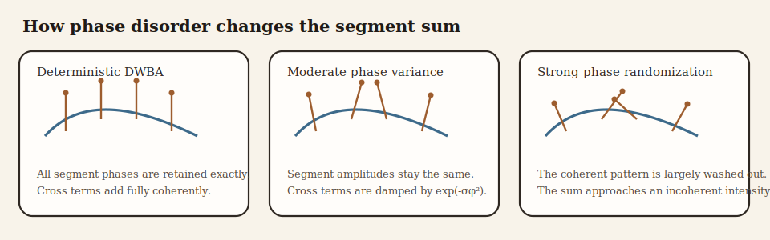

---
title: "Stochastic distorted wave Born approximation (SDWBA) theory"
output:
  rmarkdown::html_vignette:
    toc: true
    number_sections: true
    fig_caption: yes
    fig_width: 3.5
    fig_height: 3.5
    dpi: 200
    dev.args: list(pointsize=11)
bibliography: ../REFERENCES.bib
link-citations: true
reference-section-title: References
vignette: >
  %\VignetteIndexEntry{Stochastic distorted wave Born approximation (SDWBA) theory}
  %\VignetteEncoding{UTF-8}
  %\VignetteEngine{knitr::rmarkdown}
---

# Introduction

```{r model_family_header, echo=FALSE, results='asis'}
acousticTS:::.model_family_header(
  family = "sdwba",
  pages = c(
    Overview = "index.html",
    Implementation = "sdwba-implementation.html",
    Theory = "sdwba-theory.html"
  )
)
```

The stochastic distorted wave Born approximation (SDWBA) begins with the same weak-scattering derivation as the deterministic DWBA, then modifies the phase structure of the coherent sum to account for unresolved variability in body shape, posture, and internal structure [@Demer_2003_1; @Conti_2006; @Stanton_1998_2].

The deterministic part of the derivation still assumes a weakly scattering fluid-like body, so the local scattering strength is controlled by small density and compressibility contrasts in the same way as in the DWBA. The stochastic extension is introduced only after that weak-contrast amplitude model has been established.

The central idea is simple. The deterministic DWBA assumes that the phase of the contribution from every local body segment is known exactly. For live organisms, that assumption is often too strong. If small geometric perturbations alter the optical path length across the body, then the coherent interference pattern predicted by the deterministic model becomes too sharp. The SDWBA models that mismatch as a random perturbation of the segment phases.

The important point is that the stochastic term is not introduced as an unrelated correction factor. It is meant to stand in for unresolved path-length variability. In that sense, the SDWBA does not replace the DWBA amplitude model. It modifies the coherence structure of the DWBA sum when the exact phase bookkeeping implied by the deterministic geometry is no longer believable at the resolution of the available target description.

# Deterministic starting point

## Reduced DWBA line integral

For an elongated fluid-like body, the DWBA gives the backscattering amplitude as a line integral along the centerline:

$$
  \mathcal{f}_\text{bs} = \frac{k_1}{4}
  \int
  \left(\gamma_\kappa - \gamma_\rho\right)
  a(s)
  e^{2 i \mathbf{k}_2 \cdot \mathbf{r}_{pos}(s)}
  \frac{J_1\!\left(2 k_2 a(s) \cos\beta_{tilt}(s)\right)}{\cos\beta_{tilt}(s)}
  \, ds.
$$

All notation is identical to the deterministic DWBA. The material contrasts determine the local scattering strength, the exponential carries the two-way phase, and the Bessel factor arises from integrating over the local circular cross-section.

## Discretized coherent sum

After segmenting the body into $N$ short elements, the same expression is written as:

$$
  \mathcal{f}_\text{bs}(\theta) \approx \sum_{j=1}^{N} q_j(\theta),
$$

The deterministic segment contribution is:

$$
  q_j(\theta) = \frac{k_1}{4}
  \left(\gamma_\kappa - \gamma_\rho\right)_j
  a_j
  e^{2 i \mathbf{k}_2 \cdot \mathbf{r}_j}
  \frac{J_1\!\left(2 k_2 a_j \cos\beta_j\right)}{\cos\beta_j}
  \Delta s_j.
$$

This representation is exact up to the numerical quadrature error associated with segmentation. It is also fully coherent: every complex segment contribution interferes with every other one.

# Why a stochastic extension is needed

The deterministic sum assumes that the segment geometry $(\mathbf{r}_j, a_j, \beta_j)$ is known without error. That assumption is usually violated in biological targets for at least three reasons.

First, real body surfaces are not exactly smooth or axisymmetric. Second, internal material contrasts can vary on scales smaller than the model resolution. Third, organism posture changes from one realization to the next even at fixed macroscopic orientation.

Each of these effects modifies the phase more strongly than it modifies the amplitude. If the total path length to and from a segment changes by $\delta \ell_j$, the associated phase perturbation is approximately:

$$
  \varphi_j \approx 2 k_2 \delta \ell_j.
$$

Thus the dominant uncertainty enters as random phase fluctuation rather than as a large deterministic amplitude correction.

# Stochastic phase model

## Randomized segment sum

The SDWBA replaces the deterministic coherent sum by:

$$
  \mathcal{f}_\text{bs}^{(m)}(\theta) = \sum_{j=1}^{N} q_j(\theta)e^{i\varphi_j^{(m)}},
$$

where $m$ indexes a stochastic realization and $\varphi_j^{(m)}$ is the random phase assigned to segment $j$ in that realization.

The standard assumption is that these phases are independent Gaussian random variables with zero mean:

$$
  \varphi_j \sim \mathcal{N}(0, \sigma_\varphi^2).
$$

The mean is taken to be zero so that the stochastic model perturbs coherence without systematically biasing the phase in one direction.



The deterministic DWBA segment term $q_j$ is retained, but its phase is perturbed through unresolved path-length offsets $\delta \ell_j$, which produce realization-specific factors $e^{i\varphi_j}$. The model is therefore not randomizing segment amplitudes arbitrarily. It is randomizing the phase implied by a slightly perturbed effective path length. As $\sigma_\varphi$ increases, self-terms remain intact while organized interference across segments is progressively suppressed, and the ensemble response moves from a coherent sum toward an incoherent intensity-like limit.

## Why Gaussian phase noise is used

The Gaussian choice is mathematically convenient and physically reasonable when the phase perturbation is the sum of many small unresolved contributions. By the central limit theorem, the cumulative phase error then tends toward a normal distribution even if the underlying geometric perturbations are not themselves Gaussian.

The zero-mean Gaussian phase model also produces a closed form for the expected coherence factor:

$$
  \mathbb{E}[e^{i\varphi}] = e^{-\sigma_\varphi^2/2}.
$$

This is the key quantity controlling the reduction in cross terms after averaging.

It is also helpful to connect this directly to the path-length picture introduced above. If $\varphi_j = 2 k_2 \delta \ell_j$ and the unresolved path-length offsets are themselves centered and weakly fluctuating, then a centered Gaussian model for $\varphi_j$ is the natural short description of many small unresolved geometric contributions. The parameter $\sigma_\varphi$ should therefore be interpreted as a phase-disorder scale, not as a purely abstract fitting constant detached from geometry.

# Ensemble-averaged backscattering cross-section

## Expansion of the squared magnitude

The physically relevant quantity is the ensemble-averaged backscattering cross-section:

$$
  \langle \sigma_\text{bs}(\theta) \rangle = \mathbb{E}\!\left[\left|\mathcal{f}_\text{bs}(\theta)\right|^2\right].
$$

Substituting the randomized segment sum gives:

$$
  \left|\mathcal{f}_\text{bs}\right|^2 =
    \sum_{j=1}^{N} |q_j|^2 +
    \sum_{j \ne \ell} q_j q_\ell^* e^{i(\varphi_j - \varphi_\ell)}.
$$

Taking the ensemble average yields:

$$
  \langle \sigma_\text{bs} \rangle =
    \sum_{j=1}^{N} |q_j|^2 +
    \sum_{j \ne \ell} q_j q_\ell^* \,
  \mathbb{E}\!\left[e^{i(\varphi_j - \varphi_\ell)}\right].
$$

When the phase perturbations are independent and identically distributed with variance $\sigma_\varphi^2$, the coherence factor becomes:

$$
  \mathbb{E}\!\left[e^{i(\varphi_j - \varphi_\ell)}\right] =
    \mathbb{E}[e^{i\varphi_j}] \, \mathbb{E}[e^{-i\varphi_\ell}] =
    e^{-\sigma_\varphi^2}.
$$

Under that assumption, the ensemble-averaged cross-section becomes:

$$
  \langle \sigma_\text{bs} \rangle =
    \sum_{j=1}^{N} |q_j|^2 +
    e^{-\sigma_\varphi^2}
  \sum_{j \ne \ell} q_j q_\ell^*.
$$

This equation makes the stochastic mechanism explicit. The self-terms remain unchanged, while the cross terms are damped by the coherence factor $e^{-\sigma_\varphi^2}$.

## Deterministic and incoherent limits

Two limiting cases follow immediately. When the phase disorder tends to zero, the stochastic coherence factor approaches unity:

$$
  \sigma_\varphi \to 0,
$$

Under that limit, the coherence factor satisfies:

$$
  e^{-\sigma_\varphi^2} \to 1,
$$

so the deterministic DWBA is recovered.

When the phase disorder becomes very large, the coherence factor is suppressed completely:

$$
  \sigma_\varphi \to \infty,
$$

Under that limit, the coherence factor satisfies:

$$
  e^{-\sigma_\varphi^2} \to 0,
$$

In that limit, only the incoherent sum of segment intensities survives:

$$
  \langle \sigma_\text{bs} \rangle \to \sum_{j=1}^{N}|q_j|^2.
$$

The SDWBA therefore interpolates continuously between a fully coherent and a partially incoherent scattering model.

# Monte Carlo approximation

In practice, the ensemble average is approximated by repeated stochastic realizations:

$$
  \langle \sigma_\text{bs}(\theta) \rangle
  \approx \frac{1}{M}
  \sum_{m=1}^{M}
  \left|\mathcal{f}_\text{bs}^{(m)}(\theta)\right|^2,
$$

where $M$ is the number of realizations. The target strength is then defined from the averaged linear cross-section [@MacLennan_2002; @Urick_1983; @Simmonds_2005]:

$$
  TS = 10\log_{10}\!\left(\langle \sigma_\text{bs}(\theta) \rangle\right).
$$

This ordering matters. The average is taken in linear units before conversion to decibels.

# Scaling of segment number and phase variance

## Need for scale invariance

The phase variance cannot be chosen independently of the segmentation. If the same physical body is represented with twice as many segments, the randomization should not introduce a different total amount of unresolved phase disorder simply because the numerical partition changed.

For that reason, the SDWBA uses a scale-invariant prescription in which the reference number of segments varies with acoustic wavelength and body length.

## Segment scaling law

Let $(N_0, f_0, L_0)$ denote a reference segmentation, frequency, and body length. Then the number of segments used at frequency $f$ and body length $L$ is taken to scale as:

$$
  N(f,L) = N_0 \frac{fL}{f_0 L_0}.
$$

This relation keeps the typical segment length approximately proportional to wavelength. Since wavelength is inversely proportional to frequency, the number of segments must increase with both $f$ and $L$ if the same physical resolution is to be maintained.

## Phase-standard-deviation scaling

The SDWBA also preserves the product of phase standard deviation and acoustic frequency:

$$
  \operatorname{sd}_\varphi(f) \, f = \operatorname{sd}_{\varphi_0} f_0.
$$

Using the segment scaling law above gives the operational relationship:

$$
  \operatorname{sd}_\varphi(f,L) =
    \operatorname{sd}_{\varphi_0}
  \frac{N_0 L}{N(f,L)L_0}.
$$

This relation expresses the idea that the net unresolved phase disorder should remain consistent as body size and acoustic wavelength change.

# Mathematical assumptions

The SDWBA inherits all assumptions of the deterministic DWBA and adds a small set of new ones:

1. The body is weakly scattering and fluid-like.
2. The deterministic segment amplitudes remain valid.
3. Unresolved variability enters primarily through phase rather than amplitude.
4. Segment phase perturbations are independent or weakly correlated.
5. The perturbations are represented adequately by a zero-mean Gaussian law.

These assumptions explain the role of the SDWBA. It does not replace the underlying scattering physics. It softens the coherence structure of the deterministic model when unresolved morphology or posture would otherwise make the predicted interference pattern unrealistically sharp.


