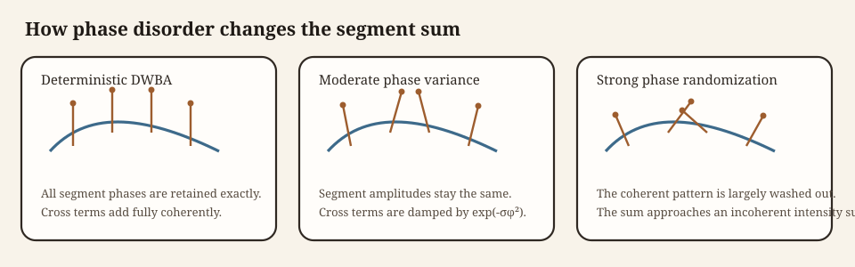

# Introduction

```{r model_family_header, echo=FALSE, results='asis'}
acousticTS:::.model_family_header(
  family = "sdwba",
  pages = c(
    Overview = "index.html",
    Implementation = "sdwba-implementation.html",
    Theory = "sdwba-theory.html"
  )
)
```

The stochastic distorted wave Born approximation (SDWBA) retains the local
weak-scattering amplitude of DWBA and perturbs the phases of its body segments.
The random phase represents unresolved variation in morphology, posture, or
internal structure that changes acoustic path length [@Demer_2003_1;
@Conti_2006]. It broadens deterministic interference features without replacing
the underlying DWBA kernel.

::: {.note data-title="Shared conventions"}
The deterministic amplitude and its symbols are derived in [DWBA
theory](../dwba/dwba-theory.html). Reporting quantities follow [Notation and
symbols](../notation-and-symbols/notation-and-symbols.html).
:::

# Deterministic starting point

## Reduced DWBA line integral

For an elongated fluid-like body, the DWBA gives the backscattering amplitude as a line integral along the centerline:

$$
  \mathcal{f}_\text{bs} = \frac{k_1}{4}
  \int
  \left(\gamma_\kappa - \gamma_\rho\right)
  a(s)
  e^{2 i \mathbf{k}_2 \cdot \mathbf{r}_{pos}(s)}
  \frac{J_1\!\left(2 k_2 a(s) \cos\beta_{tilt}(s)\right)}{\cos\beta_{tilt}(s)}
  \, ds.
$$

All notation is identical to the deterministic DWBA. The material contrasts determine the local scattering strength, the exponential carries the two-way phase, and the Bessel factor arises from integrating over the local circular cross-section.

## Discretized coherent sum

After segmenting the body into $N$ short elements, the same expression is written as:

$$
  \mathcal{f}_\text{bs}(\theta) \approx \sum_{j=1}^{N} q_j(\theta),
$$

The deterministic segment contribution is:

$$
  q_j(\theta) = \frac{k_1}{4}
  \left(\gamma_\kappa - \gamma_\rho\right)_j
  a_j
  e^{2 i \mathbf{k}_2 \cdot \mathbf{r}_j}
  \frac{J_1\!\left(2 k_2 a_j \cos\beta_j\right)}{\cos\beta_j}
  \Delta s_j.
$$

Within the slender-body DWBA approximation, this discretization is fully
coherent. Its additional numerical error is the segment quadrature error.

# Why a stochastic extension is needed

The deterministic sum treats $(\mathbf{r}_j,a_j,\beta_j)$ as exact. Real
targets depart from this description through surface structure, unresolved
material variation, and changes in posture.

Each of these effects modifies the phase more strongly than it modifies the amplitude. If the total path length to and from a segment changes by $\delta \ell_j$, the associated phase perturbation is approximately:

$$
  \varphi_j \approx 2 k_2 \delta \ell_j.
$$

Thus the dominant uncertainty enters as random phase fluctuation rather than as a large deterministic amplitude correction.

# Stochastic phase model

## Randomized segment sum

The SDWBA replaces the deterministic coherent sum by:

$$
  \mathcal{f}_\text{bs}^{(m)}(\theta) = \sum_{j=1}^{N} q_j(\theta)e^{i\varphi_j^{(m)}},
$$

where $m$ indexes a stochastic realization and $\varphi_j^{(m)}$ is the random phase assigned to segment $j$ in that realization.

A common SDWBA closure uses independent, zero-mean Gaussian phases
[@Demer_2003_1]:

$$
  \varphi_j \sim \mathcal{N}(0, \sigma_\varphi^2).
$$

The zero mean avoids a systematic phase shift.



The deterministic $q_j$ remains fixed. Increasing $\sigma_\varphi$ suppresses
organized interference between segments while leaving their self-terms intact.

## Why Gaussian phase noise is used

The Gaussian model is appropriate when phase error accumulates from many small,
unresolved contributions. It also gives the characteristic function in closed
form:

$$
  \mathbb{E}[e^{i\varphi}] = e^{-\sigma_\varphi^2/2}.
$$

This is the key quantity controlling the reduction in cross terms after averaging.

If $\varphi_j=2k_2\delta\ell_j$, then $\sigma_\varphi$ is a scale for
unresolved path-length disorder. It is therefore frequency dependent when the
underlying length perturbations are held fixed.

# Ensemble-averaged backscattering cross-section

## Expansion of the squared magnitude

The physically relevant quantity is the ensemble-averaged backscattering cross-section:

$$
  \langle \sigma_\text{bs}(\theta) \rangle = \mathbb{E}\!\left[\left|\mathcal{f}_\text{bs}(\theta)\right|^2\right].
$$

Substituting the randomized segment sum gives:

$$
  \left|\mathcal{f}_\text{bs}\right|^2 =
    \sum_{j=1}^{N} |q_j|^2 +
    \sum_{j \ne \ell} q_j q_\ell^* e^{i(\varphi_j - \varphi_\ell)}.
$$

Taking the ensemble average yields:

$$
  \langle \sigma_\text{bs} \rangle =
    \sum_{j=1}^{N} |q_j|^2 +
    \sum_{j \ne \ell} q_j q_\ell^* \,
  \mathbb{E}\!\left[e^{i(\varphi_j - \varphi_\ell)}\right].
$$

When the phase perturbations are independent and identically distributed with variance $\sigma_\varphi^2$, the coherence factor becomes:

$$
  \mathbb{E}\!\left[e^{i(\varphi_j - \varphi_\ell)}\right] =
    \mathbb{E}[e^{i\varphi_j}] \, \mathbb{E}[e^{-i\varphi_\ell}] =
    e^{-\sigma_\varphi^2}.
$$

Under that assumption, the ensemble-averaged cross-section becomes:

$$
  \langle \sigma_\text{bs} \rangle =
    \sum_{j=1}^{N} |q_j|^2 +
    e^{-\sigma_\varphi^2}
  \sum_{j \ne \ell} q_j q_\ell^*.
$$

The self-terms remain unchanged, while each cross term is multiplied by
$e^{-\sigma_\varphi^2}$.

## Deterministic and incoherent limits

Two limiting cases follow immediately. When the phase disorder tends to zero, the stochastic coherence factor approaches unity:

$$
  \sigma_\varphi \to 0,
$$

Under that limit, the coherence factor satisfies:

$$
  e^{-\sigma_\varphi^2} \to 1,
$$

so the deterministic DWBA is recovered.

When the phase disorder becomes very large, the coherence factor is suppressed completely:

$$
  \sigma_\varphi \to \infty,
$$

Under that limit, the coherence factor satisfies:

$$
  e^{-\sigma_\varphi^2} \to 0,
$$

In that limit, only the incoherent sum of segment intensities survives:

$$
  \langle \sigma_\text{bs} \rangle \to \sum_{j=1}^{N}|q_j|^2.
$$

The SDWBA therefore interpolates continuously between a fully coherent and a partially incoherent scattering model.

# Monte Carlo approximation

In practice, the ensemble average is approximated by repeated stochastic realizations:

$$
  \langle \sigma_\text{bs}(\theta) \rangle
  \approx \frac{1}{M}
  \sum_{m=1}^{M}
  \left|\mathcal{f}_\text{bs}^{(m)}(\theta)\right|^2,
$$

where $M$ is the number of realizations. Target strength is computed from the
averaged linear cross-section [@MacLennan_2002]:

$$
  TS = 10\log_{10}\!\left(
  \frac{\langle \sigma_\text{bs}(\theta) \rangle}{1\ \mathrm{m}^2}
  \right).
$$

This ordering matters. The average is taken in linear units before conversion to decibels.

# Scaling of segment number and phase variance

## Need for scale invariance

The phase variance cannot be chosen independently of the segmentation. If the same physical body is represented with twice as many segments, the randomization should not introduce a different total amount of unresolved phase disorder simply because the numerical partition changed.

For that reason, the SDWBA uses a scale-invariant prescription in which the reference number of segments varies with acoustic wavelength and body length.

## Segment scaling law

Let $(N_0, f_0, L_0)$ denote a reference segmentation, frequency, and body length. Then the number of segments used at frequency $f$ and body length $L$ is taken to scale as:

$$
  N(f,L) = N_0 \frac{fL}{f_0 L_0}.
$$

This keeps segment length approximately proportional to wavelength. The number
of segments therefore grows with frequency and body length.

## Phase-standard-deviation scaling

The SDWBA also preserves the product of phase standard deviation and acoustic frequency:

$$
  \operatorname{sd}_\varphi(f) \, f = \operatorname{sd}_{\varphi_0} f_0.
$$

Using the segment scaling law above gives the operational relationship:

$$
  \operatorname{sd}_\varphi(f,L) =
    \operatorname{sd}_{\varphi_0}
  \frac{N_0 L}{N(f,L)L_0}.
$$

This relation expresses the idea that the net unresolved phase disorder should remain consistent as body size and acoustic wavelength change.

# Mathematical assumptions

The SDWBA inherits all assumptions of the deterministic DWBA and adds a small set of new ones:

1. The body is weakly scattering and fluid-like.
2. The deterministic segment amplitudes remain valid.
3. Unresolved variability enters primarily through phase rather than amplitude.
4. Segment phase perturbations are independent or weakly correlated.
5. The perturbations are represented adequately by a zero-mean Gaussian law.

SDWBA is therefore a model of unresolved phase coherence, not an alternative
local scattering law.


