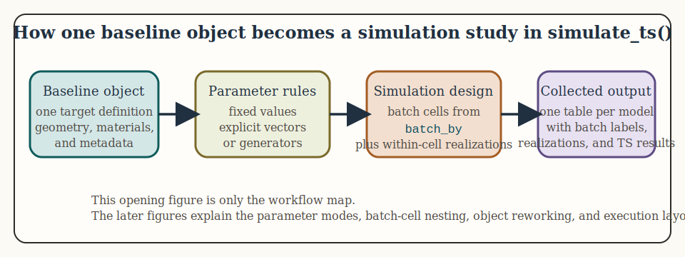
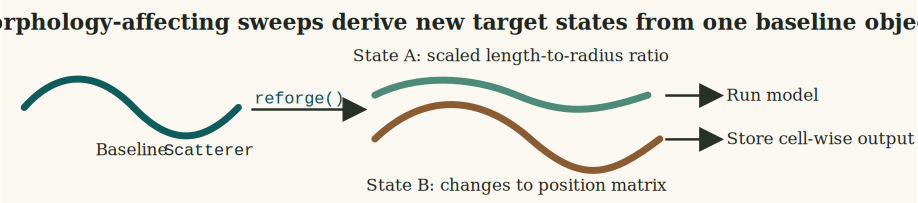
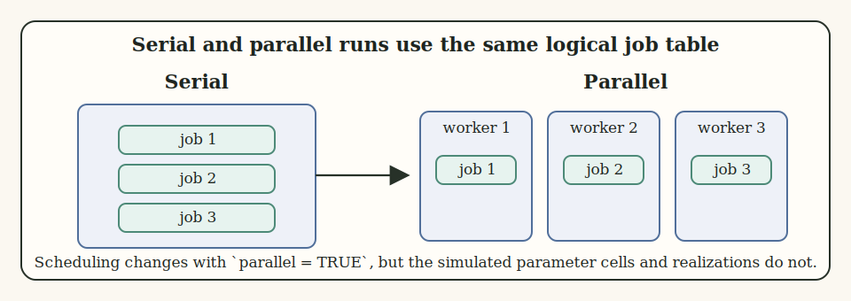

# Introduction

Parameter sweeps are especially useful when a model has to be interpreted over the orientation, size, and contrast ranges emphasized in benchmark and survey studies [@jech_etal_2015; @demer_new_2005].


Single deterministic model runs are useful, but many acoustic questions are inherently distributional. The package therefore includes simulation tools for repeated realizations, parameter batching, and ensemble summaries.



This page is about how to turn a single target description into a structured family of model runs. The core idea is that the object remains fixed as the bookkeeping container, while selected inputs are varied across realizations or across a parameter grid.

# Main entry point

The main current simulation interface is `simulate_ts()`. It supports repeated draws of user-specified parameters, optional batching over one or more variables, and optional parallel execution.

In other words, `simulate_ts()` is a workflow wrapper around repeated `target_strength()` calls. It does not replace the usual model layer. It automates the process of rebuilding a set of parameters, optionally reworking the object, running the model, and collecting the outputs into a set of tidy result tables.

```{r eval = TRUE}
library(acousticTS)

shape_obj <- cylinder(
  length_body = 0.05,
  radius_body = 0.003,
  n_segments = 80
)

obj <- fls_generate(
  shape = shape_obj,
  density_body = 1045,
  sound_speed_body = 1520
)

res <- simulate_ts(
  object = obj,
  frequency = seq(38e3, 120e3, by = 6e3),
  model = "DWBA",
  n_realizations = 5,
  parameters = list(
    theta_body = function() runif(1, min = 0.5 * pi, max = pi),
    density_body = 1045
  ),
  parallel = FALSE
)
```

The return value is a named list with one data frame per model.

# Parameter specification

The scratch simulation notes are worth keeping in mind here because they clarify the four main parameter modes supported by `simulate_ts()`:

1. single fixed values,
2. explicit vectors,
3. generating functions that return one draw at a time,
4. structured `reforge()` inputs such as named target-dimension vectors.

When `batch_by` is supplied, the selected parameters define a Cartesian grid and each grid cell is then repeated for `n_realizations`. That distinction between batch cells and within-cell draws is the core conceptual point of the interface.

Those four modes answer different questions:

1. fixed values are for constants that should be repeated in every realization,
2. explicit vectors are for a known set of realization-level values,
3. functions are for stochastic draws generated on demand,
4. structured values are for explicit geometry targets that should be preserved as one unit.

The distinction matters because it separates deterministic sweeps from uncertainty propagation.


Fixed values are copied into every run unchanged. Explicit vectors supply a known sequence of values. Generating functions do not provide a pre-listed table at all. They create a new draw whenever a realization is built. Structured values are preserved as list-columns so named geometry targets remain intact. That difference is what separates a design grid from on-the-fly uncertainty propagation and from explicit morphology rebuilding.

```{r eval = TRUE}
parameters <- list(
  theta_body = seq(0.5 * pi, pi, length.out = 5),
  density_body = function() rnorm(1, mean = 1045, sd = 5),
  sound_speed_body = 1520,
  body_target = c(length = 0.045)
)
```

In this example, `theta_body` is an explicit set of values, `density_body` is random, `sound_speed_body` is held fixed, and `body_target` is a structured `reforge()` input.

For fluid-like scatterers, convenience aliases such as `length_body` are also supported. These are normalized internally onto the same `reforge()` pathway as `body_target`, while preserving the original simulation column in the returned output.

```{r eval = TRUE}
res_length_alias <- simulate_ts(
  object = obj,
  frequency = 120e3,
  model = "DWBA",
  n_realizations = 4,
  parameters = list(
    length_body = function() runif(1, min = 0.04, max = 0.06),
    theta_body = function() runif(1, min = 0.5 * pi, max = pi)
  ),
  parallel = FALSE
)

head(res_length_alias$DWBA[, c("length_body", "theta_body", "TS")])
```

# Batching versus realizations

The most important conceptual distinction in the interface is the difference between a batched parameter and a realization-level parameter.

1. `batch_by` creates a grid of settings that should each be kept distinct in the output.
2. `n_realizations` controls how many repeated runs are performed within each grid cell.

Suppose `theta_body` and `density_body` are both placed in `batch_by`. Then the simulation does not treat them as uncertain draws around one target. It treats them as a design grid whose combinations are all run separately.

```{r eval = TRUE}
res_grid <- simulate_ts(
  object = obj,
  frequency = seq(38e3, 120e3, by = 6e3),
  model = c("DWBA", "SDWBA"),
  n_realizations = 3,
  parameters = list(
    theta_body = seq(0.5 * pi, pi, length.out = 4),
    density_body = c(1035, 1045, 1055)
  ),
  batch_by = c("theta_body", "density_body"),
  parallel = FALSE
)
```

Here the output contains one row structure per model, per frequency, per batch cell, and per realization. That is why batched jobs can grow quickly.


This is the core simulation structure in the current interface. Batched parameters define the outer design. Realizations live inside that design. If a user loses track of that nesting, it becomes very easy to misread deterministic design cells as random draws or random draws as deterministic sweep levels.

# Parameters that modify the object

Not every simulated parameter is a simple scalar passed into `target_strength()`. Some parameters alter the working object itself. This is especially important for reshaping workflows.

The current simulation code supports two broad cases:

1. parameters matching accepted `reforge()` inputs can trigger per-realization resizing or reparameterization,
2. parameters matching object-component fields can be inserted into the working object before the model call.

This means `simulate_ts()` can be used not just for orientation or density perturbations, but also for controlled morphology studies.

```{r eval = TRUE}
body_shape <- arbitrary(
  x_body = c(0.00, 0.02, 0.05, 0.08),
  zU_body = c(0.001, 0.004, 0.004, 0.001),
  zL_body = c(-0.001, -0.004, -0.004, -0.001)
)

bladder_shape <- arbitrary(
  x_bladder = c(0.02, 0.04, 0.06),
  zU_bladder = c(0.0012, 0.0018, 0.0012),
  zL_bladder = c(-0.0012, -0.0018, -0.0012)
)

obj_sbf <- sbf_generate(
  body_shape = body_shape,
  bladder_shape = bladder_shape,
  density_body = 1045,
  sound_speed_body = 1520,
  density_bladder = 1.2,
  sound_speed_bladder = 343
)

res_shape <- simulate_ts(
  object = obj_sbf,
  frequency = seq(38e3, 120e3, by = 6e3),
  model = "DWBA",
  n_realizations = 2,
  parameters = list(
    body_scale = c(0.9, 1.1),
    swimbladder_inflation_factor = c(0.8, 1.2)
  ),
  batch_by = c("body_scale", "swimbladder_inflation_factor"),
  parallel = FALSE
)
```

This is one of the cleanest ways to keep a morphology-sensitivity analysis tied to the same baseline target.

For `FLS` objects, the same idea can be expressed more explicitly through `body_target` or through the convenience alias `length_body`.

```{r eval = TRUE}
res_fls_reforge <- simulate_ts(
  object = obj,
  frequency = 120e3,
  model = "DWBA",
  n_realizations = 2,
  parameters = list(
    body_target = list(
      c(length = 0.04, radius = 0.0025),
      c(length = 0.06, radius = 0.0035)
    ),
    isometric_body = FALSE,
    theta_body = function() runif(1, min = 0.5 * pi, max = pi)
  ),
  batch_by = "body_target",
  parallel = FALSE
)

head(res_fls_reforge$DWBA[, c("body_target", "theta_body", "TS")])
```

When batching across structured geometry targets, wrap the candidates in a list so each target vector is treated as one batch value.



Morphology-affecting parameters do not behave like ordinary scalar metadata. They change the working target itself before the model is run. The resulting simulations should therefore be interpreted as distinct geometric states derived from one baseline object, not as repeated evaluations of a single unchanged shape.

There is one especially important point for curvature-aware workflows: `simulate_ts()` does not automatically call `brake()` for the modern `DWBA` or `SDWBA` paths. If the baseline object is straight, then `length_body` or `body_target` simply resize that straight object. If the baseline object is already a bent `FLS`, then those same parameters resize the existing bent geometry directly.

For bent `FLS` objects, `length_body` and `body_target["length"]` are interpreted as the target bent centerline arc length, not as the flattened projected `x` span. That makes the resize semantics consistent with the object that is actually being modeled.

```{r eval = TRUE}
obj_bent <- brake(obj, radius_curvature = 5, mode = "ratio")

res_bent <- simulate_ts(
  object = obj_bent,
  frequency = 120e3,
  model = "DWBA",
  n_realizations = 2,
  parameters = list(
    length_body = c(0.04, 0.05),
    theta_body = 0.5 * pi
  ),
  batch_by = "length_body",
  parallel = FALSE
)

head(res_bent$DWBA[, c("length_body", "theta_body", "TS")])
```

That example is useful because it separates two different ideas cleanly:

1. the bent state comes from the baseline object passed into `simulate_ts()`,
2. the resizing comes from `length_body` or `body_target`.

If the scientific workflow instead needs "resize a straight object and then bend it differently for each realization," that should currently be constructed outside `simulate_ts()` or through the deprecated `*_curved` model interfaces that still wire curvature in internally.

# When simulation is useful

Simulation or batched evaluation is most useful when:

1. orientation is uncertain,
2. material properties are better treated as distributions than as fixed values,
3. multiple body lengths or frequencies must be screened systematically,
4. model sensitivity is of greater interest than a single nominal prediction.

In practice, this means simulation is less about "making the model stochastic" and more about mapping the consequences of uncertainty, variability, or design decisions.

# Interpreting the output

The returned list is model-centered. Each element is a data frame that carries the realization index, any batched parameters, and the model outputs. That organization is deliberate: it makes downstream plotting or aggregation straightforward.

```{r eval = TRUE}
names(res_grid)
head(res_grid$DWBA)
head(res_grid$SDWBA)
```

Common downstream summaries include:

1. mean and quantiles of `TS` by frequency,
2. variance decomposition by orientation or material parameter,
3. pairwise model differences across matched grid cells,
4. screening plots to identify nonlinear regions before deeper analysis.

# Parallel execution

`simulate_ts()` currently uses PSOCK workers for parallel execution across Windows, macOS, and Linux. That has two practical consequences:

1. startup overhead is more noticeable for small jobs,
2. larger simulations benefit more clearly from parallelization than tiny exploratory runs.

For this reason, `parallel = FALSE` is often the right default while debugging a workflow, even if `parallel = TRUE` is the right choice for production runs.

```{r eval = FALSE}
res_parallel <- simulate_ts(
  object = obj,
  frequency = seq(38e3, 120e3, by = 2e3),
  model = "DWBA",
  n_realizations = 100,
  parameters = list(theta_body = function() runif(1, 0.5 * pi, pi)),
  parallel = TRUE,
  n_cores = 4
)
```



Parallelization changes scheduling, not interpretation. The same batched cells and realization-level jobs still exist. Parallel execution simply distributes them across workers. That is why debugging is often easier in serial mode first, even when the final production run is parallel.

# Practical cautions

The simulation workflow can become expensive quickly, especially when several parameters are batched simultaneously. The main practical risks are:

- combinatorial growth in the evaluation grid,
- unnecessary parallel overhead for small jobs,
- confusion between realization-level randomness and batch-level parameter sweeps.

Two additional cautions are worth keeping in mind:

1. if a parameter sequence is meant to represent uncertainty, placing it in `batch_by` changes the interpretation from random variation to deterministic design cells,
2. if geometry-affecting parameters are varied, the results should be interpreted as new target states rather than as mere perturbations of one fixed shape.

For that reason, this page should be read together with [FAQ and troubleshooting](../faq-troubleshooting/faq-troubleshooting.html).

Because the current parallel path is PSOCK-based, larger simulations benefit from being planned deliberately instead of relying on a maximal batch grid by default.

# Relationship to `anneal()`

The current documentation and source code indicate that `simulate_ts()` is expected to give way to `anneal()` in future releases. The important point for current users is that the workflow logic on this page remains useful even if the interface evolves.

The stable ideas are:

1. keep one object as the baseline target description,
2. separate batch design from within-cell variation,
3. make model comparison operate on matched simulation cells,
4. summarize in linear or logarithmic units according to the scientific question.

# Relationship to future interfaces

The current simulation interface is already useful, but the package documentation indicates that this part of the workflow may continue to evolve. This article should therefore be read as a workflow guide rather than as a claim that the current interface is final.
