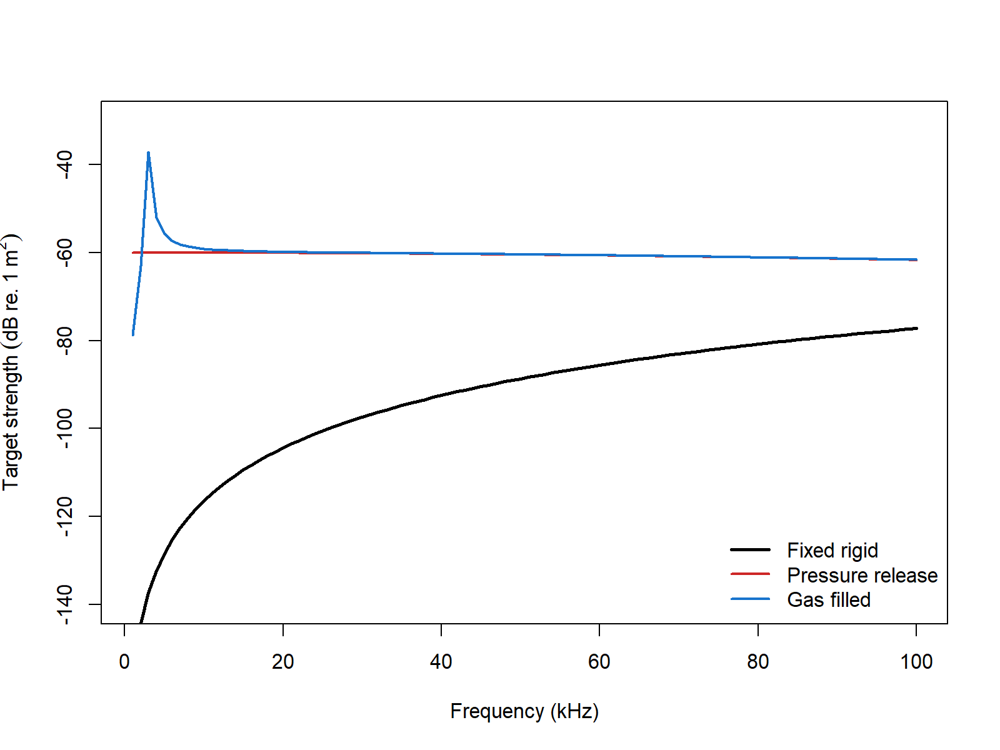

# acousticTS implementation

```{r model_family_header, echo=FALSE, results='asis'}
acousticTS:::.model_family_header(
  family = "sphms",
  pages = c(
    Overview = "index.html",
    Implementation = "sphms-implementation.html",
    Theory = "sphms-theory.html"
  )
)
```


These pages follow the classical exact sphere literature for fluid, elastic, and approximate shell limits [@anderson_sound_1950; @faran_sound_1951; @hickling_analysis_1962].

The acousticTS package uses object-based scatterers so the same implementation pattern carries across models: create a scatterer, run `target_strength()`, inspect the stored model output, and then compare a small set of physically important inputs. For SPHMS, the object must be spherical and the main model choice is the boundary condition.

That apparent simplicity is one of the reasons SPHMS is so useful. When the target really is well approximated by a sphere, the geometry and the coordinate system match exactly, so the main practical decisions collapse to size, material contrast, and boundary interpretation rather than to complicated numerical bookkeeping.

## Sphere object generation

The example below uses a gas-filled sphere so the same geometry can be reused for gas-filled and idealized rigid or pressure-release comparisons.

```{r}
library(acousticTS)

sphere_shape <- sphere(
  radius_body = 1e-3
)

gas_sphere <- gas_generate(
  shape = sphere_shape,
  g_fluid = 0.0012,
  h_fluid = 0.22,
  theta_body = pi / 2
)

gas_sphere
```

This setup is a good example of the geometry-versus-physics distinction that runs through the package. The outer geometry is simply spherical. The scatterer constructor then gives that sphere a specific physical interpretation, here a gas-filled interior with strong density and sound-speed contrast relative to the surrounding fluid.

## Calculating a TS-frequency spectrum

```{r}
frequency <- seq(1e3, 100e3, by = 1e3)

gas_sphere <- target_strength(
  object = gas_sphere,
  frequency = frequency,
  model = "sphms",
  boundary = "gas_filled"
)
```

This call is mechanically simple, but it is still worth reading carefully. The `model` argument selects the spherical modal-series solution, while the `boundary` argument chooses which spherical boundary-value problem is being solved. In other words, SPHMS does not mean only one thing acoustically. The same spherical geometry can be used under different interface assumptions, and that choice is often the most important physical decision in the run.

## Extracting model results

Model results can be extracted either visually or directly through `extract()`.

### Plotting results

```{r echo=FALSE, out.width=c('49%','49%'), fig.align='center', fig.alt='Pre-rendered SPHMS example plots showing the spherical geometry and its stored gas-filled target-strength spectrum.'}
knitr::include_graphics(c("sphms-shape-plot.png", "sphms-model-plot.png"))
```

### Accessing results

```{r}
sphms_results <- extract(gas_sphere, "model")$SPHMS
head(sphms_results)
```

At this stage, readers should confirm that the returned output matches the intended spherical problem. A gas-filled run should usually look materially different from a rigid or pressure-release run of the same size, especially when the contrast is strong. This is also a good point to confirm that the frequency grid and reporting variables are the ones needed for the later comparison.

## Comparison workflows

### Boundary conditions

Because the geometry is fixed, boundary-condition comparisons are a clean way to understand what part of the response is due to the interface assumption rather than the size of the sphere itself.

```{r echo=FALSE, out.width='85%', fig.align='center', fig.alt='Pre-rendered SPHMS boundary-condition comparison for the same sphere under fixed-rigid, pressure-release, and gas-filled assumptions.'}

```

This comparison is especially helpful because it isolates the role of the boundary condition cleanly. The outer radius is the same in all three runs. What changes is the interface physics: suppressed normal motion, vanishing surface pressure, or a highly compressible gas-filled interior. That makes the resulting differences much easier to interpret than if geometry and boundary were changed simultaneously.

For fluid-filled spheres, the same implementation pattern applies; the main change is the selected `boundary` and the interior material properties. In practical SPHMS work, the first controls to revisit are usually the sphere radius, the selected boundary condition, and the medium-to-interior contrasts, because those are the inputs that determine the modal coefficient problem most directly.

### Benchmark comparisons

SPHMS can be compared directly against the Jech benchmark definitions stored in `benchmark_ts`. The summary below uses the full spherical benchmark grid. Elapsed times are representative values from the current machine rather than universal expectations.

| Boundary | Max abs. delta TS (dB) | Mean abs. delta TS (dB) | Elapsed (s) |
|:--|--:|--:|--:|
| `fixed_rigid` | 0.00497 | 0.00246 | 0.03 |
| `pressure_release` | 0.00500 | 0.00243 | 0.09 |
| `gas_filled` | 0.00499 | 0.00263 | 0.06 |
| `liquid_filled` | 0.00492 | 0.00241 | 0.11 |

All four spherical boundary types remain very close to the benchmark family over the full grid, with the current implementation staying within about 0.005 dB in the worst case.

### Cross-software implementation checks

For the penetrable spherical cases, the current acousticTS implementation can also be checked directly against the locally available `KRMr` and `echoSMs` sphere solvers. Those checks serve a different purpose from the Jech benchmark table above: they verify that the software implementations agree when they are solving the same penetrable spherical problem, rather than only asking how closely any one implementation tracks the benchmark family.

| Boundary | Comparison | Mean abs. delta TS (dB) | Max abs. delta TS (dB) |
|:--|:--|--:|--:|
| `gas_filled` | acousticTS vs `KRMr` | 3.21e-14 | 2.21e-12 |
| `gas_filled` | acousticTS vs `echoSMs` | 1.71e-13 | 1.52e-11 |
| `liquid_filled` | acousticTS vs `KRMr` | 5.70e-12 | 1.30e-10 |
| `liquid_filled` | acousticTS vs `echoSMs` | 3.68e-11 | 3.37e-09 |

Those values show that the penetrable SPHMS branches are effectively identical across the three implementations on the shared spherical definitions. In other words, the small residuals reported against the benchmark family above are not an acousticTS-specific artifact. They are shared by the matched software implementations solving the same gas-filled and liquid-filled sphere problems.

SPHMS does expose one additional numerical control, `m_limit`, so it is worth checking how aggressively the modal cap can be reduced before the liquid-filled benchmark fit starts to move. The table below keeps the same weakly scattering liquid-filled benchmark and only changes that truncation cap.

| Boundary | `m_limit` | Max abs. delta TS (dB) | Mean abs. delta TS (dB) | Elapsed (s) |
|:--|:--|--:|--:|--:|
| `liquid_filled` | default rule | 0.00492 | 0.00241 | 0.07 |
| `liquid_filled` | `20` | 0.52550 | 0.00640 | 0.14 |
| `liquid_filled` | `10` | 58.24225 | 8.07819 | 0.02 |

That pattern is useful because it shows that SPHMS is not especially tolerant of aggressive modal under-truncation, even though the wall-clock time can drop. The benchmarked spherical branches therefore do not need the same kind of configuration matrix as PSMS. Boundary choice is the main physical switch, and `m_limit` is best treated as a guarded numerical override rather than as a routine tuning knob.
