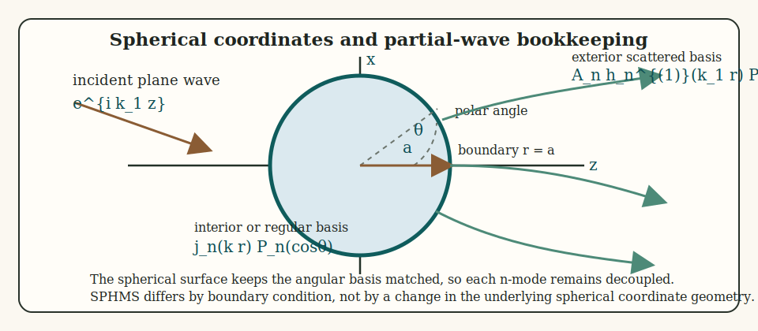

# Introduction

The sphere is the classical geometry for which the acoustic scattering problem can be solved exactly by separation of variables. Because the Helmholtz equation separates in spherical coordinates, the incident, scattered, and interior fields are expanded in spherical eigenfunctions, and the boundary conditions reduce to algebraic equations for each angular order.[^1][^2][^3]

That structure underlies the spherical modal series solution for rigid, pressure-release, and fluid-filled spherical boundaries. Gas-filled spheres fit into the same mathematical framework as a fluid-filled sphere with a strong density and sound-speed contrast, so the same modal derivation applies there as well.

The rigid, pressure-release, and fluid-filled conditions used below are summarized separately in the companion [boundary conditions article](../boundary_conditions.html).

This schematic is keyed to the modal derivation below: the sphere boundary at $r=a$ is where the boundary condition is imposed, the radial callout indicates the regular interior and exterior radial functions, the polar angle $\theta$ marks the spherical-coordinate geometry, and the outgoing rays represent the far-field coefficient $A_n$ attached to each partial wave.

# Reduction of the wave equation in spherical coordinates

## Helmholtz equation in the surrounding fluid

In a homogeneous inviscid fluid, the time-harmonic acoustic pressure satisfies

$$
  \nabla^2 p + k^2 p = 0,
$$

where $k = \omega/c$. In spherical coordinates $(r,\theta,\varphi)$,

$$
  \nabla^2 p =
  \frac{1}{r^2}\frac{\partial}{\partial r}
  \left(r^2\frac{\partial p}{\partial r}\right)
  + \frac{1}{r^2 \sin\theta}\frac{\partial}{\partial \theta}
  \left(\sin\theta\frac{\partial p}{\partial \theta}\right)
  + \frac{1}{r^2\sin^2\theta}\frac{\partial^2 p}{\partial \varphi^2}.
$$

For axisymmetric incidence, the field is independent of $\varphi$, so the last term vanishes.

## Separation of variables

Seek a solution of the form

$$
  p(r,\theta) = R(r)\Theta(\theta).
$$

Substituting into the Helmholtz equation and separating radial from angular dependence gives

$$
  \frac{1}{R}\frac{d}{dr}
  \left(r^2\frac{dR}{dr}\right) + k^2r^2
  = - \frac{1}{\Theta\sin\theta}
      \frac{d}{d\theta}\left(\sin\theta\frac{d\Theta}{d\theta}\right).
$$

Since the left-hand side depends only on $r$ and the right-hand side only on $\theta$, both must equal the same separation constant, traditionally written as $n(n+1)$. The angular equation becomes

$$
  \frac{1}{\sin\theta}
  \frac{d}{d\theta}
  \left(\sin\theta\frac{d\Theta}{d\theta}\right)
  + n(n+1)\Theta = 0,
$$

whose regular solutions are the Legendre polynomials

$$
  \Theta(\theta) = P_n(\cos\theta).
$$

The radial equation becomes

$$
  \frac{d}{dr}\left(r^2\frac{dR}{dr}\right)
  + \left(k^2r^2 - n(n+1)\right)R = 0,
$$

whose solutions are the spherical Bessel, Neumann, and Hankel functions.

## Orthogonality

The angular modes decouple because

$$
  \int_{-1}^{1} P_m(\mu)P_n(\mu)\,d\mu
  = \frac{2}{2n+1}\delta_{mn}.
$$

This orthogonality is the key step that turns the continuous boundary conditions into independent equations for each order $n$.

# Incident and scattered field expansions

## Incident plane wave

A plane wave propagating along the polar axis is expanded as

$$
  p_{inc}(r,\theta)
  = P_0 e^{ik_1r\cos\theta}
  = P_0\sum_{n=0}^{\infty}(2n+1)i^n j_n(k_1r)P_n(\cos\theta).
$$

The use of $j_n$ follows from regularity at the origin.

## Exterior scattered field

The scattered field must satisfy the Sommerfeld radiation condition and is therefore expanded in outgoing spherical Hankel functions:

$$
  p_{scat}(r,\theta)
  = P_0\sum_{n=0}^{\infty}(2n+1)i^n A_n h_n^{(1)}(k_1r)P_n(\cos\theta).
$$

The coefficients $A_n$ are determined by the boundary conditions.

## Far-field backscatter

Using the large-argument asymptotic form

$$
  h_n^{(1)}(kr) \sim \frac{(-i)^{n+1}e^{ikr}}{kr},
  \qquad r \to \infty,
$$

the scattered field becomes

$$
  p_{scat}(r,\theta) \sim
  P_0\frac{e^{ik_1r}}{r}
  \left[-\frac{i}{k_1}
  \sum_{n=0}^{\infty}(2n+1)A_nP_n(\cos\theta)
  \right].
$$

In the backscattering direction $\theta = \pi$, one has $P_n(-1)=(-1)^n$, so the backscattering amplitude is

$$
  f_{bs} = -\frac{i}{k_1}
  \sum_{n=0}^{\infty}(-1)^n(2n+1)A_n.
$$

# Boundary-condition derivations

## Fixed rigid sphere

For a rigid sphere of radius $a$, the normal fluid velocity vanishes at the surface. Since particle velocity is proportional to the normal derivative of pressure, the condition is

$$
  \left.\frac{\partial}{\partial r}(p_{inc}+p_{scat})\right|_{r=a}=0.
$$

Substituting the modal expansions and using orthogonality gives, for each order $n$,

$$
  j_n'(k_1a) + A_n h_n^{(1)\,'}(k_1a)=0.
$$

Hence

$$
  A_n = -\frac{j_n'(k_1a)}{h_n^{(1)\,'}(k_1a)}.
$$

## Pressure-release sphere

For a pressure-release boundary, the total pressure vanishes at the surface:

$$
  p_{inc}(a,\theta)+p_{scat}(a,\theta)=0.
$$

Substitution of the expansions gives, mode by mode,

$$
  j_n(k_1a) + A_n h_n^{(1)}(k_1a)=0,
$$

so

$$
  A_n = -\frac{j_n(k_1a)}{h_n^{(1)}(k_1a)}.
$$

## Fluid-filled sphere

For a fluid interior of density $\rho_3$ and wavenumber $k_3$, the interior field must remain finite at the origin, so it is written as

$$
  p_{int}(r,\theta) = P_0\sum_{n=0}^{\infty}(2n+1)i^n B_n j_n(k_3r)P_n(\cos\theta).
$$

At $r=a$, pressure and normal velocity are continuous:

$$
  p_{ext} = p_{int},
$$

and

$$
  \frac{1}{\rho_1}\frac{\partial p_{ext}}{\partial r}
  = \frac{1}{\rho_3}\frac{\partial p_{int}}{\partial r}.
$$

After substituting the modal expansions, each order satisfies the system

$$
  j_n(k_1a) + A_n h_n^{(1)}(k_1a) = B_n j_n(k_3a),
$$

$$
  \frac{k_1}{\rho_1}\left[j_n'(k_1a) + A_n h_n^{(1)\,'}(k_1a)\right]
  = \frac{k_3}{\rho_3}B_n j_n'(k_3a).
$$

Solving the pressure-continuity equation for the interior amplitude gives

$$
  B_n = \frac{j_n(k_1 a) + A_n h_n^{(1)}(k_1 a)}{j_n(k_3 a)}.
$$

Substituting this into the velocity condition yields

$$
  j_n'(k_1 a) + A_n h_n^{(1)\,'}(k_1 a)
  =
  \frac{\rho_1 k_3}{\rho_3 k_1}
  \frac{j_n'(k_3 a)}{j_n(k_3 a)}
  \left[j_n(k_1 a) + A_n h_n^{(1)}(k_1 a)\right].
$$

If the density and sound-speed contrasts are written as

$$
  g = \frac{\rho_3}{\rho_1},
  \qquad
  h = \frac{c_3}{c_1},
$$

then $k_3/k_1 = 1/h$ and the prefactor becomes $1/(gh)$. Rearranging therefore gives

$$
  A_n
  \left[
    h_n^{(1)\,'}(k_1 a)
    - \frac{1}{gh}
      \frac{j_n'(k_3 a)}{j_n(k_3 a)}
      h_n^{(1)}(k_1 a)
  \right]
  =
  \frac{1}{gh}
  \frac{j_n'(k_3 a)}{j_n(k_3 a)}
  j_n(k_1 a)
  - j_n'(k_1 a).
$$

Thus the fluid-filled coefficient can be written explicitly as

$$
  A_n =
  \frac{
    \dfrac{1}{gh}\dfrac{j_n'(k_3 a)}{j_n(k_3 a)}j_n(k_1 a)
    - j_n'(k_1 a)
  }{
    h_n^{(1)\,'}(k_1 a)
    - \dfrac{1}{gh}\dfrac{j_n'(k_3 a)}{j_n(k_3 a)}h_n^{(1)}(k_1 a)
  }.
$$

This is the direct spherical analogue of the fluid-filled cylindrical coefficient formulas seen in other modal models. The important derivation step is the elimination of the interior amplitude from the $2 \times 2$ continuity system. Gas-filled spheres obey the same algebra, with the main difference being that the contrasts $g$ and $h$ are then far from unity rather than close to it.

# Modal truncation

The exact solution is an infinite partial-wave series. In practice only finitely many modes contribute appreciably at fixed acoustic size. The required number of modes increases with $k_1a$ because higher angular orders resolve finer angular variation along the sphere.

This is a general feature of all modal scattering solutions and follows from the fact that the angular spectrum broadens as the target becomes acoustically larger.

After choosing a truncation order $n_{max}$, one simply evaluates the independent coefficient problem for each $n=0,1,\ldots,n_{max}$ and inserts the resulting $A_n$ into the far-field series. Because the spherical basis remains orthogonal at every step, truncation introduces only a cutoff in the number of retained partial waves; it does not change the diagonal structure of the mode-wise solve.

# Backscattering cross-section and target strength

Once the amplitude is known,

$$
  \sigma_{bs} = |f_{bs}|^2,
$$

and

$$
  TS = 10\log_{10}(\sigma_{bs}).
$$

Because the derivation is exact within linear acoustics and the stated boundary model, the only approximations thereafter are those introduced by truncating the infinite modal series.

# Mathematical assumptions

The spherical modal series rests on the following assumptions:

1. Time-harmonic linear acoustics.
2. A perfectly spherical interface.
3. Homogeneous material properties within each region.
4. Exact separability in spherical coordinates.
5. Radiation condition in the exterior field.

Those assumptions are what make the sphere the natural reference problem for validating more complicated scattering models. The geometry is perfectly matched to the coordinate system, the angular basis remains orthogonal, and every retained order remains algebraically local even in the fluid-filled case. That is exactly why the spherical problem serves as the standard benchmark against which more complicated modal and approximate models are often judged.

## References

[^1]: Anderson, V. C. (1950). Sound scattering from a fluid sphere. *The Journal of the Acoustical Society of America*, 22, 426-431.

[^2]: Faran, J. J. (1951). Sound scattering by solid cylinders and spheres. *The Journal of the Acoustical Society of America*, 23, 405-418.

[^3]: Hickling, R. (1962). Analysis of echoes from a solid elastic sphere in water. *The Journal of the Acoustical Society of America*, 34, 1582-1592.
