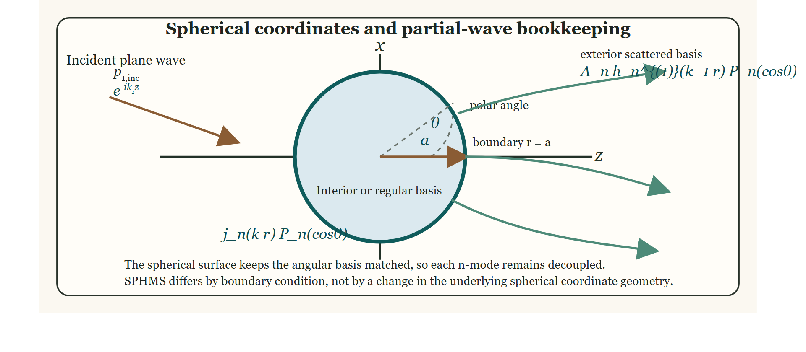

---
title: "Spherical modal series solution (SPHMS) theory"
output:
  rmarkdown::html_vignette:
    toc: true
    number_sections: true
    fig_caption: yes
    fig_width: 3.5
    fig_height: 3.5
    dpi: 200
    dev.args: list(pointsize=11)
bibliography: ../REFERENCES.bib
link-citations: true
reference-section-title: References
vignette: >
  %\VignetteIndexEntry{Spherical modal series solution (SPHMS) theory}
  %\VignetteEncoding{UTF-8}
  %\VignetteEngine{knitr::rmarkdown}
---

# Introduction

```{r model_family_header, echo=FALSE, results='asis'}
acousticTS:::.model_family_header(
  family = "sphms",
  pages = c(
    Overview = "index.html",
    Implementation = "sphms-implementation.html",
    Theory = "sphms-theory.html"
  )
)
```

The sphere is the classical geometry for which the acoustic scattering problem can be solved exactly by separation of variables. Because the Helmholtz equation separates in spherical coordinates, the incident, scattered, and interior fields can be expanded in spherical eigenfunctions, and the boundary conditions reduce to independent algebraic equations for each angular order [@Anderson_1950; @Faran_1951; @Hickling_1962].

That structure is what underlies the spherical modal series solution for rigid, pressure-release, fluid-filled, and gas-filled spheres. In this article, medium `1` denotes the surrounding seawater and medium `2` denotes the sphere interior, consistent with the shared package notation summarized in the [acoustic scattering primer](../acoustic-scattering-primer/acoustic-scattering-primer.html) and [notation guide](../notation-and-symbols/notation-and-symbols.html). Shell-based spherical problems are treated separately in the `ESSMS` and calibration articles because once an intermediate shell is introduced, the interface physics changes qualitatively.

The unshelled spherical problem considered here has three boundary families. A rigid sphere enforces zero normal velocity at $r = a$, a pressure-release sphere enforces zero pressure there, and a fluid-filled or gas-filled sphere enforces continuity of pressure and normal velocity between the surrounding medium and the interior. Shell-supported spherical problems are treated separately because once an elastic shell is introduced, the interface physics changes qualitatively.

<!--  -->

The boundary condition is imposed at $r = a$, the incident and scattered fields are expanded in spherical partial waves outside the sphere, and the interior field is expanded in regular spherical waves inside the sphere. The polar angle $\theta$ identifies the usual axisymmetric geometry, while the coefficient $A_n$ carries the scattered contribution of angular order $n$.

# Reduction of the wave equation in spherical coordinates

## Helmholtz equation in the surrounding fluid

In a homogeneous inviscid fluid, the time-harmonic acoustic pressure satisfies:

$$
  \nabla^2 p + k^2 p = 0,
$$

where $k = \omega/c$. In spherical coordinates $(r,\theta,\varphi)$, the Laplacian becomes:

$$
  \nabla^2 p =
    \frac{1}{r^2}\frac{\partial}{\partial r}
  \left(r^2\frac{\partial p}{\partial r}\right) +
    \frac{1}{r^2 \sin\theta}\frac{\partial}{\partial \theta}
  \left(\sin\theta\frac{\partial p}{\partial \theta}\right) +
    \frac{1}{r^2\sin^2\theta}\frac{\partial^2 p}{\partial \varphi^2}.
$$

For axisymmetric incidence, the field is independent of $\varphi$, so the last term vanishes.

## Separation of variables

The axisymmetric pressure can be expressed as a product of radial and angular factors:

$$
  p(r,\theta) = R(r)\Theta(\theta),
$$

where $R(r)$ represents the radial dependence of the pressure field and $\Theta(\theta)$ represents the angular dependence. Substituting this product into the Helmholtz equation and separating radial from angular dependence gives:

$$
  \frac{1}{R}\frac{d}{dr}
  \left(r^2\frac{dR}{dr}\right) + k^2r^2 = -\frac{1}{\Theta\sin\theta}
  \frac{d}{d\theta}\left(\sin\theta\frac{d\Theta}{d\theta}\right).
$$

Because the left-hand side depends only on $r$ and the right-hand side depends only on $\theta$, both sides must equal the same separation constant. Writing that constant as $n(n+1)$ gives the angular equation:

$$
  \frac{1}{\sin\theta}
  \frac{d}{d\theta}
  \left(\sin\theta\frac{d\Theta}{d\theta}\right) +
    n(n+1)\Theta = 0,
$$

whose regular solutions are the Legendre polynomials:

$$
  \Theta(\theta) = P_n(\cos\theta).
$$

The radial equation takes the form:

$$
  \frac{d}{dr}\left(r^2\frac{dR}{dr}\right) +
    \left(k^2r^2 - n(n+1)\right)R = 0,
$$

whose independent solutions are the spherical Bessel, oeumann, and Hankel functions. The essential point is that spherical geometry keeps the angular order $n$ separated exactly. That is why each partial wave can be solved independently once the boundary condition is imposed.

## Orthogonality

The angular modes decouple because the Legendre polynomials satisfy:

$$
  \int_{-1}^{1} P_m(\mu)P_n(\mu)\,d\mu =
    \frac{2}{2n+1}\delta_{mn}.
$$

This orthogonality is the key step that turns the continuous boundary conditions into independent equations for each order $n$.

# Incident and scattered field expansions

## Incident plane wave

Let $P_0$ denote the incident pressure amplitude. A plane wave propagating along the polar axis is expanded as:

$$
  p_{1,\text{inc}}(r,\theta) =
    P_0 e^{ik_1r\cos\theta} =
    P_0\sum_{n=0}^{\infty}(2n+1)i^n \text{j}_n(k_1r)P_n(\cos\theta).
$$

The use of $\text{j}_n$ is the spherical analogue of using a regular interior radial basis in other modal solutions. Although the incident plane wave is physically defined in the exterior region, its modal expansion is written in terms of the regular spherical Bessel functions because those are the nonsingular basis functions associated with the separated radial equation.

## Exterior scattered field

The exterior scattered field must satisfy the Sommerfeld radiation condition [@Sommerfeld_1949] and is therefore expanded in outgoing spherical Hankel functions:

$$
  p_{1,\text{scat}}(r,\theta) =
    P_0\sum_{n=0}^{\infty}(2n+1)i^n A_n h_n^{(1)}(k_1r)P_n(\cos\theta).
$$

The coefficients $A_n$ are determined by the boundary conditions.

## Far-field backscatter

Using the large-argument asymptotic form:

$$
  h_n^{(1)}(kr) \sim \frac{(-i)^{n+1}e^{ikr}}{kr},
  \qquad r \to \infty,
$$

the scattered field becomes:

$$
  p_{1,\text{scat}}(r,\theta) \sim
  P_0\frac{e^{ik_1r}}{r}
  \left[-\frac{i}{k_1}
  \sum_{n=0}^{\infty}(2n+1)A_nP_n(\cos\theta)
  \right].
$$

In the backscattering direction $\theta = \pi$, one has $P_n(-1) = (-1)^n$, so the backscattering amplitude is:

$$
  \mathcal{f}_\text{bs} = -\frac{i}{k_1}
  \sum_{n=0}^{\infty}(-1)^n(2n+1)A_n.
$$

# Boundary-condition derivations

## Fixed rigid sphere

For a rigid sphere of radius $a$, the normal fluid velocity vanishes at the surface. Since particle velocity is proportional to the normal derivative of pressure, the boundary condition is:

$$
  \left.\frac{\partial}{\partial r}(p_{1,\text{inc}}+p_{1,\text{scat}})\right|_{r=a} = 0.
$$

Substituting the modal expansions and using orthogonality gives, for each order $n$:

$$
  \text{j}_n^\prime(k_1a) + A_n h_n^{(1)\,\prime}(k_1a) = 0.
$$

This boundary condition gives the scattered partial-wave coefficient:

$$
  A_n = -\frac{\text{j}_n^\prime(k_1a)}{h_n^{(1)\,\prime}(k_1a)}.
$$

## Pressure-release sphere

For a pressure-release boundary, the total pressure vanishes at the surface:

$$
  p_{1,\text{inc}}(a,\theta) + p_{1,\text{scat}}(a,\theta) = 0.
$$

Substitution of the modal expansions gives, mode by mode:

$$
  \text{j}_n(k_1a) + A_n h_n^{(1)}(k_1a) = 0.
$$

This boundary condition gives the scattered partial-wave coefficient:

$$
  A_n = -\frac{\text{j}_n(k_1a)}{h_n^{(1)}(k_1a)}.
$$

## Fluid-filled and gas-filled sphere

For a fluid or gas interior, the pressure inside the sphere must remain finite at the origin, so the interior field is expanded in regular spherical Bessel functions. Writing the interior density and wavenumber as $\rho_2$ and $k_2$, the interior field becomes:

$$
  p_2(r,\theta) = P_0\sum_{n=0}^{\infty}(2n+1)i^n B_n \text{j}_n(k_2r)P_n(\cos\theta).
$$

At $r = a$, pressure and normal velocity are continuous. In region-indexed notation, the pressure condition is:

$$
  p_1 = p_2,
$$

The corresponding normal-velocity condition is:

$$
  \frac{1}{\rho_1}\frac{\partial p_1}{\partial r} =
    \frac{1}{\rho_2}\frac{\partial p_2}{\partial r}.
$$

Since the exterior total pressure is $p_1 = p_{1,\text{inc}} + p_{1,\text{scat}}$, substituting the modal expansions gives, for each order $n$:

$$
  \begin{align*}
    \text{j}_n(k_1a) + A_n h_n^{(1)}(k_1a) &= B_n \text{j}_n(k_2a), \\
    \frac{k_1}{\rho_1}\left[\text{j}_n^\prime(k_1a) + A_n h_n^{(1)\,\prime}(k_1a)\right] &=
      \frac{k_2}{\rho_2}B_n \text{j}_n^\prime(k_2a).
  \end{align*}
$$

Solving the pressure-continuity equation for the interior coefficient gives:

$$
  B_n = \frac{\text{j}_n(k_1 a) + A_n h_n^{(1)}(k_1 a)}
  {\text{j}_n(k_2 a)}.
$$

Substituting that result into the velocity condition yields:

$$
  \text{j}_n^\prime(k_1 a) + A_n h_n^{(1)\,\prime}(k_1 a) =
    \frac{\rho_1 k_2}{\rho_2 k_1}
  \frac{\text{j}_n^\prime(k_2 a)}{\text{j}_n(k_2 a)}
  \left[\text{j}_n(k_1 a) + A_n h_n^{(1)}(k_1 a)\right]
$$

Now define the density and sound-speed contrasts by:

$$
  g_{21} = \frac{\rho_2}{\rho_1},
  \qquad
  h_{21} = \frac{c_2}{c_1}
$$

Because $k_2/k_1 = 1/h_{21}$, the prefactor $\rho_1 k_2 / (\rho_2 k_1)$ becomes $1/(g_{21}h_{21})$. Rearranging the continuity equations therefore gives:

$$
  A_n
  \left[
  h_n^{(1)\,\prime}(k_1 a) -\frac{1}{g_{21}h_{21}}
  \frac{\text{j}_n'(k_2 a)}{\text{j}_n(k_2 a)}
  h_n^{(1)}(k_1 a)
  \right] = \\
    \frac{1}{g_{21}h_{21}}
  \frac{\text{j}_n'(k_2 a)}{\text{j}_n(k_2 a)}
  \text{j}_n(k_1 a) -\text{j}_n'(k_1 a)
$$

The scattered partial-wave coefficient can therefore be written explicitly as:

$$
  A_n =
    \frac{
  \dfrac{1}{g_{21}h_{21}}\dfrac{\text{j}_n^\prime(k_2 a)}{\text{j}_n(k_2 a)}\text{j}_n(k_1 a) -
    \text{j}_n^\prime(k_1 a)
  }{
  h_n^{(1)\,\prime}(k_1 a) -
    \dfrac{1}{g_{21}h_{21}}\dfrac{\text{j}_n^\prime(k_2 a)}{\text{j}_n(k_2 a)}h_n^{(1)}(k_1 a)
  }
$$

This is the direct spherical analogue of the fluid-filled cylindrical coefficient formulas seen in other modal models. The important mathematical step is the elimination of the interior amplitude from the $2 \times 2$ continuity system. Gas-filled spheres obey exactly the same algebra. The only difference is physical: the contrasts $g_{21}$ and $h_{21}$ are then typically far from unity rather than moderately close to it.

# Modal truncation

The exact solution is an infinite partial-wave series. In practice only finitely many modes contribute appreciably at fixed acoustic size. The required number of modes increases with $k_1 a$ because higher angular orders resolve finer angular variation along the sphere.

This is a general feature of all modal scattering solutions and follows from the fact that the angular spectrum broadens as the target becomes acoustically larger.

After choosing a truncation order $n_{max}$, one simply evaluates the independent coefficient problem for each $n=0,1,\ldots,n_{max}$ and inserts the resulting $A_n$ into the far-field series. Because the spherical basis remains orthogonal at every step, truncation introduces only a cutoff in the number of retained partial waves; it does not change the diagonal structure of the mode-wise solve.

# Backscattering cross-section and target strength

Once the backscattering amplitude is known, the backscattering cross-section is:

$$
  \sigma_\text{bs} = |\mathcal{f}_\text{bs}|^2
$$

and the target strength is [@MacLennan_2002; @Urick_1983; @Simmonds_2005]:

$$
  TS = 10\log_{10}(\sigma_\text{bs}).
$$

Since $\sigma_\text{bs}$ is the squared magnitude of a scattering amplitude, one may also write $TS = 20\log_{10}|\mathcal{f}_\text{bs}|$ when the amplitude itself is the reported quantity. Because the derivation is exact within linear acoustics and the stated boundary model, the only approximations thereafter are those introduced by truncating the infinite modal series.

# Mathematical assumptions

The spherical modal series rests on the following assumptions:

1. Time-harmonic linear acoustics.
2. A perfectly spherical interface.
3. Homogeneous material properties within each region.
4. Exact separability in spherical coordinates.
5. Radiation condition in the exterior field.

Those assumptions are what make the sphere the natural reference problem for validating more complicated scattering models. The geometry is perfectly matched to the coordinate system, the angular basis remains orthogonal, and every retained order remains algebraically local even in the fluid-filled case. That is exactly why the spherical problem serves as the standard benchmark against which more complicated modal and approximate models are often judged.


