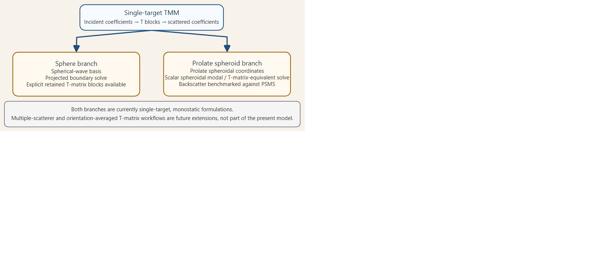

# Overview

```{r model_family_header, echo=FALSE, results='asis'}
acousticTS:::.model_family_header(
  family = "tmm",
  pages = c(
    Overview = "index.html",
    Implementation = "tmm-implementation.html",
    Theory = "tmm-theory.html"
  )
)
```


These pages follow the coefficient-map view of scattering and later numerical implementations for axisymmetric bodies [@waterman_new_1969; @waterman_t_2009; @ganesh_numerically_2022].

```{r tmm_overview, echo=FALSE, results='asis'}
acousticTS:::.model_family_overview(
  family = "tmm",
  summary = paste(
    "The transition matrix method (`TMM`) is the package's current",
    "single-target bridge between exact modal-series solvers and broader",
    "angle-dependent scattering products."
  ),
  core_idea = paste(
    "Represent the incident and scattered fields in complete modal bases and",
    "solve for the linear map between those coefficient vectors. In the",
    "supported package scope, that gives a reusable single-target retained state",
    "for monostatic target strength and, where externally constrained, for",
    "general-angle or orientation-averaged post-processing."
  ),
  best_for = c(
    "Single-target axisymmetric scattering problems that need more than one post-processed product from one solve",
    "Sphere, oblate spheroid, and prolate spheroid problems with retained scattering products",
    "Geometry-specific comparisons between exact modal families and a T-matrix viewpoint"
  ),
  supports = c(
    "`Sphere`, `OblateSpheroid`, `ProlateSpheroid`, and guarded `Cylinder` branches",
    "Single homogeneous interiors under rigid, pressure-release, liquid-filled, and gas-filled boundaries",
    "Stored retained state for scattering slices, grids, diagnostics, and orientation averages where validated"
  ),
  assumptions = c(
    "Single-target scope only",
    "Geometry-specific basis choice rather than one universal retained operator for every shape",
    "Cylinder branch has narrower validated scope than sphere, oblate, and prolate branches"
  ),
  reading = c(
    "[Implementation](tmm-implementation.html): stored-state workflows, plots, benchmarks, and supported scope",
    "[Theory](tmm-theory.html): T-matrix interpretation, boundary operators, and geometry-matched bases"
  )
)
```


