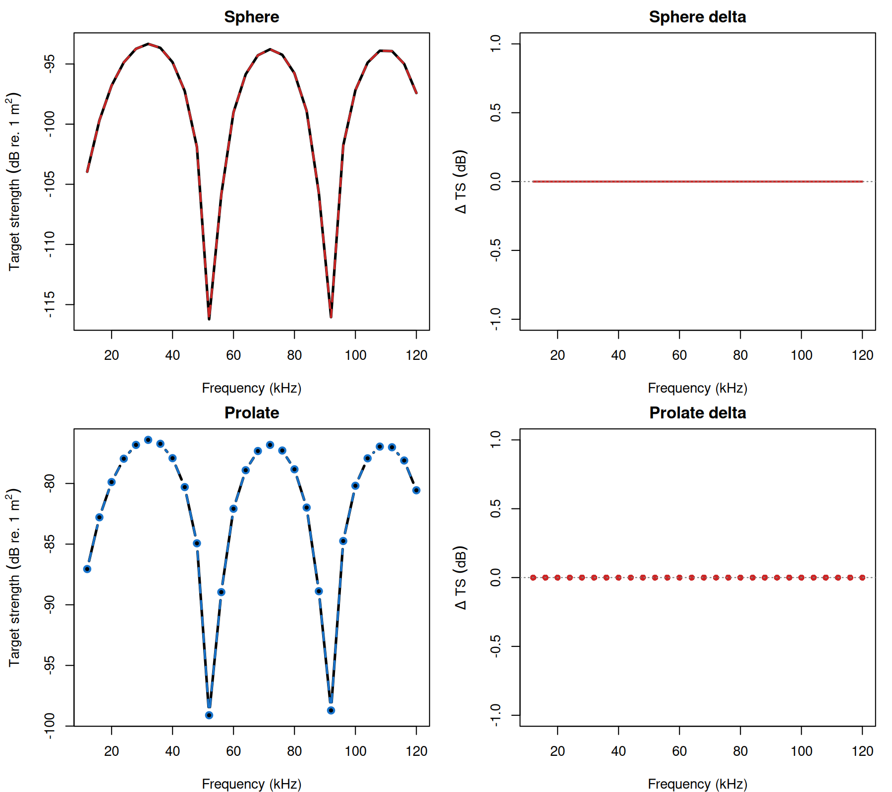
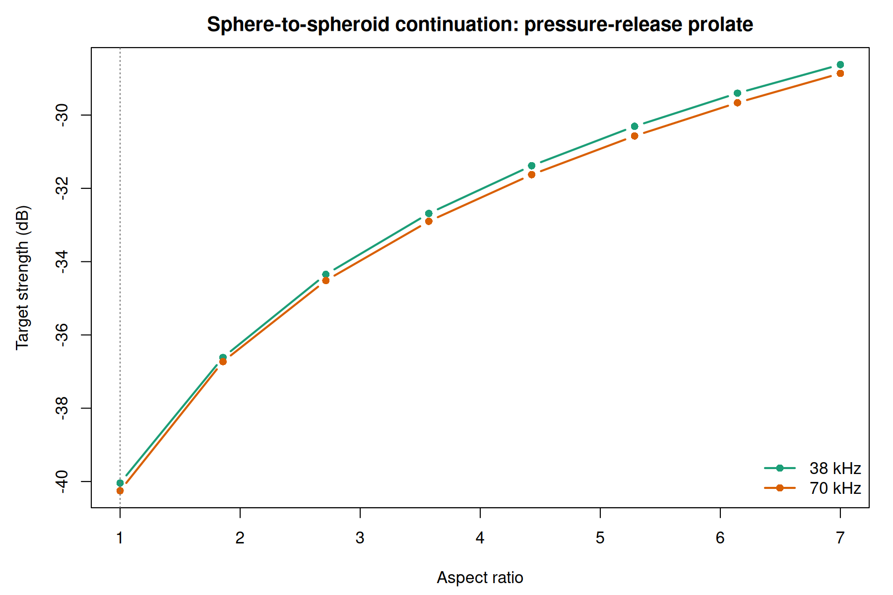
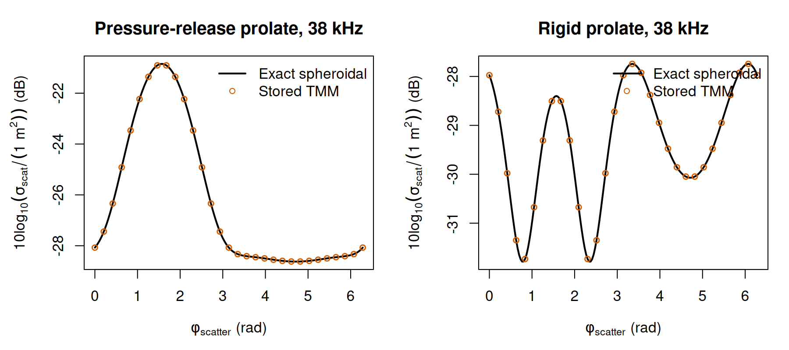
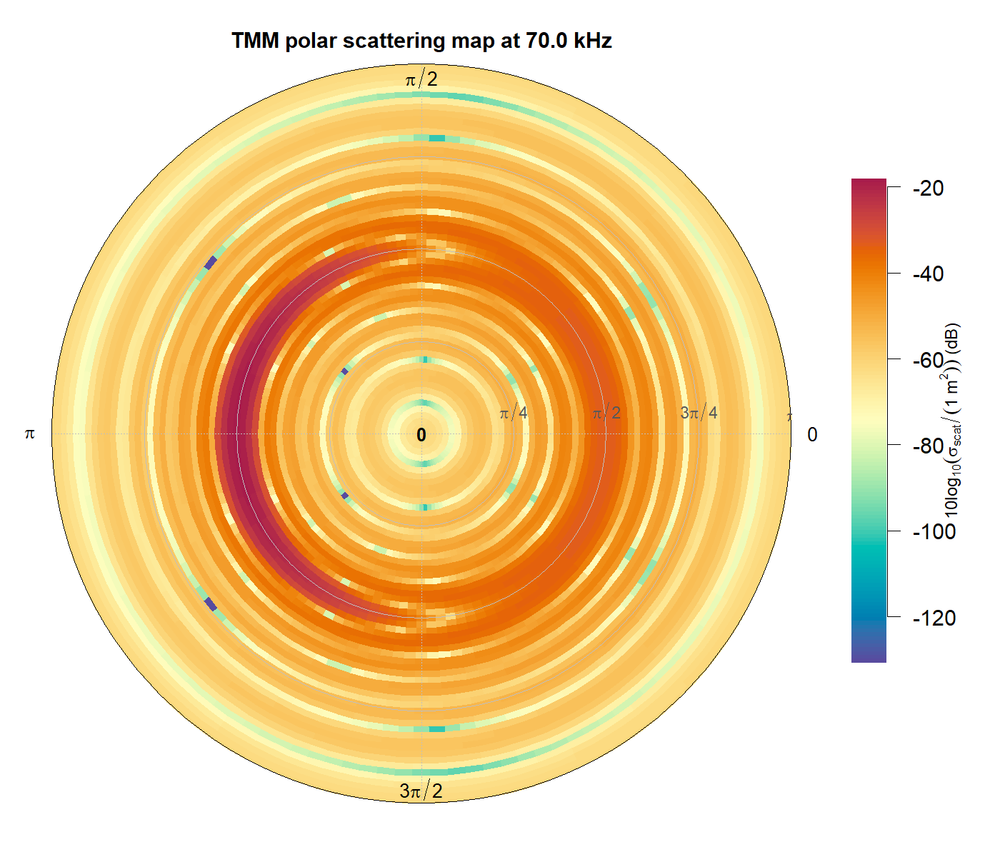

# Benchmarks

```{r model_family_header, echo=FALSE, results='asis'}
acousticTS:::.model_family_header(
  family = "tmm",
  pages = c(
    Overview = "index.html",
    Theory = "tmm-theory.html",
    Implementation = "tmm-implementation.html",
    Benchmarks = "tmm-benchmarks.html",
    Validation = "tmm-validation.html"
  )
)
```

The TMM benchmark ladder is shape-specific: spheres are compared with `SPHMS`, prolates with `PSMS`, and finite cylinders with `FCMS`. Shell-sphere cases are compared against the published shell-sphere reference used for ESSMS.

## Benchmark tables

::: {.panel-tabset}

### Sphere

| $a$ (mm) | Boundary | $\max \vert \Delta TS \vert$ SPHMS (dB) | $\vert \overline{\Delta TS} \vert$ SPHMS (dB) |
|:--|:--|--:|--:|
| `5` | `fixed_rigid` | `1.66e-11` | `1.95e-12` |
| `5` | `pressure_release` | `1.76e-11` | `1.76e-12` |
| `5` | `liquid_filled` | `4.19e-11` | `6.17e-12` |
| `5` | `gas_filled` | `1.75e-11` | `1.75e-12` |
| `10` | `fixed_rigid` | `2.37e-10` | `2.75e-11` |
| `10` | `pressure_release` | `2.44e-10` | `2.91e-11` |
| `10` | `liquid_filled` | `1.15e-10` | `1.74e-11` |
| `10` | `gas_filled` | `2.45e-10` | `2.86e-11` |

### Oblate

| Boundary | $\max \vert \Delta TS \vert$ SPHMS limit (dB) | $\vert \overline{\Delta TS} \vert$ SPHMS limit (dB) |
|:--|--:|--:|
| `fixed_rigid` | `3.60e-10` | `4.97e-11` |
| `pressure_release` | `3.12e-10` | `5.06e-11` |
| `liquid_filled` | `1.09e-10` | `1.92e-11` |
| `gas_filled` | `3.12e-10` | `5.07e-11` |

### Prolate

| $L$ (mm) | $a$ (mm) | Boundary | $\max \vert \Delta TS \vert$ PSMS (dB) | $\vert \overline{\Delta TS} \vert$ PSMS (dB) |
|:--|:--|:--|--:|--:|
| `60` | `8` | `fixed_rigid` | `0.00000` | `0.00000` |
| `60` | `8` | `pressure_release` | `0.00000` | `0.00000` |
| `60` | `8` | `liquid_filled` | `0.00000` | `0.00000` |
| `60` | `8` | `gas_filled` | `0.00000` | `0.00000` |
| `140` | `10` | `fixed_rigid` | `0.00000` | `0.00000` |
| `140` | `10` | `pressure_release` | `0.00000` | `0.00000` |
| `140` | `10` | `liquid_filled` | `0.00000` | `0.00000` |
| `140` | `10` | `gas_filled` | `0.00000` | `0.00000` |

### Cylinder

| $L$ (mm) | $a$ (mm) | Boundary | $\max \vert \Delta TS \vert$ FCMS (dB) | $\vert \overline{\Delta TS} \vert$ FCMS (dB) |
|:--|:--|:--|--:|--:|
| `70` | `10` | `fixed_rigid` | `0.00e+00` | `0.00e+00` |
| `70` | `10` | `pressure_release` | `0.00e+00` | `0.00e+00` |
| `70` | `10` | `liquid_filled` | `0.00e+00` | `0.00e+00` |
| `70` | `10` | `gas_filled` | `0.00e+00` | `0.00e+00` |
| `50` | `8` | `fixed_rigid` | `3.55e-15` | `5.08e-16` |
| `50` | `8` | `pressure_release` | `0.00e+00` | `0.00e+00` |
| `50` | `8` | `liquid_filled` | `0.00e+00` | `0.00e+00` |
| `50` | `8` | `gas_filled` | `0.00e+00` | `0.00e+00` |

:::

## Representative spectra

```{r echo=FALSE, out.width='85%', fig.align='center', fig.alt="Two-panel representative TMM benchmarks: liquid-filled sphere against SPHMS and liquid-filled prolate spheroid against PSMS."}

```

```{r echo=FALSE, out.width='85%', fig.align='center', fig.alt='TMM orientation-averaged spectrum benchmark figure.'}
knitr::include_graphics("tmm-orientation-average-spectrum.png")
```

<details>
<summary>Benchmark branch and continuation figures</summary>

```{r echo=FALSE, out.width='85%', fig.align='center', fig.alt='TMM sphere-to-spheroid continuation benchmark figure.'}

```

```{r echo=FALSE, out.width='85%', fig.align='center', fig.alt='TMM prolate exact angular benchmark figure.'}

```

</details>

<details>
<summary>Stored scattering benchmark maps</summary>

```{r echo=FALSE, out.width=c('49%','49%'), fig.align='center', fig.alt='TMM pressure-release sphere heatmap and polar scattering benchmark maps.'}
knitr::include_graphics(c("tmm-sphere-heatmap.png", "tmm-sphere-polar.png"))
```

```{r echo=FALSE, out.width=c('49%','49%'), fig.align='center', fig.alt='TMM liquid-filled oblate heatmap and polar scattering benchmark maps.'}
knitr::include_graphics(c("tmm-oblate-heatmap.png", "tmm-oblate-polar.png"))
```

```{r echo=FALSE, out.width=c('49%','49%'), fig.align='center', fig.alt='TMM liquid-filled prolate heatmap and polar scattering benchmark maps.'}
knitr::include_graphics(c("tmm-prolate-heatmap.png", "tmm-prolate-polar.png"))
```

```{r echo=FALSE, out.width='85%', fig.align='center', fig.alt='TMM bistatic polar scattering map benchmark figure.'}

```

```{r echo=FALSE, out.width='85%', fig.align='center', fig.alt='TMM angular scattering slice benchmark figure.'}
knitr::include_graphics("tmm-scattering-slice.png")
```

</details>
