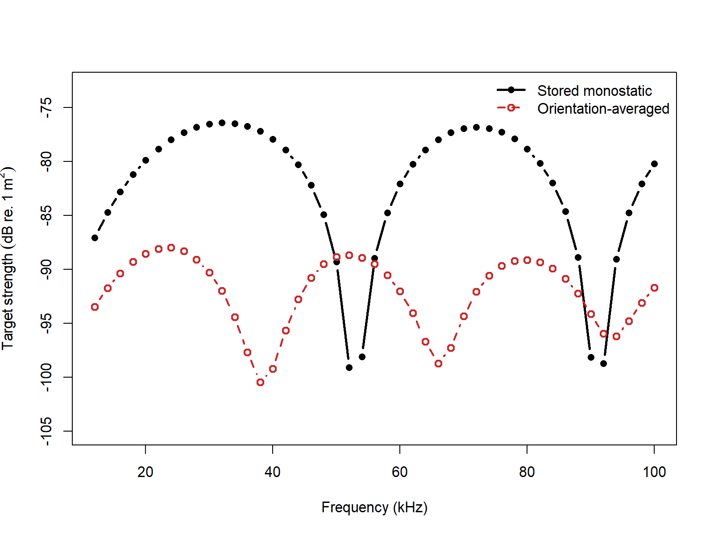
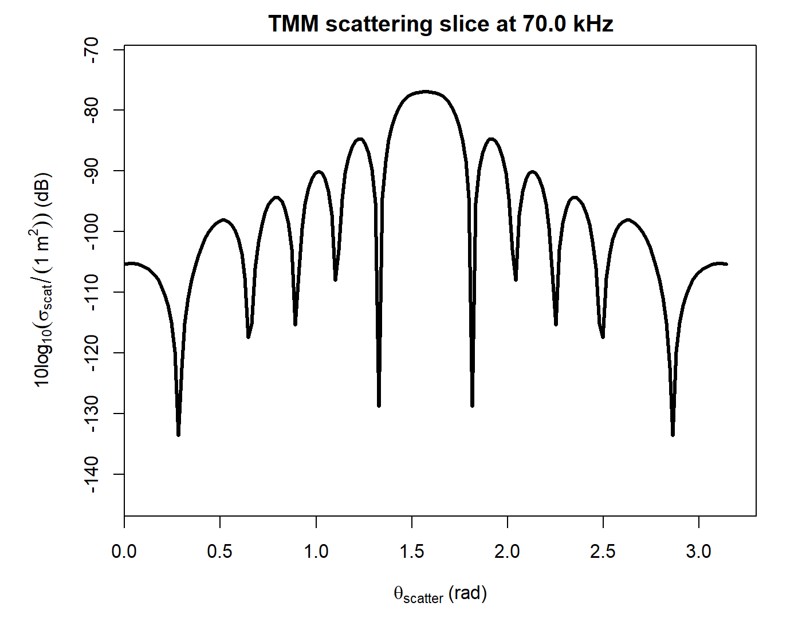
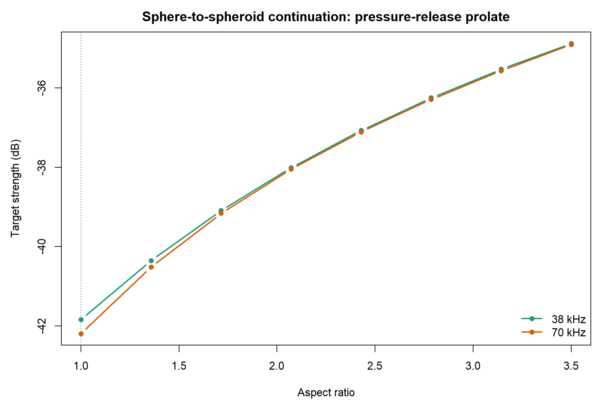
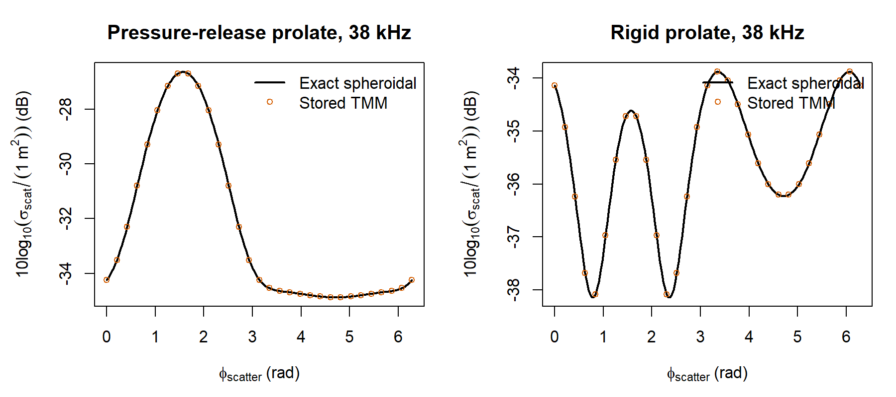
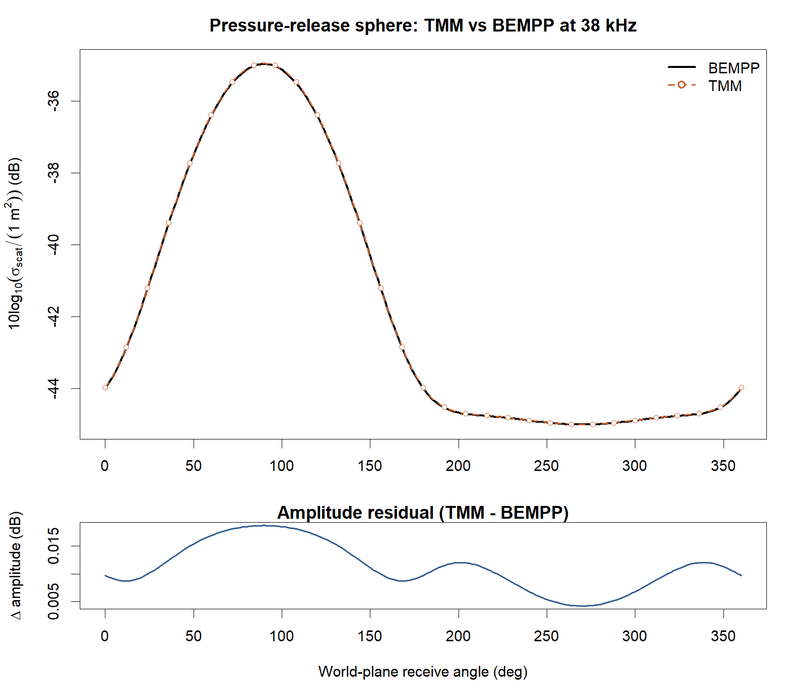
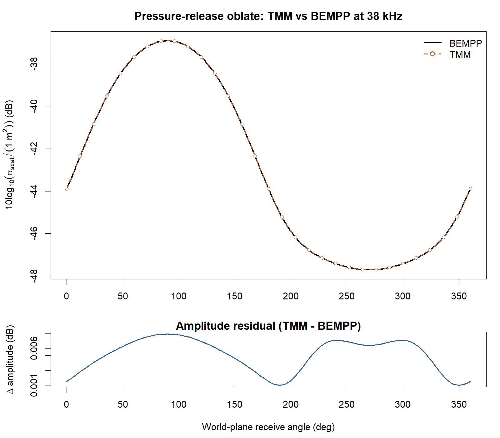
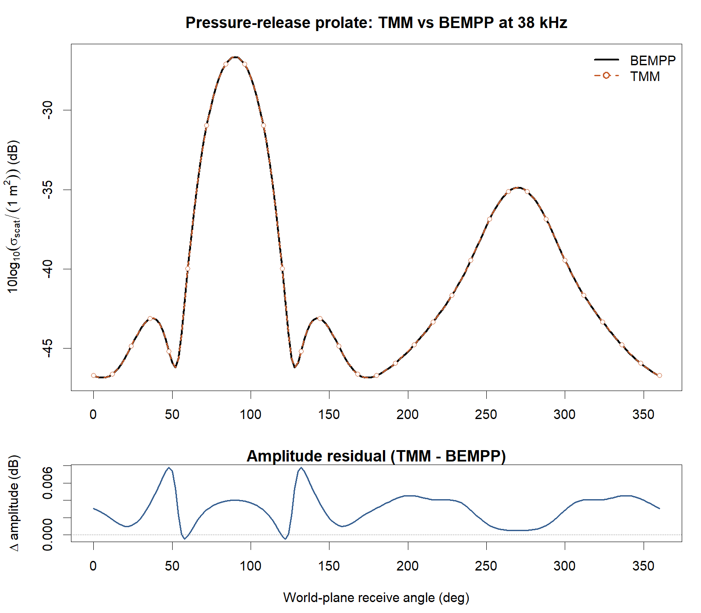
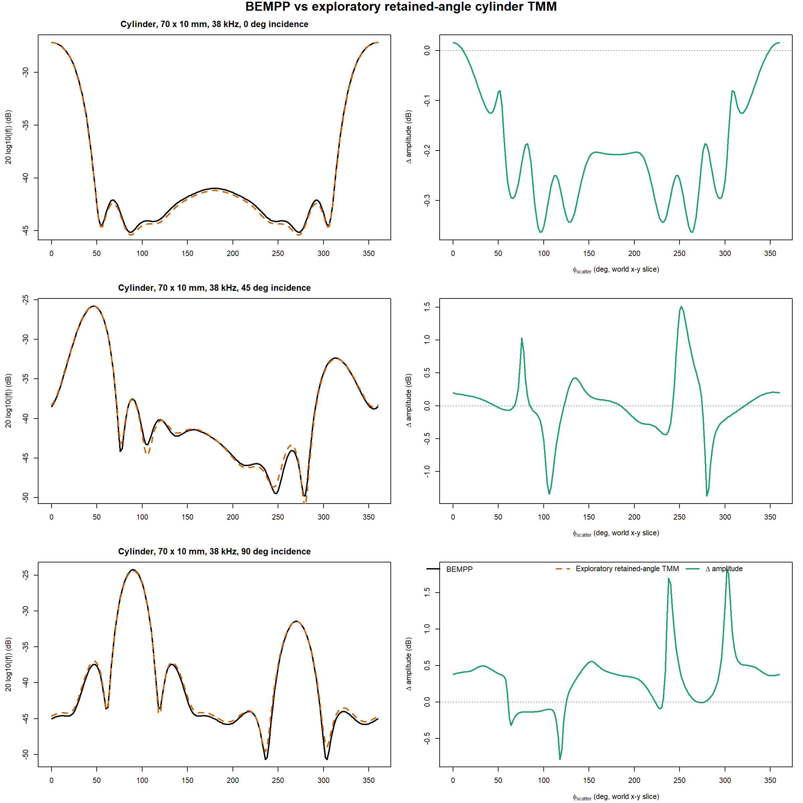
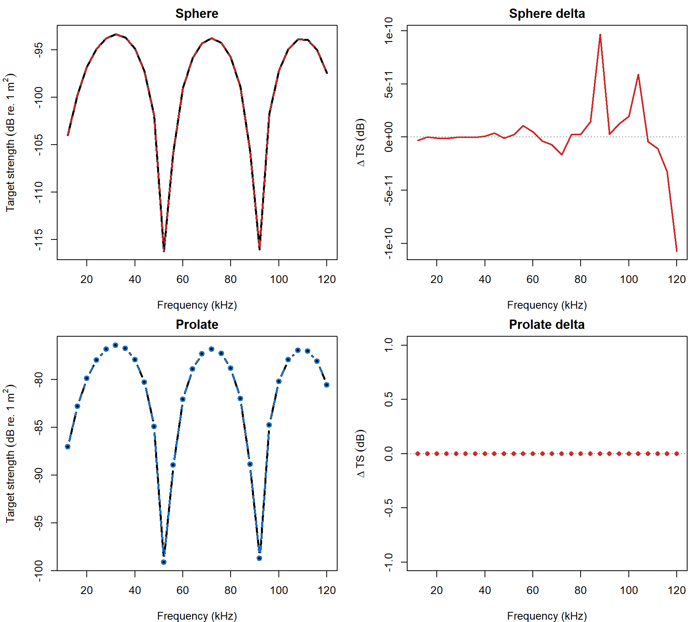

# acousticTS implementation

```{r model_family_header, echo=FALSE, results='asis'}
acousticTS:::.model_family_header(
  family = "tmm",
  pages = c(
    Overview = "index.html",
    Implementation = "tmm-implementation.html",
    Theory = "tmm-theory.html"
  )
)
```


These pages follow the coefficient-map view of scattering and later numerical implementations for axisymmetric bodies [@waterman_new_1969; @waterman_t_2009; @ganesh_numerically_2022].

The acousticTS package uses object-based scatterers, so the `TMM` workflow follows the same broad structure used elsewhere in the package: define the geometry, attach the material interpretation, evaluate target strength over the frequency range of interest, and then inspect the returned response carefully enough to understand what the model is actually buying you.

## Why use `TMM` over `SPHMS` or `PSMS`?

For the currently supported canonical shapes, `TMM` is not primarily about producing a different target-strength answer from `SPHMS`, `PSMS`, or `FCMS`. In the exact or sanity-checked single-target cases documented here, it should reduce to those shape-specific families. The reason to use `TMM` is that it organizes the scattering problem around an incident-to-scattered coefficient map rather than only around a monostatic backscatter formula. That makes it the natural family to extend later toward stored T-matrix blocks, bistatic scattering, orientation averaging, and eventually multi-target workflows.

In other words:

1. if the goal is only a sphere target-strength calculation, `SPHMS` remains the more direct exact model,
2. if the goal is only a prolate-spheroid target-strength calculation, `PSMS` remains the more direct exact model,
3. if the goal is only a finite-cylinder target-strength calculation, `FCMS` remains the more direct exact model even though the default monostatic cylinder branch in `TMM` is benchmark-matched to it, and
4. if the goal is to stay inside a transition-matrix framework that can grow into broader scattering workflows while using one common post-processing layer across spheres, spheroids, and cylinders, `TMM` is the relevant model family.

::: {.caution data-title="Cylinder TMM scope"}
The current `TMM` cylinder branch is intentionally narrower than the sphere, oblate, and prolate branches. The default monostatic path is benchmark-matched to `FCMS`, but full retained-angle cylinder grids and bistatic summaries are still outside the validated public scope.
:::

## Object generation

```{r}
library(acousticTS)

density_sw <- 1026.8
sound_speed_sw <- 1477.3

sphere_shape <- sphere(radius_body = 0.01)
oblate_shape <- oblate_spheroid(
  length_body = 0.012,
  radius_body = 0.01,
  n_segments = 80
)
prolate_shape <- prolate_spheroid(
  length_body = 0.14,
  radius_body = 0.01,
  n_segments = 80
)
cylinder_shape <- cylinder(
  length_body = 0.07,
  radius_body = 0.01,
  n_segments = 80
)

sphere_object <- fls_generate(
  shape = sphere_shape,
  density_body = 1028.9,
  sound_speed_body = 1480.3,
  theta_body = pi / 2
)

oblate_object <- fls_generate(
  shape = oblate_shape,
  density_body = 1028.9,
  sound_speed_body = 1480.3,
  theta_body = pi / 2
)

prolate_object <- fls_generate(
  shape = prolate_shape,
  density_body = 1028.9,
  sound_speed_body = 1480.3,
  theta_body = pi / 2
)

cylinder_object <- fls_generate(
  shape = cylinder_shape,
  density_body = 1028.9,
  sound_speed_body = 1480.3,
  theta_body = pi / 2
)
```

The setup looks like the other exact families in the package: build a shape, generate a homogeneous scatterer, and then call `target_strength()`. The practical difference is that `TMM` keeps the calculation inside a transition-matrix viewpoint rather than only inside a direct modal-series viewpoint. The currently documented shape set is:

1. `Sphere`
2. `OblateSpheroid`
3. `ProlateSpheroid`
4. `Cylinder`

## Calculating a TS-frequency spectrum

```{r}
sphere_object <- target_strength(
  object = sphere_object,
  frequency = seq(12e3, 120e3, by = 12e3),
  model = "tmm",
  boundary = "liquid_filled",
  density_sw = density_sw,
  sound_speed_sw = sound_speed_sw
)

prolate_object <- target_strength(
  object = prolate_object,
  frequency = c(12e3, 18e3, 38e3, 70e3, 100e3),
  model = "tmm",
  boundary = "liquid_filled",
  density_sw = density_sw,
  sound_speed_sw = sound_speed_sw
)

sphere_object@model$TMM
prolate_object@model$TMM
```

This step is intentionally similar to the other exact families. The important part is not that the call looks unfamiliar. It is that the stored result now comes from a T-matrix-centered model family. For spheres, the reported `n_max` is the retained spherical-wave cutoff. For prolates, the reported `n_max` is inherited from the exact spheroidal retained system and should therefore be interpreted as the size of the retained spheroidal solve rather than as a spherical-wave truncation limit.

## Extracting model results

Model results can be extracted either visually or directly through `extract()`.

### Plotting results

```{r echo=FALSE, out.width=c('49%','49%'), fig.align='center', fig.alt='Pre-rendered TMM example plots showing the sphere geometry and its stored target-strength spectrum.'}
knitr::include_graphics(c("tmm-shape-plot.png", "tmm-model-plot.png"))
```

### Accessing results

```{r}
tmm_results <- extract(sphere_object, "model")$TMM
head(tmm_results)
```

At this stage, the main thing to confirm is that `TMM` is reproducing the expected exact-family response for the chosen geometry rather than drifting away from it. That is especially important for a model family like this one, because the main value of the transition-matrix formulation is not that it should disagree with `SPHMS` or `PSMS` on canonical shapes. It is that it should reproduce them while retaining the more general transition-matrix bookkeeping.

### Explicit T-matrix storage

Explicit per-frequency T-matrix block storage is available for both supported geometry branches.

```{r}
sphere_store <- target_strength(
  object = fls_generate(
    shape = sphere(radius_body = 0.01, n_segments = 80),
    g_body = 1,
    h_body = 1,
    theta_body = pi / 2
  ),
  frequency = 38e3,
  model = "tmm",
  boundary = "pressure_release",
  density_sw = density_sw,
  sound_speed_sw = sound_speed_sw,
  store_t_matrix = TRUE
)

length(sphere_store@model_parameters$TMM$parameters$t_matrix[[1]])
```

For prolate spheroids, the stored blocks live in the same `@model_parameters$TMM$parameters$t_matrix` slot and can be reused through helpers such as `tmm_scattering()`, `tmm_average_orientation()`, `tmm_bistatic_summary()`, and `tmm_products()` without rebuilding the retained modal solve. Cylinders can also be stored, but the retained cylinder state is intentionally narrower: it reuses the exact geometry-matched cylindrical family only for exact monostatic evaluations and orientation-averaged monostatic products. Full general-angle cylinder grids and bistatic summaries are not exposed yet because a validated retained cylinder angular operator is still missing.

### Orientation averaging from stored blocks

One of the practical reasons to keep the result in a T-matrix framework is that the same stored blocks can be reused for other single-target summaries without rerunning the boundary solve. The simplest example is an orientation-averaged monostatic cross section.

```{r}
prolate_store <- target_strength(
  object = fls_generate(
    shape = prolate_spheroid(
      length_body = 0.14,
      radius_body = 0.01,
      n_segments = 80
    ),
    density_body = 1028.9,
    sound_speed_body = 1480.3,
    theta_body = pi / 2
  ),
  frequency = seq(12e3, 100e3, 2e3),
  model = "tmm",
  boundary = "liquid_filled",
  density_sw = density_sw,
  sound_speed_sw = sound_speed_sw,
  store_t_matrix = TRUE
)

orientation_dist <- tmm_orientation_distribution(
  distribution = "uniform",
  lower = 0.45 * pi,
  upper = pi,
  n_theta = 7
)

orientation_avg <- tmm_average_orientation(
  object = prolate_store,
  distribution = orientation_dist
)

orientation_avg
```

By default, `tmm_average_orientation()` assumes the exact monostatic receive direction for each supplied incident angle. So the helper is averaging the differential backscattering cross section over the chosen orientation distribution, not rebuilding the underlying T-matrix solve at every angle.

The distribution helper is there so the main orientation pathways stay explicit and standardized:

1. `distribution = "uniform"` creates a uniform distribution in `theta_body` over a bounded interval,
2. `distribution = "normal"` creates a normal distribution on `[0, pi]`,
3. `distribution = "truncated_normal"` creates a normal distribution restricted to `[lower, upper]`, and
4. `distribution = "quadrature"` or `distribution = "pdf"` lets the user supply their own angle grid and either direct weights or a density.

Because this helper is meant for monostatic orientation-averaged backscatter, its returned columns follow the same naming convention used elsewhere in the package: `sigma_bs` and `TS`.

```{r echo=FALSE, out.width='90%', fig.align='center', fig.alt='Pre-rendered comparison of the stored monostatic TMM spectrum and the orientation-averaged TMM spectrum for the liquid-filled prolate spheroid example.'}

```

The orientation-averaged line can sit far below the stored monostatic line, and that is not a bug by itself. The stored monostatic spectrum in this example is the broadside response of one fixed orientation, while the orientation-averaged spectrum is a linear average of `sigma_bs` over a wide range of body angles. For a long prolate spheroid, broadside is typically much stronger than the more oblique and near-end-on views, so the average can be many decibels lower than the broadside-only curve.

### Angular scattering slices from stored blocks

The same stored blocks can also be sent through `plot(..., type = "scattering")` to inspect a single angular slice of the far-field response at a chosen stored frequency.

```{r echo=FALSE, out.width='85%', fig.align='center', fig.alt="Angular TMM scattering slice for a stored liquid-filled prolate spheroid at 70 kHz, plotted as differential scattering cross section in dB versus receive polar angle."}

```

This is useful when the question is no longer just "what is the monostatic target strength?" but also "how does the same stored transition matrix distribute scattering over receive angle at a fixed frequency?" That is exactly the kind of post-processing that is natural in a T-matrix workflow and comparatively awkward in the purely direct exact-family formulations.

All of the `tmm_scattering()`-style helpers use the **body-fixed angular coordinates** of the canonical axisymmetric target, not arbitrary world-frame directions. For the built-in prolate, oblate, and cylinder shapes in acousticTS, the symmetry axis is the body `x`-axis. So when these helpers are compared against an external BEM/FEM slice generated in a world `x-y` plane, the world directions need to be converted to the body-fixed `(\theta, \phi)` convention before the comparison is apples-to-apples.

### Higher-level bistatic summaries

Once the stored blocks are available, the next natural step is to move beyond individual points and slices and ask for higher-level bistatic summaries. For the current package build, that applies to the spherical and spheroidal stored branches. `tmm_bistatic_summary()` does that for one stored frequency by returning:

1. a forward-centered great-circle slice,
2. an orthogonal dorsal/ventral-style great-circle slice,
3. the peak-scattering direction on a 2D receive-angle grid,
4. the exact monostatic backscatter value,
5. a `-3 dB` backscatter-lobe width measured on the forward-centered slice, and
6. integrated scattering over coarse angular sectors measured relative to the forward direction.

```{r}
summary_70 <- tmm_bistatic_summary(
  object = prolate_store,
  frequency = 70e3,
  n_theta = 21,
  n_phi = 41,
  n_psi = 41
)

summary_70$metrics
summary_70$sector_integrals
```

Those summary products are not new physics. They are just structured reuses of the same stored T-matrix blocks. That makes them a good sanity-check layer: the exact monostatic value reported by `summary_70$metrics$TS` should agree with the monostatic `TS` already stored on the object at `70 kHz`.

### Single solved target, many post-process products

The separate helpers are useful when only one post-processing product is needed. But the broader T-matrix workflow is often "solve once, then ask for several things." The higher-level `tmm_products()` wrapper is meant for exactly that pattern.

```{r}
products_70 <- tmm_products(
  object = prolate_store,
  frequency = 70e3,
  orientation = orientation_dist,
  bistatic_summary = TRUE,
  n_theta = 21,
  n_phi = 41,
  n_psi = 41
)

names(products_70)
products_70$bistatic_summary$metrics
```

This is closer to the real reason for keeping a T-matrix-based representation around. The workflow is no longer "get one monostatic spectrum and stop." It becomes "solve the target once, then reuse the stored operator for monostatic, orientation-averaged, and bistatic products."

### Bistatic scattering grids and polar maps

For two-dimensional receive-angle views, the stored blocks can be reused through `tmm_scattering_grid()` or displayed directly through `plot(..., type = "scattering", polar = TRUE)` or `plot(..., type = "scattering", heatmap = TRUE)`. The implementation page uses pre-rendered figures for those heavier views so the article stays lightweight to build.

The vignette embeds pre-rendered examples here so the implementation page does not need to rebuild the heavier two-dimensional scattering figures every time it is rendered. The current gallery covers the stored branches that actually support angular grids: `Sphere`, `OblateSpheroid`, and `ProlateSpheroid`. `Cylinder` is intentionally omitted because the retained-cylinder path currently stops at exact monostatic reuse and orientation-averaged monostatic products.

### Shape gallery
::: {.panel-tabset}

#### Sphere
These two views show the stored pressure-release sphere at `70 kHz`. The heatmap uses the direct ($\phi_\text{scatter}$, $\theta_\text{scatter}$) grid, while the polar map wraps the same grid into a circular view.

```{r echo=FALSE, out.width=c('49%','49%'), fig.align='center', fig.alt='Pre-rendered TMM scattering maps for the stored pressure-release sphere at 70 kHz. The left panel is a heatmap in phi-scatter and theta-scatter, and the right panel is the corresponding polar map.'}
knitr::include_graphics(c("tmm-sphere-heatmap.png", "tmm-sphere-polar.png"))
```

#### Oblate
These two views show the stored liquid-filled oblate spheroid at `70 kHz`, which is a useful intermediate case because it still uses the spherical-coordinate retained branch but no longer has the exact spherical symmetry of the sphere.

```{r echo=FALSE, out.width=c('49%','49%'), fig.align='center', fig.alt='Pre-rendered TMM scattering maps for the stored liquid-filled oblate spheroid at 70 kHz. The left panel is a heatmap in phi-scatter and theta-scatter, and the right panel is the corresponding polar map.'}
knitr::include_graphics(c("tmm-oblate-heatmap.png", "tmm-oblate-polar.png"))
```

#### Prolate
These two views show the stored liquid-filled prolate spheroid at `70 kHz`, which is the geometry where the retained spheroidal angular operator is most directly useful.

```{r echo=FALSE, out.width=c('49%','49%'), fig.align='center', fig.alt='Pre-rendered TMM scattering maps for the stored liquid-filled prolate spheroid at 70 kHz. The left panel is a heatmap in phi-scatter and theta-scatter, and the right panel is the corresponding polar map.'}
knitr::include_graphics(c("tmm-prolate-heatmap.png", "tmm-prolate-polar.png"))
```

In each polar view, the radius is the scattering polar angle `theta_scatter`, not physical distance from the target. So the center corresponds to `theta_scatter = 0`, the outer ring corresponds to `theta_scatter = pi`, and the target itself is not drawn as a literal object at the origin.

:::
## Benchmark comparisons

The benchmark ladder is intentionally shape-specific and follows the exact-family references already used elsewhere in the package.

- Sphere cases are compared against `SPHMS`
- Oblate spheroids are checked through both the exact sphere limit and an external pressure-release BEMPP far-field slice for a genuinely nonspherical oblate case
- Prolate spheroid cases are compared against `PSMS`
- Cylinder cases are compared against `FCMS` for the default monostatic branch, now extended through `200 kHz` on the tested grids

Those broad checks were run over multiple shapes and multiple frequency grids rather than just one canonical example, but the resulting summary tables are kept static here so the implementation page remains lightweight to build.

### Benchmark tables
::: {.panel-tabset}

#### Sphere

Spherical models were benchmarked against `SPHMS` over `12:120 by 4` kHz for `a = 5`, `10`, and `18 mm`.

| $a$ (mm) | Boundary | $\max \vert \Delta TS \vert ~ (\text{dB})$ | $\vert \overline{\Delta TS} \vert ~ (\text{dB})$ | $t_\text{TMM} (\text{s})$ | $t_\text{SPHMS} (\text{s})$ |
|:--|:--|--:|--:|--:|--:|
| `5` | `fixed_rigid` | `1.66e-11` | `1.95e-12` | `0.27` | `0.03` |
| `5` | `pressure_release` | `1.76e-11` | `1.77e-12` | `0.31` | `0.07` |
| `5` | `liquid_filled` | `2.26e-11` | `4.04e-12` | `0.39` | `0.01` |
| `5` | `gas_filled` | `1.75e-11` | `1.75e-12` | `0.47` | `0.03` |
| `10` | `fixed_rigid` | `2.37e-10` | `2.75e-11` | `0.50` | `0.00` |
| `10` | `pressure_release` | `2.44e-10` | `2.91e-11` | `0.56` | `0.02` |
| `10` | `liquid_filled` | `1.14e-10` | `1.67e-11` | `0.75` | `0.02` |
| `10` | `gas_filled` | `2.45e-10` | `2.86e-11` | `0.78` | `0.01` |
| `18` | `fixed_rigid` | `7.62e-10` | `8.32e-11` | `1.03` | `0.01` |
| `18` | `pressure_release` | `7.91e-10` | `8.49e-11` | `1.06` | `0.00` |
| `18` | `liquid_filled` | `4.59e-09` | `2.36e-10` | `1.47` | `0.02` |
| `18` | `gas_filled` | `8.46e-10` | `8.71e-11` | `1.53` | `0.00` |

#### Oblate

Oblate sphere-limit checks used three equal-volume radii and compared against the `SPHMS` sphere limit at `12`, `38`, `70`, and `120 kHz`.

| Boundary | $\max \vert \Delta TS \vert ~ (\text{dB})$ | $\vert \overline{\Delta TS} \vert ~ (\text{dB})$ | $t_\text{TMM} (\text{s})$ | $t_\text{SPHMS} (\text{s})$ |
|:--|--:|--:|--:|--:|
| `fixed_rigid` | `3.60e-10` | `4.97e-11` | `0.11` | `0.05` |
| `pressure_release` | `3.12e-10` | `5.06e-11` | `0.12` | `0.00` |
| `liquid_filled` | `1.04e-10` | `2.02e-11` | `0.15` | `0.02` |
| `gas_filled` | `3.12e-10` | `5.07e-11` | `0.23` | `0.00` |

#### Prolate

Prolate models were benchmarked against `PSMS`. The `60 x 8 mm` case used `12`, `18`, `38`, `70`, `100`, and `150 kHz`, while the `140 x 10 mm` case used `12`, `18`, `38`, `70`, and `100 kHz`.

| $L$ (mm) | $a$ (mm) | Boundary | $\max \vert \Delta TS \vert ~ (\text{dB})$ | $\vert \overline{\Delta TS} \vert ~ (\text{dB})$ | $t_\text{TMM} (\text{s})$ | $t_\text{PSMS} (\text{s})$ |
|:--|:--|:--|--:|--:|--:|--:|
| `60` | `8` | `fixed_rigid` | `0.00000` | `0.00000` | `0.03` | `0.08` |
| `60` | `8` | `pressure_release` | `0.00000` | `0.00000` | `0.03` | `0.02` |
| `60` | `8` | `liquid_filled` | `0.00000` | `0.00000` | `2.50` | `1.83` |
| `60` | `8` | `gas_filled` | `0.00000` | `0.00000` | `2.39` | `2.53` |
| `140` | `10` | `fixed_rigid` | `0.00000` | `0.00000` | `0.03` | `0.02` |
| `140` | `10` | `pressure_release` | `0.00000` | `0.00000` | `0.02` | `0.02` |
| `140` | `10` | `liquid_filled` | `0.00000` | `0.00000` | `2.81` | `2.23` |
| `140` | `10` | `gas_filled` | `0.00000` | `0.00000` | `2.70` | `2.81` |

#### Cylinder

Cylinders were benchmarked against `FCMS` over `12`, `18`, `38`, `70`, `100`, `150`, and `200 kHz`.

| $L$ (mm) | $a$ (mm) | Boundary | $\max \vert \Delta TS \vert ~ (\text{dB})$ | $\vert \overline{\Delta TS} \vert ~ (\text{dB})$ | $t_\text{TMM} (\text{s})$ | $t_\text{FCMS} (\text{s})$ |
|:--|:--|:--|--:|--:|--:|--:|
| `70` | `10` | `fixed_rigid` | `0.00e+00` | `0.00e+00` | `0.011` | `0.004` |
| `70` | `10` | `pressure_release` | `0.00e+00` | `0.00e+00` | `0.001` | `0.000` |
| `70` | `10` | `liquid_filled` | `0.00e+00` | `0.00e+00` | `0.009` | `0.001` |
| `70` | `10` | `gas_filled` | `0.00e+00` | `0.00e+00` | `0.002` | `0.004` |
| `50` | `8` | `fixed_rigid` | `3.55e-15` | `5.08e-16` | `0.000` | `0.000` |
| `50` | `8` | `pressure_release` | `0.00e+00` | `0.00e+00` | `0.001` | `0.000` |
| `50` | `8` | `liquid_filled` | `0.00e+00` | `0.00e+00` | `0.004` | `0.001` |
| `50` | `8` | `gas_filled` | `0.00e+00` | `0.00e+00` | `0.002` | `0.004` |

:::

These are intentionally not one-off canonical checks. The tables above sweep multiple shapes and frequency sets so the agreement is not just tied to one hand-picked sphere or one hand-picked prolate spheroid.

Two points matter most here.

1. The sphere branch behaves like a true spherical-coordinate T-matrix implementation and agrees with `SPHMS` to numerical precision on the tested grid.
2. The oblate branch collapses correctly onto the exact sphere solution in the sphere limit and also agrees closely with an external pressure-release BEMPP slice for a genuinely nonspherical oblate case.
3. The prolate branch now uses the geometry-matched spheroidal-coordinate backend, so the `TMM` and `PSMS` spectra coincide across the tested geometry and frequency sweep for all four supported scalar boundary types.
4. The default monostatic finite-cylinder branch now lands directly on `FCMS` across the tested geometry and frequency sweep because it uses the geometry-matched cylindrical modal backend, and the stored-cylinder path reuses that same backend only where the monostatic mapping is exact.

That fourth point is an **in-package exact-family consistency check**, not a claim that the cylinder branch is already externally closed against BEM/FEM over all angles. It means the current monostatic `TMM` cylinder branch and `FCMS` are now the same calculation family at the package level. The external cylinder discussion below is separate and is the reason the retained general-angle cylinder helpers remain disabled.

That benchmark pattern is exactly what one would want at this stage. The current TMM family is useful because it stays within a transition-matrix formulation while still landing on the correct exact-family answers for the canonical geometries it presently supports in the default monostatic workflow.

## Diagnostics and internal validation

Exact-family comparisons are the first validation ladder, but they are not the whole story for `TMM`. For the newer branches, it is also useful to check whether the retained operator is internally self-consistent. The `tmm_diagnostics()` helper does that by reusing the stored blocks and reporting:

1. monostatic reconstruction residuals,
2. reciprocity residuals under incident/receive-angle exchange,
3. an optical-theorem residual for the spherical-coordinate branch, and
4. block-level conditioning summaries.

For the rigid and pressure-release prolate branches, there is now an even tighter internal validator available during development: the stored-block `TMM` angular field can be checked directly against the exact general-angle spheroidal modal-series solution used by `PSMS`. That is the fastest way to constrain off-axis disagreements, because it removes external meshing and solver conventions from the loop and asks only whether the retained prolate operator reproduces the exact scalar spheroidal field at the same incident and receive angles.

```{r eval=FALSE}
diag_70 <- tmm_diagnostics(
  prolate_store,
  n_theta = 31,
  n_phi = 61
)

diag_70$summary
```

For this package build, independent BEMPP cross-checks were available for the pressure-release sphere, oblate, and prolate branches. The cylinder situation is different because the current retained-cylinder scope is intentionally monostatic-only. So the current validation ladder for the remaining newer branches combines:

1. exact-family checks where they exist (`SPHMS`, `PSMS`, `FCMS`),
2. limiting-case checks such as the oblate sphere limit, and
3. theorem-based diagnostics from the stored T-matrix blocks.

The table below shows representative diagnostic summaries for one stored object from each currently supported branch where $e$ is the residual.

| Case | $\mathscr{f}~(\text{kHz})$ | Max monostatic $e$ | Max reciprocity $e$ | Max optical-theorem $e$ | Min block `rcond` | Max block transpose $e$ |
|:--|:--|--:|--:|--:|--:|--:|
| sphere, `fixed_rigid` | `38, 70` | `2.55e-16` | `2.12e-16` | `1.24e-03` | `3.11e-09` | `1.93e-16` |
| oblate spheroid, `liquid_filled` | `38, 70` | `2.80e-16` | `1.14e-04` | `1.34e-03` | `2.24e-16` | `3.48e-01` |
| prolate spheroid, `liquid_filled` | `38, 70` | `3.28e-16` | `2.64e-12` | `NA` | `3.35e-47` | `1.15e-13` |
| finite cylinder, `fixed_rigid` | `38, 70` | `0.00e+00` | `NA` | `NA` | `NA` | `NA` |

Two points are worth emphasizing.

1. The sphere and prolate branches are numerically self-consistent to essentially machine precision on the tested grids.
2. The stored-cylinder branch is deliberately narrower than the sphere and prolate branches. It currently carries only the geometry-matched monostatic reuse path, so reciprocity and optical-theorem-style angular diagnostics are left as `NA` rather than being computed from an unvalidated cylinder grid operator.

## Sphere-to-spheroid continuation

For spheroidal targets, one of the most useful internal checks is to start from the equal-volume sphere limit and then deform the target smoothly to the requested aspect ratio. The monostatic response should move smoothly along that path. Abrupt jumps, non-finite values, or strong zig-zag second differences at modest aspect ratio are a sign that the truncation or angular reconstruction is not under control.

This check is now built into `tmm_diagnostics()` for prolate and oblate targets. The continuation is generated at constant volume, beginning from the exact sphere limit and stepping to the requested spheroidal aspect ratio.

The figure below shows the built-in continuation path for a pressure-release prolate spheroid with target aspect ratio `3.5`.

{fig-alt="Sphere-to-spheroid continuation path for a pressure-release prolate spheroid, showing target strength versus aspect ratio for 38 and 70 kHz. The curves begin at the exact sphere limit and deform smoothly to the target aspect ratio."}

The practical point is simple: this is a much faster development check than an external solver loop. It constrains whether the stored T-matrix branch behaves sensibly before external meshing, field normalization, or far-field extraction are even involved.

## Exact prolate angular validation

For the retained prolate branch, the most useful current validation is not a paper-style sketch and not an external mesh-based comparison. It is a direct check against the exact general-angle spheroidal solution already available in the package for rigid and pressure-release scalar prolates. That is the right apples-to-apples comparison because it uses:

1. the same geometry,
2. the same incident and receive-angle definitions,
3. the same scalar boundary conditions, and
4. the same far-field normalization.

So, for the current retained prolate `TMM` operator, the key question is simply whether `tmm_scattering()` reproduces the exact `prolate_spheroid_fbs()` field when both are evaluated at the same stored frequency and the same incident/receive angles.

The figure below shows that check for a rigid and a pressure-release prolate spheroid with `L = 70 mm`, `a = 10 mm`, broadside incidence, and a `38 kHz` equatorial receive-angle sweep. The line is the exact general-angle spheroidal solution and the open symbols are the stored-block `TMM` reconstruction.

{fig-alt="Two-panel exact-vs-stored validation figure for the retained prolate TMM branch. Each panel shows differential scattering cross section in decibels versus receive azimuth angle for a 70 mm by 10 mm prolate spheroid at 38 kHz and broadside incidence. The black line is the exact general-angle spheroidal solution and the orange open symbols are the stored-block TMM reconstruction. One panel is pressure-release and the other is fixed-rigid."}

This is a much stronger constraint on the current prolate branch than the earlier exploratory paper-style plots, because it directly tests the retained angular operator that powers `tmm_scattering()`, `tmm_scattering_grid()`, and the higher-level post-processing helpers.

That body-fixed angle convention also resolves the earlier mismatch with the exploratory BEMPP prolate slice. For the pressure-release prolate case with `L = 70 mm`, `a = 10 mm`, and `38 kHz`, the retained `TMM` branch and the external BEMPP far-field solution line up closely across the tested incidence angles:

| World-frame incidence (deg) | Max abs. delta amplitude (dB) | Mean abs. delta amplitude (dB) | Note |
|--:|--:|--:|:--|
| `0` | `0.0069` | `0.0033` | pressure-release, BEMPP far-field |
| `45` | `0.0076` | `0.0031` | pressure-release, BEMPP far-field |
| `90` | `0.0078` | `0.0030` | pressure-release, BEMPP far-field |

The same body-fixed/world-frame conversion is also important for the nonspherical oblate branch, which still uses the spherical-coordinate retained operator. For a pressure-release oblate with polar semiaxis `c = 6 mm` and equatorial semiaxis `a = 10 mm`, the corrected BEMPP comparison is likewise tight on the tested cases:

| Frequency (kHz) | World-frame incidence (deg) | Max abs. delta amplitude (dB) | Mean abs. delta amplitude (dB) | Validation note |
|--:|--:|--:|--:|:--|
| `38` | `0` | `0.0091` | `0.0054` | pressure-release, BEMPP far-field |
| `38` | `45` | `0.0083` | `0.0053` | pressure-release, BEMPP far-field |
| `38` | `90` | `0.0079` | `0.0051` | pressure-release, BEMPP far-field |
| `70` | `90` | `0.0091` | `0.0047` | pressure-release, BEMPP far-field |

By contrast, the same corrected BEMPP comparison also clarified why the current package does **not** expose a full retained-cylinder angular operator. Additional pressure-release cylinder checks were run at a second frequency and a second geometry, and the exploratory retained-cylinder angular reconstruction remained much less reliable than the sphere and prolate branches:

| $L$ (mm) | $a$ (mm) | Frequency (kHz) | World-frame incidence (deg) | Stored-cylinder `n_max` | Max abs. delta amplitude (dB) | Mean abs. delta amplitude (dB) |
|:--|:--|--:|--:|--:|--:|--:|
| `70` | `10` | `38` | `90` | `24` | `1.58` | `0.74` |
| `70` | `10` | `70` | `90` | `24` | `8.12` | `3.73` |
| `50` | `8` | `38` | `90` | `24` | `0.71` | `0.29` |

Those extra checks matter because they show the remaining cylinder issue is not just one broken benchmark file. A retained cylinder angular operator can sometimes be tuned to look better on a low-to-moderate-frequency case, but that improvement does not generalize cleanly once the frequency or geometry changes. So the external benchmark work now supports a more precise conclusion: the retained prolate branch is behaving correctly, while the cylinder family should currently stop at exact monostatic reuse and orientation-averaged monostatic products until a separate validated retained cylinder angular operator is built.

## External BEM validation figures

The BEMPP pressure-release slices are a useful second validation ladder because they are independent of the in-package exact-family models. The three figures below show the broadside `38 kHz` comparisons currently used to constrain the stored `TMM` angular operators.

For the sphere, the comparison is direct because the world-frame `x-y` slice and the body-fixed slice are identical by symmetry. For the oblate and prolate spheroids, the BEMPP world-frame slice is first converted to the same body-fixed angular convention used by `tmm_scattering()`. That frame conversion is what resolves the earlier apparent nonspherical mismatch.

### External BEM figures
::: {.panel-tabset}

#### Sphere

```{r echo=FALSE, out.width='85%', fig.align='center', fig.alt='Pre-rendered pressure-release sphere validation against BEMPP. The upper panel overlays the TMM and BEMPP angular scattering curves at 38 kHz for a 10 mm radius sphere, and the lower panel shows the amplitude residual in dB across the same receive-angle sweep.'}

```

#### Oblate

```{r echo=FALSE, out.width='85%', fig.align='center', fig.alt='Pre-rendered pressure-release oblate spheroid validation against BEMPP. The upper panel overlays the TMM and BEMPP angular scattering curves at 38 kHz for an oblate spheroid with 6 mm polar semiaxis and 10 mm equatorial semiaxis under broadside incidence, and the lower panel shows the amplitude residual in dB across the same receive-angle sweep after converting the BEMPP world-frame directions into the TMM body-fixed angle convention.'}

```

#### Prolate

```{r echo=FALSE, out.width='85%', fig.align='center', fig.alt='Pre-rendered pressure-release prolate spheroid validation against BEMPP. The upper panel overlays the TMM and BEMPP angular scattering curves at 38 kHz for a 70 mm by 10 mm prolate spheroid under broadside incidence, and the lower panel shows the amplitude residual in dB across the same receive-angle sweep after converting the BEMPP world-frame directions into the TMM body-fixed angle convention.'}

```

#### Cylinder

```{r echo=FALSE, out.width='92%', fig.align='center', fig.alt='Pre-rendered pressure-release cylinder comparison against BEMPP for the exploratory retained-angle cylinder TMM branch. The figure shows 38 kHz world-frame x-y slice comparisons at 0, 45, and 90 degree incidence, with BEMPP and exploratory retained-angle TMM overlays and the corresponding amplitude residual curves.'}

```

For the cylinder, the analogous full-angle figure is shown here only as a **constraint on the old exploratory retained-angle cylinder operator**. It is not documenting a currently supported public cylinder workflow. The point of the figure is to show why the package now refuses to provide full retained cylinder grids and bistatic summaries instead of pretending they are validated.

The current exact monostatic cylinder branch can still be compared to the same BEMPP slices at the single backscatter point. That sharper check makes the scope clearer:

| $L$ (mm) | $a$ (mm) | Frequency (kHz) | World-frame incidence (deg) | Backscatter-point delta amplitude (dB) | Interpretation |
|:--|:--|--:|--:|--:|:--|
| `70` | `10` | `38` | `90` | `-0.128` | broadside is the best current case here, but still above a `< 0.1 dB` target |
| `70` | `10` | `70` | `90` | `-0.063` | broadside falls below `0.1 dB` on this tested case |
| `50` | `8` | `38` | `90` | `-0.198` | smaller broadside case is still above a `< 0.1 dB` target |
| `70` | `10` | `38` | `45` | `-5.104` | oblique monostatic point is still not externally closed |
| `70` | `10` | `38` | `0` | `-272.091` | end-on pressure-release cylinder remains strongly inconsistent with BEMPP |

These figures make the external-validation story much more concrete:

1. the pressure-release sphere is externally calibrated to the BEMPP far-field solver,
2. the retained pressure-release oblate branch also agrees closely once the frame convention is matched correctly,
3. the retained pressure-release prolate branch also agrees closely once the frame convention is matched correctly,
4. the exploratory retained-angle cylinder branch does **not** agree externally and is therefore not part of the current public retained-cylinder workflow, and
5. even the current exact monostatic pressure-release cylinder branch is only externally close near broadside on the tested cases, so cylinder remains the least externally constrained `TMM` shape family and now emits a warning by default when used.

At this point, no direct paper-figure reproduction is claimed here for the prolate angular response. If a future paper-grounded reproduction is added, it needs to match the original paper's normalization, axes, and geometry conventions exactly rather than only mimicking the general visual style.

:::
## Representative spectra

```{r echo=FALSE, out.width='85%', fig.align='center', fig.alt="Two-panel representative TMM benchmarks: liquid-filled sphere against SPHMS over 12 to 120 kHz, and liquid-filled prolate spheroid against PSMS over 12, 18, 38, 70, and 100 kHz. The upper panels overlay the spectra and the lower panels show the TMM minus reference difference."}

```

The sphere figure is the more conventional benchmark story: a T-matrix implementation agreeing with the exact spherical modal solution. The prolate figure is really a geometry-consistency story: the current `TMM` family now lands on the exact spheroidal solution rather than drifting because of a mismatched basis.
