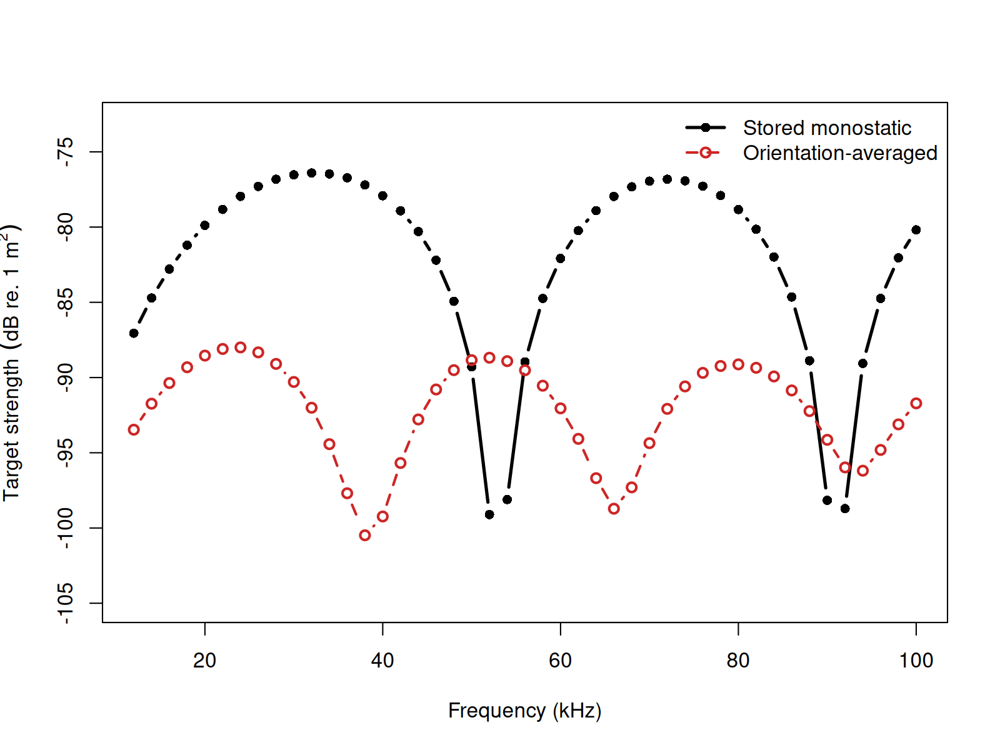
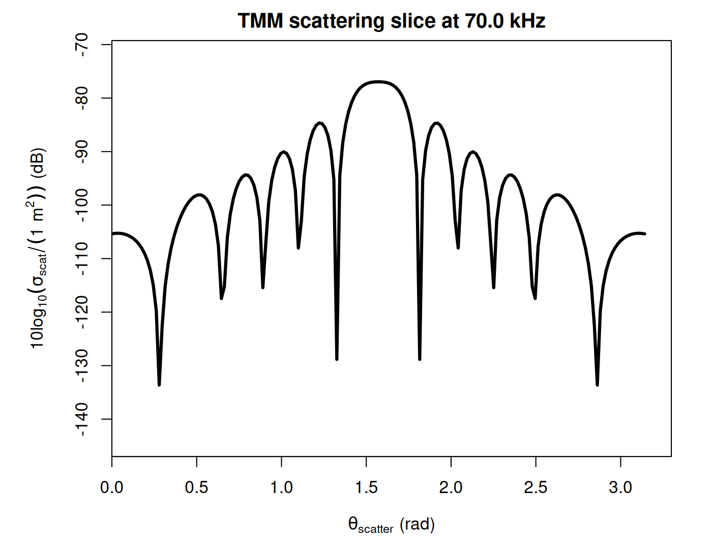

# acousticTS implementation

```{r model_family_header, echo=FALSE, results='asis'}
acousticTS:::.model_family_header(
  family = "tmm",
  pages = c(
    Overview = "index.html",
    Theory = "tmm-theory.html",
    Implementation = "tmm-implementation.html",
    Benchmarks = "tmm-benchmarks.html",
    Validation = "tmm-validation.html"
  )
)
```


These pages follow the coefficient-map view of acoustic scattering: the target response is represented as a map from incident modal amplitudes to scattered modal amplitudes [@Waterman_1969; @Waterman_2009].

The acousticTS package uses object-based scatterers, so the `TMM` workflow follows the same broad structure used elsewhere in the package: define the geometry, attach the material interpretation, evaluate target strength over the frequency range of interest, and then inspect the returned response carefully enough to understand what the model is actually buying you.

## Why use `TMM` over `SPHMS` or `PSMS`?

For the supported canonical shapes, `TMM` is not primarily about producing a different target-strength answer from `SPHMS`, `PSMS`, or `FCMS`. In the exact or sanity-checked single-target cases documented here, it agrees with those shape-specific families where they describe the same physics. The reason to use `TMM` is that it organizes the scattering problem around an incident-to-scattered coefficient map rather than only around a monostatic backscatter formula. That makes it the natural family for stored T-matrix blocks, bistatic scattering, orientation averaging, and later multi-target workflows.

In other words:

1. if the goal is only a sphere target-strength calculation, `SPHMS` is the more direct exact model,
2. if the goal is only a prolate-spheroid target-strength calculation, `PSMS` is the more direct exact model,
3. if the goal is only a finite-cylinder target-strength calculation, `FCMS` is the more direct exact model even though the default monostatic cylinder branch in `TMM` is benchmark-matched to it, and
4. if the goal is to stay inside a transition-matrix framework that can grow into broader scattering workflows while using one common post-processing layer across spheres, spheroids, and cylinders, `TMM` is the relevant model family.

::: {.caution data-title="Cylinder TMM scope"}
The `TMM` cylinder branch is intentionally narrower than the sphere, oblate, and prolate branches. The default monostatic path is benchmark-matched to `FCMS`, but full retained-angle cylinder grids and bistatic summaries remain outside the validated public scope.
:::

## Object generation

```{r}
library(acousticTS)

density_sw <- 1026.8
sound_speed_sw <- 1477.3

sphere_shape <- sphere(radius_body = 0.01)
oblate_shape <- oblate_spheroid(
  length_body = 0.012,
  radius_body = 0.01,
  n_segments = 80
)
prolate_shape <- prolate_spheroid(
  length_body = 0.14,
  radius_body = 0.01,
  n_segments = 80
)
cylinder_shape <- cylinder(
  length_body = 0.07,
  radius_body = 0.01,
  n_segments = 80
)

sphere_object <- fls_generate(
  shape = sphere_shape,
  density_body = 1028.9,
  sound_speed_body = 1480.3,
  theta_body = pi / 2
)

oblate_object <- fls_generate(
  shape = oblate_shape,
  density_body = 1028.9,
  sound_speed_body = 1480.3,
  theta_body = pi / 2
)

prolate_object <- fls_generate(
  shape = prolate_shape,
  density_body = 1028.9,
  sound_speed_body = 1480.3,
  theta_body = pi / 2
)

cylinder_object <- fls_generate(
  shape = cylinder_shape,
  density_body = 1028.9,
  sound_speed_body = 1480.3,
  theta_body = pi / 2
)
```

The setup looks like the other exact families in the package: build a shape, generate a homogeneous scatterer, and then call `target_strength()`. The practical difference is that `TMM` keeps the calculation inside a transition-matrix viewpoint rather than only inside a direct modal-series viewpoint. The documented shape set is:

1. `Sphere`
2. `OblateSpheroid`
3. `ProlateSpheroid`
4. `Cylinder`

## Calculating a TS-frequency spectrum

```{r}
sphere_object <- target_strength(
  object = sphere_object,
  frequency = seq(12e3, 120e3, by = 12e3),
  model = "tmm",
  boundary = "liquid_filled",
  density_sw = density_sw,
  sound_speed_sw = sound_speed_sw
)

prolate_object <- target_strength(
  object = prolate_object,
  frequency = c(12e3, 18e3, 38e3, 70e3, 100e3),
  model = "tmm",
  boundary = "liquid_filled",
  density_sw = density_sw,
  sound_speed_sw = sound_speed_sw
)

sphere_object@model$TMM
prolate_object@model$TMM
```

This step is intentionally similar to the other exact families. The important part is not that the call looks unfamiliar. It is that the stored result comes from a T-matrix-centered model family. For spheres, the reported `n_max` is the retained spherical-wave cutoff. For prolates, the reported `n_max` is inherited from the exact spheroidal retained system and should therefore be interpreted as the size of the retained spheroidal solve rather than as a spherical-wave truncation limit.

## Extracting model results

Model results can be extracted either visually or directly through `extract()`.

### Plotting results

```{r echo=FALSE, out.width=c('49%','49%'), fig.align='center', fig.alt='Pre-rendered TMM example plots showing the sphere geometry and its stored target-strength spectrum.'}
knitr::include_graphics(c("tmm-shape-plot.png", "tmm-model-plot.png"))
```

### Accessing results

```{r}
tmm_results <- extract(sphere_object, "model")$TMM
head(tmm_results)
```

At this stage, the main thing to confirm is that `TMM` is reproducing the expected exact-family response for the chosen geometry rather than drifting away from it. That is especially important for a model family like this one, because the main value of the transition-matrix formulation is not that it should disagree with `SPHMS` or `PSMS` on canonical shapes. It is that it should reproduce them while retaining the more general transition-matrix bookkeeping.

### Explicit T-matrix storage

Explicit per-frequency T-matrix block storage is available for both supported geometry branches.

```{r}
sphere_store <- target_strength(
  object = fls_generate(
    shape = sphere(radius_body = 0.01, n_segments = 80),
    g_body = 1,
    h_body = 1,
    theta_body = pi / 2
  ),
  frequency = 38e3,
  model = "tmm",
  boundary = "pressure_release",
  density_sw = density_sw,
  sound_speed_sw = sound_speed_sw,
  store_t_matrix = TRUE
)

length(sphere_store@model_parameters$TMM$parameters$t_matrix[[1]])
```

For prolate spheroids, the stored blocks live in the same `@model_parameters$TMM$parameters$t_matrix` slot and can be reused through helpers such as `tmm_scattering()`, `tmm_average_orientation()`, `tmm_bistatic_summary()`, and `tmm_products()` without rebuilding the retained modal solve. Cylinders can also be stored, but the retained cylinder state is intentionally narrower: it reuses the exact geometry-matched cylindrical family only for exact monostatic evaluations and orientation-averaged monostatic products. Full general-angle cylinder grids and bistatic summaries are not exposed because a validated retained cylinder angular operator is missing.

### Orientation averaging from stored blocks

One of the practical reasons to keep the result in a T-matrix framework is that the same stored blocks can be reused for other single-target summaries without rerunning the boundary solve. The simplest example is an orientation-averaged monostatic cross section.

```{r}
prolate_store <- target_strength(
  object = fls_generate(
    shape = prolate_spheroid(
      length_body = 0.14,
      radius_body = 0.01,
      n_segments = 80
    ),
    density_body = 1028.9,
    sound_speed_body = 1480.3,
    theta_body = pi / 2
  ),
  frequency = seq(12e3, 100e3, 2e3),
  model = "tmm",
  boundary = "liquid_filled",
  density_sw = density_sw,
  sound_speed_sw = sound_speed_sw,
  store_t_matrix = TRUE
)

orientation_dist <- tmm_orientation_distribution(
  distribution = "uniform",
  lower = 0.45 * pi,
  upper = pi,
  n_theta = 7
)

orientation_avg <- tmm_average_orientation(
  object = prolate_store,
  distribution = orientation_dist
)

orientation_avg
```

By default, `tmm_average_orientation()` assumes the exact monostatic receive direction for each supplied incident angle. So the helper is averaging the differential backscattering cross section over the chosen orientation distribution, not rebuilding the underlying T-matrix solve at every angle.

The distribution helper is there so the main orientation pathways stay explicit and standardized:

1. `distribution = "uniform"` creates a uniform distribution in `theta_body` over a bounded interval,
2. `distribution = "normal"` creates a normal distribution on `[0, pi]`,
3. `distribution = "truncated_normal"` creates a normal distribution restricted to `[lower, upper]`, and
4. `distribution = "quadrature"` or `distribution = "pdf"` lets the user supply their own angle grid and either direct weights or a density.

Because this helper is meant for monostatic orientation-averaged backscatter, its returned columns follow the same naming convention used elsewhere in the package: `sigma_bs` and `TS`.

```{r echo=FALSE, out.width='90%', fig.align='center', fig.alt='Pre-rendered comparison of the stored monostatic TMM spectrum and the orientation-averaged TMM spectrum for the liquid-filled prolate spheroid example.'}

```

The orientation-averaged line can sit far below the stored monostatic line, and that is not a bug by itself. The stored monostatic spectrum in this example is the broadside response of one fixed orientation, while the orientation-averaged spectrum is a linear average of `sigma_bs` over a wide range of body angles. For a long prolate spheroid, broadside is typically much stronger than the more oblique and near-end-on views, so the average can be many decibels lower than the broadside-only curve.

### Angular scattering slices from stored blocks

The same stored blocks can also be sent through `plot(..., type = "scattering")` to inspect a single angular slice of the far-field response at a chosen stored frequency.

```{r echo=FALSE, out.width='85%', fig.align='center', fig.alt="Angular TMM scattering slice for a stored liquid-filled prolate spheroid at 70 kHz, plotted as differential scattering cross section in dB versus receive polar angle."}

```

This is useful when the question is no longer just "what is the monostatic target strength?" but also "how does the same stored transition matrix distribute scattering over receive angle at a fixed frequency?" That is exactly the kind of post-processing that is natural in a T-matrix workflow and comparatively awkward in the purely direct exact-family formulations.

All of the `tmm_scattering()`-style helpers use the **body-fixed angular coordinates** of the canonical axisymmetric target, not arbitrary world-frame directions. For the built-in prolate, oblate, and cylinder shapes in acousticTS, the symmetry axis is the body `x`-axis. So when these helpers are compared against an external BEM/FEM slice generated in a world `x-y` plane, the world directions need to be converted to the body-fixed `(\theta, \phi)` convention before the comparison is apples-to-apples.

### Higher-level bistatic summaries

Once the stored blocks are available, the next natural step is to move beyond individual points and slices and ask for higher-level bistatic summaries. Within the documented package scope, that applies to the spherical and spheroidal stored branches. `tmm_bistatic_summary()` does that for one stored frequency by returning:

1. a forward-centered great-circle slice,
2. an orthogonal dorsal/ventral-style great-circle slice,
3. the peak-scattering direction on a 2D receive-angle grid,
4. the exact monostatic backscatter value,
5. a `-3 dB` backscatter-lobe width measured on the forward-centered slice, and
6. integrated scattering over coarse angular sectors measured relative to the forward direction.

```{r}
summary_70 <- tmm_bistatic_summary(
  object = prolate_store,
  frequency = 70e3,
  n_theta = 21,
  n_phi = 41,
  n_psi = 41
)

summary_70$metrics
summary_70$sector_integrals
```

Those summary products are not new physics. They are just structured reuses of the same stored T-matrix blocks. That makes them a good sanity-check layer: the exact monostatic value reported by `summary_70$metrics$TS` should agree with the monostatic `TS` already stored on the object at `70 kHz`.

### Single solved target, many post-process products

The separate helpers are useful when only one post-processing product is needed. But the broader T-matrix workflow is often "solve once, then ask for several things." The higher-level `tmm_products()` wrapper is meant for exactly that pattern.

```{r}
products_70 <- tmm_products(
  object = prolate_store,
  frequency = 70e3,
  orientation = orientation_dist,
  bistatic_summary = TRUE,
  n_theta = 21,
  n_phi = 41,
  n_psi = 41
)

names(products_70)
products_70$bistatic_summary$metrics
```

This is closer to the real reason for keeping a T-matrix-based representation around. The workflow is no longer "get one monostatic spectrum and stop." It becomes "solve the target once, then reuse the stored operator for monostatic, orientation-averaged, and bistatic products."

### Bistatic scattering grids and polar maps

For two-dimensional receive-angle views, the stored blocks can be reused through `tmm_scattering_grid()` or displayed directly through `plot(..., type = "scattering", polar = TRUE)` or `plot(..., type = "scattering", heatmap = TRUE)`. The implementation page uses pre-rendered figures for those heavier views so the article stays lightweight to build.

The vignette embeds pre-rendered examples here so the implementation page does not need to rebuild the heavier two-dimensional scattering figures every time it is rendered. The gallery covers the stored branches that actually support angular grids: `Sphere`, `OblateSpheroid`, and `ProlateSpheroid`. `Cylinder` is intentionally omitted because the retained-cylinder path stops at exact monostatic reuse and orientation-averaged monostatic products.

### Shape gallery
::: {.panel-tabset}

#### Sphere
These two views show the stored pressure-release sphere at `70 kHz`. The heatmap uses the direct ($\phi_\text{scatter}$, $\theta_\text{scatter}$) grid, while the polar map wraps the same grid into a circular view.

```{r echo=FALSE, out.width=c('49%','49%'), fig.align='center', fig.alt='Pre-rendered TMM scattering maps for the stored pressure-release sphere at 70 kHz. The left panel is a heatmap in phi-scatter and theta-scatter, and the right panel is the corresponding polar map.'}
knitr::include_graphics(c("tmm-sphere-heatmap.png", "tmm-sphere-polar.png"))
```

#### Oblate
These two views show the stored liquid-filled oblate spheroid at `70 kHz`, which is a useful intermediate case because it still uses the spherical-coordinate retained branch but no longer has the exact spherical symmetry of the sphere.

```{r echo=FALSE, out.width=c('49%','49%'), fig.align='center', fig.alt='Pre-rendered TMM scattering maps for the stored liquid-filled oblate spheroid at 70 kHz. The left panel is a heatmap in phi-scatter and theta-scatter, and the right panel is the corresponding polar map.'}
knitr::include_graphics(c("tmm-oblate-heatmap.png", "tmm-oblate-polar.png"))
```

#### Prolate
These two views show the stored liquid-filled prolate spheroid at `70 kHz`, which is the geometry where the retained spheroidal angular operator is most directly useful.

```{r echo=FALSE, out.width=c('49%','49%'), fig.align='center', fig.alt='Pre-rendered TMM scattering maps for the stored liquid-filled prolate spheroid at 70 kHz. The left panel is a heatmap in phi-scatter and theta-scatter, and the right panel is the corresponding polar map.'}
knitr::include_graphics(c("tmm-prolate-heatmap.png", "tmm-prolate-polar.png"))
```

In each polar view, the radius is the scattering polar angle `theta_scatter`, not physical distance from the target. So the center corresponds to `theta_scatter = 0`, the outer ring corresponds to `theta_scatter = pi`, and the target itself is not drawn as a literal object at the origin.

:::
## Benchmark and validation references

For TMM benchmark and validation evidence, use:

- [TMM benchmarks](tmm-benchmarks.html)
- [TMM validation](tmm-validation.html)
