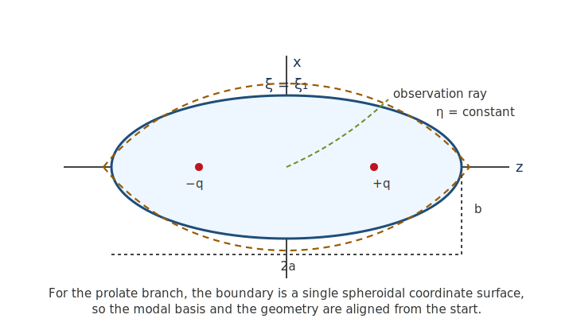

# Introduction

```{r model_family_header, echo=FALSE, results='asis'}
acousticTS:::.model_family_header(
  family = "tmm",
  pages = c(
    Overview = "index.html",
    Implementation = "tmm-implementation.html",
    Theory = "tmm-theory.html"
  )
)
```

The transition matrix method (`TMM`) is a basis-expansion view of scattering. Instead of solving directly for the scattered pressure in physical space, one expands both the incident and scattered fields in complete wave bases and then asks for the linear map between the two coefficient vectors. That map is the transition matrix, or T-matrix [@waterman_new_1969].

For a single target, that point of view is valuable even before one thinks about multiple scattering. Once the target response is represented in a basis-to-basis form, the same mathematical object can in principle support monostatic scattering, bistatic scattering, rotations, and later orientation averaging.

For smooth axisymmetric targets, the most natural basis depends on the geometry. A sphere is naturally represented in spherical coordinates, while a prolate spheroid is naturally represented in prolate spheroidal coordinates. Oblate spheroids can still be handled in a spherical-wave T-matrix framework by enforcing the boundary conditions on the actual surface $r(\theta)$, but the surface geometry then enters explicitly through the boundary operator. Finite cylinders are different again: the sidewall-endcap junctions make a purely spherical retained operator much less natural than a cylindrical modal basis, especially once one wants reliable angular products away from the simplest monostatic setting [@varadan_computation_1982; @ganesh_far_2008; @ganesh_numerically_2022; @waterman_t_2009].

Unless stated otherwise, medium `1` is the surrounding seawater and medium `2` is the target interior.

# General single-target T-matrix formulation

## Incident and scattered modal expansions

For time-harmonic pressure with implicit factor $e^{-i\omega t}$, the pressure in a homogeneous region satisfies the Helmholtz equation:

$$
  \nabla^2 p + k^2 p = 0.
$$

In a modal T-matrix formulation, the incident and scattered fields are expanded as:

$$
  p^{inc} = \sum_{\nu} a_{\nu}\,\psi^{(1)}_{\nu},
  \qquad
  p^{sca} = \sum_{\nu} f_{\nu}\,\psi^{(3)}_{\nu}.
$$

where $\psi^{(1)}_{\nu}$ denotes a regular basis state and $\psi^{(3)}_{\nu}$ denotes an outgoing basis state. The single-target transition matrix is then the linear map:

$$
  \mathbf{f} = \mathbf{T}\mathbf{a}.
$$

For axisymmetric targets, the azimuthal order decouples. The T-matrix can therefore be organized into independent $m$-blocks, and the monostatic backscatter amplitude is reconstructed from those blocks after the incident plane-wave coefficients have been determined [@waterman_new_1969; @varadan_computation_1982].

## Boundary conditions

Consider the four scalar acoustic boundary types: `fixed_rigid`,
`pressure_release`, `liquid_filled`, and `gas_filled`.

The first two use only the exterior basis. For a rigid target, the normal velocity vanishes at the boundary, which in pressure language means the normal derivative of pressure vanishes. For a pressure-release target, the pressure itself vanishes at the surface.

For fluid- or gas-filled targets, an interior field must also be represented. The boundary conditions are then:

$$
  p^{ext} = p^{int},
  \qquad
  \frac{1}{\rho_{ext}} \frac{\partial p^{ext}}{\partial n} =
    \frac{1}{\rho_{int}} \frac{\partial p^{int}}{\partial n}.
$$

This is the part of the formulation where density and sound-speed contrasts become part of the modal system rather than only simple amplitude rescalings.

# Spherical-coordinate branch

## General axisymmetric surface formulation

Suppose the scatterer surface is axisymmetric and can be written in spherical coordinates as:

$$
  r = r(\theta).
$$

The exterior regular and outgoing basis states are then built from spherical partial waves:

$$
  \psi^{(1)}_{mn}(r,\theta,\phi) =
    j_n(kr)\,P_n^m(\cos\theta)\,e^{im\phi},
  \qquad
  \psi^{(3)}_{mn}(r,\theta,\phi) =
    h_n^{(1)}(kr)\,P_n^m(\cos\theta)\,e^{im\phi}.
$$

Along the curved meridional profile $r(\theta)$, the outward normal derivative
is:

$$
  \frac{\partial}{\partial n} =
    \frac{1}{\sqrt{1 + \left[r_\theta / r\right]^2}}
  \left(
  \frac{\partial}{\partial r} -
    \frac{r_\theta}{r^2}\frac{\partial}{\partial \theta}
  \right).
$$

where $r_\theta = dr/d\theta$.

So even in a spherical basis, a nonspherical axisymmetric boundary couples the radial and angular derivatives of each retained basis state. The block T-matrix equations are then obtained by enforcing the boundary conditions on the physical surface and projecting the resulting equations back onto the retained spherical basis.

## Special geometries in the spherical branch

### Sphere

For a sphere:

$$
  r(\theta) = a.
$$

so $r_\theta = 0$ and the normal derivative reduces to the ordinary radial derivative. The spherical-coordinate T-matrix formulation therefore collapses to the classical spherical partial-wave problem.

### Oblate spheroid

For an oblate spheroid with axial semiaxis $c$ and equatorial semiaxis $a$, where $c \le a$:

$$
  r(\theta) =
    \left(
  \frac{\cos^2\theta}{c^2} +
    \frac{\sin^2\theta}{a^2}
  \right)^{-1/2}.
$$

Differentiating gives:

$$
  r_\theta =
    -\sin\theta\cos\theta
  \left(
  \frac{1}{a^2} - \frac{1}{c^2}
  \right)
  \left(
  \frac{\cos^2\theta}{c^2} +
    \frac{\sin^2\theta}{a^2}
  \right)^{-3/2}.
$$

So the oblate branch remains a spherical-basis T-matrix formulation, but with the actual oblate meridional geometry entering through $r(\theta)$ and $r_\theta$.

### Finite cylinder

For a right circular finite cylinder with half-length $a$ and radius $b$, the meridional surface can be written piecewise in spherical coordinates as:

$$
  r(\theta) =
    \min\left(
  \frac{a}{|\cos\theta|},
  \frac{b}{|\sin\theta|}
  \right).
$$

This simply states that a ray from the origin first meets either an end-cap plane or the cylindrical side wall. The resulting $r(\theta)$ is continuous but not differentiable where the side wall and end-cap meet, which is one reason finite cylinders are numerically less forgiving than smooth spheres or spheroids in a spherical-basis T-matrix treatment [@waterman_t_2009].

## Monostatic reconstruction

Once the retained block coefficients are obtained, the backscatter amplitude is reconstructed by evaluating the outgoing expansion in the receive direction opposite to the incident plane wave. The backscattering cross section then follows from:

$$
  \sigma_{bs} = |f_{bs}|^2
$$

and finally:

$$
  TS = 10 \log_{10} \left(\sigma_{bs}\right)
$$

# Cylindrical interpretation

For a finite cylinder, the most natural modal picture is again geometry matched. The circular cross-section is represented by cylindrical partial waves, while the finite length enters through an axial operator that reduces to the familiar finite-cylinder coherence factor in the monostatic near-broadside problem. In that sense, the cylinder T-matrix viewpoint is not different in principle from the spherical or spheroidal ones: incident coefficients are still mapped to scattered coefficients. What changes is the basis in which that mapping is most stable and physically transparent.

The main obstacle for cylinders is geometric non-smoothness. A sphere or smooth spheroid has a differentiable meridional profile everywhere, whereas a finite cylinder has sidewall-endcap junctions. Those corners are exactly what make spherical retained operators converge slowly and what motivate a cylindrical interpretation whenever one wants a trustworthy finite-cylinder operator.

# Prolate spheroid branch

## Why spherical coordinates are not the best exact basis

A prolate spheroid is not a constant-$r$ surface. So while spherical-wave expansions can still be written down, they do not align naturally with the geometry. This is exactly the regime where the classic spheroidal-coordinate literature becomes relevant [@varadan_computation_1982; @ganesh_numerically_2022; @hackman_application_1984].

For the single-target scalar acoustic problem, it is more natural to use prolate spheroidal coordinates and write the target surface as a single coordinate surface $\xi = \xi_1$. That is also the natural starting point for a geometry-matched T-matrix formulation.

## Prolate spheroidal coordinates

Let $q$ be the semifocal length and let $(\xi,\eta,\phi)$ be prolate spheroidal coordinates. In Cartesian coordinates:

$$
  x = q\sqrt{(\xi^2 - 1)(1 - \eta^2)}\cos\phi,
  \qquad
  y = q\sqrt{(\xi^2 - 1)(1 - \eta^2)}\sin\phi,
  \qquad
  z = q \xi \eta.
$$

The coordinate ranges are:

$$
  \xi \ge 1,
  \qquad
  -1 \le \eta \le 1,
  \qquad
  0 \le \phi < 2\pi.
$$

If the body surface is $\xi = \xi_1$, then the major semi-axis $a$ and
minor semi-axis $b$ satisfy:

$$
  a = \xi_1 q,
  \qquad
  b = q\sqrt{\xi_1^2 - 1}.
$$

so equivalently:

$$
  \xi_1 = \left[1 - \left(\frac{b}{a}\right)^2\right]^{-1/2}.
$$

<!--  -->

## Spheroidal modal representation

In a homogeneous region, the separated pressure field is written as the product of a radial spheroidal function in $\xi$, an angular spheroidal function in $\eta$, and an azimuthal factor in $\phi$.

The resulting field expansion has the same logical structure as the generic T-matrix expression above, but the basis is now geometry-matched.

For rigid and pressure-release prolates, the retained degrees remain effectively local in the exact spheroidal basis. For liquid- and gas-filled prolates, the interior and exterior reduced frequencies differ, so the angular bases no longer match exactly. This introduces overlap-driven coupling between retained degrees, exactly as in the exact prolate spheroidal modal-series solution [@hackman_application_1984; @spence_scattering_1951; @furusawa_prolate_1988].

## T-matrix interpretation in a geometry-matched basis

The essential mathematical point is that the T-matrix concept does not depend on using spherical coordinates specifically. What matters is that the incident and scattered fields are both expanded in complete modal bases, and that a linear operator maps one coefficient vector to the other.

For spheres, the geometry-matched basis is spherical. For prolate spheroids, the geometry-matched basis is spheroidal. In both cases, the T-matrix interpretation is the same: the target response is represented as a linear map from incident modal amplitudes to scattered modal amplitudes in the basis natural to that geometry.

