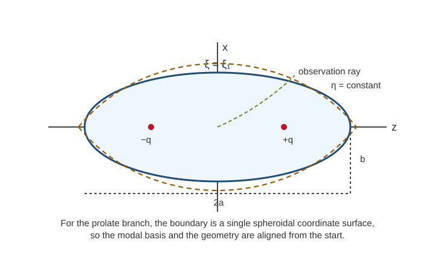

# Introduction

```{r model_family_header, echo=FALSE, results='asis'}
acousticTS:::.model_family_header(
  family = "tmm",
  pages = c(
    Overview = "index.html",
    Implementation = "tmm-implementation.html",
    Theory = "tmm-theory.html"
  )
)
```

The transition matrix method (`TMM`) represents a target by the linear map from
incident-wave coefficients to scattered-wave coefficients [@Waterman_1969].
Once constructed, that map can be evaluated for different incident and receive
directions without resolving the boundary-value problem.

This coefficient map supports monostatic and bistatic scattering, rotations,
and orientation averages when the retained basis and numerical solution are
valid for those operations.

The useful basis depends on geometry. Spheres and spherical shells use spherical
waves. Prolate spheroids use prolate spheroidal waves. Oblate spheroids can use
spherical waves enforced on $r(\theta)$. Finite cylinders favor cylindrical
modes because the sidewall-endcap junction converges poorly in a smooth
spherical basis [@Varadan_1982; @Waterman_2009].

::: {.note data-title="Shared conventions"}
Medium indices, field conventions, and reporting quantities follow [Notation
and symbols](../notation-and-symbols/notation-and-symbols.html). Boundary types
are defined on the [Boundary conditions](../boundary_conditions.html)
page.
:::

# General single-target T-matrix formulation

## Incident and scattered modal expansions

For time-harmonic pressure with implicit factor $e^{-i\omega t}$, the pressure in a homogeneous region satisfies the Helmholtz equation [@Morse_1968]:

$$
  \nabla^2 p + k^2 p = 0.
$$

In a modal T-matrix formulation, the incident and scattered fields are expanded as:

$$
  p^{inc} = \sum_{\nu} a_{\nu}\,\psi^{(1)}_{\nu},
  \qquad
  p^{sca} = \sum_{\nu} f_{\nu}\,\psi^{(3)}_{\nu}.
$$

Here $\psi^{(1)}_{\nu}$ is regular and $\psi^{(3)}_{\nu}$ is outgoing. The
transition matrix is the linear map:

$$
  \mathbf{f} = \mathbf{T}\mathbf{a}.
$$

For an axisymmetric target, azimuthal order $m$ decouples and $\mathbf T$ is
block diagonal in $m$. If $a_{m'n'}(\widehat{\mathbf k}_i)$ are the plane-wave
coefficients for incident direction $\widehat{\mathbf k}_i$, the far-field
amplitude in receive direction $\widehat{\mathbf k}_s$ has the general form:

$$
  f(\widehat{\mathbf k}_s,\widehat{\mathbf k}_i)
  = \frac{1}{k_1}
  \sum_{mn}\sum_{m'n'}
  \mathcal Y_{mn}(\widehat{\mathbf k}_s)
  T_{mn,m'n'}
  a_{m'n'}(\widehat{\mathbf k}_i),
$$

where $\mathcal Y_{mn}$ includes the angular basis and outgoing-wave phase.
Backscatter is the special case
$\widehat{\mathbf k}_s=-\widehat{\mathbf k}_i$ [@Mishchenko_2002].

## Boundary conditions

Consider the four scalar acoustic boundary types: `fixed_rigid`,
`pressure_release`, `liquid_filled`, and `gas_filled`.

The first two use only the exterior basis. For a rigid target, the normal velocity vanishes at the boundary, which in pressure language means the normal derivative of pressure vanishes. For a pressure-release target, the pressure itself vanishes at the surface.

For fluid- or gas-filled targets, an interior field must also be represented. The boundary conditions are then:

$$
  p^{ext} = p^{int},
  \qquad
  \frac{1}{\rho_{ext}} \frac{\partial p^{ext}}{\partial n} =
    \frac{1}{\rho_{int}} \frac{\partial p^{int}}{\partial n}.
$$

Density and sound speed therefore enter the modal boundary operator.

# Spherical-coordinate branch

## General axisymmetric surface formulation

Suppose the scatterer surface is axisymmetric and can be written in spherical coordinates as:

$$
  r = r(\theta).
$$

The exterior regular and outgoing basis states are then built from spherical partial waves:

$$
  \begin{align*}
    \psi^{(1)}_{mn}(r,\theta,\phi) &=
      j_n(kr)\,P_n^m(\cos\theta)\,e^{im\phi}, \\
    \psi^{(3)}_{mn}(r,\theta,\phi) &=
      h_n^{(1)}(kr)\,P_n^m(\cos\theta)\,e^{im\phi}.
  \end{align*}
$$

Along the curved meridional profile $r(\theta)$, the outward normal derivative
is:

$$
  \frac{\partial}{\partial n} =
    \frac{1}{\sqrt{1 + \left[r_\theta / r\right]^2}}
  \left(
  \frac{\partial}{\partial r} -
    \frac{r_\theta}{r^2}\frac{\partial}{\partial \theta}
  \right).
$$

where $r_\theta=dr/d\theta$.

A nonspherical boundary therefore couples radial and angular derivatives. The
boundary residual is projected back onto the retained spherical basis to form
each $m$-block.

## Special geometries in the spherical branch

### Sphere

For a sphere:

$$
  r(\theta) = a.
$$

so $r_\theta = 0$ and the normal derivative reduces to the ordinary radial derivative. The spherical-coordinate T-matrix formulation therefore collapses to the classical spherical partial-wave problem.

### Spherical shells

For a concentric shell with outer radius $a$ and inner radius $b$, spherical
symmetry keeps the T-matrix diagonal in $(m,n)$. The diagonal coefficient is
the exterior modal scattering coefficient obtained from the two interface
systems. A fluid shell couples exterior, shell, and core acoustic fields. An
elastic shell also carries longitudinal and transverse elastic potentials. The
coefficient map is therefore:

$$
  f_{mn}=T_n a_{mn},
$$

with $T_n$ supplied by the corresponding shell boundary determinant. See [VESM
theory](../vesm/vesm-theory.html) for fluid shells and [ESSMS
theory](../essms/essms-theory.html) for elastic shells.

### Oblate spheroid

For an oblate spheroid with axial semiaxis $c$ and equatorial semiaxis $a$, where $c \le a$:

$$
  r(\theta) =
    \left(
  \frac{\cos^2\theta}{c^2} +
    \frac{\sin^2\theta}{a^2}
  \right)^{-1/2}.
$$

Differentiating gives:

$$
  r_\theta = -\sin\theta\cos\theta
  \left(
  \frac{1}{a^2} - \frac{1}{c^2}
  \right)
  \left(
  \frac{\cos^2\theta}{c^2} +
    \frac{\sin^2\theta}{a^2}
  \right)^{-3/2}.
$$

So the oblate branch remains a spherical-basis T-matrix formulation, but with the actual oblate meridional geometry entering through $r(\theta)$ and $r_\theta$.

### Finite cylinder

For a right circular finite cylinder with half-length $a$ and radius $b$, the meridional surface can be written piecewise in spherical coordinates as:

$$
  r(\theta) =
    \min\left(
  \frac{a}{|\cos\theta|},
  \frac{b}{|\sin\theta|}
  \right).
$$

A ray from the origin first meets either an end cap or the sidewall. The profile
is continuous but not differentiable at their junction, which slows convergence
of a spherical-wave representation [@Waterman_2009].

## Monostatic reconstruction

Once the retained block coefficients are obtained, the backscatter amplitude is reconstructed by evaluating the outgoing expansion in the receive direction opposite to the incident plane wave. The backscattering cross section then follows from:

$$
  \sigma_{bs} = |f_{bs}|^2
$$

and target strength is [@MacLennan_2002]:

$$
  TS = 10 \log_{10}\left(
  \frac{\sigma_{bs}}{1\ \mathrm{m}^2}\right).
$$

# Cylindrical interpretation

For a finite cylinder, cylindrical partial waves describe the cross-section and
an axial operator describes finite length. Near broadside in monostatic
scattering, that operator reduces to the familiar finite-cylinder coherence
factor.

The sidewall-endcap corners are the main obstacle. Angular products require
particular care because a near-broadside coherence closure is not a general
bistatic cylinder solution.

# Prolate spheroid branch

## Why spherical coordinates are not the best exact basis

A prolate spheroid is not a constant-$r$ surface. So while spherical-wave expansions can still be written down, they do not align naturally with the geometry. This is exactly the regime where the classic spheroidal-coordinate transition-matrix literature becomes relevant [@Varadan_1982; @Hackman_1984].

In prolate spheroidal coordinates, the boundary is the coordinate surface
$\xi=\xi_1$.

## Prolate spheroidal coordinates

Let $q$ be the semifocal length and let $(\xi,\eta,\phi)$ be prolate spheroidal coordinates. In Cartesian coordinates:

$$
  \begin{align*}
    x &= q\sqrt{(\xi^2 - 1)(1 - \eta^2)}\cos\phi, \\
    y &= q\sqrt{(\xi^2 - 1)(1 - \eta^2)}\sin\phi, \\
    z &= q \xi \eta.
  \end{align*}
$$

The coordinate ranges are:

$$
  \xi \ge 1,
  \qquad -1 \le \eta \le 1,
  \qquad
  0 \le \phi < 2\pi.
$$

If the body surface is $\xi = \xi_1$, then the major semi-axis $a$ and
minor semi-axis $b$ satisfy:

$$
  a = \xi_1 q,
  \qquad
  b = q\sqrt{\xi_1^2 - 1}.
$$

so equivalently:

$$
  \xi_1 = \left[1 - \left(\frac{b}{a}\right)^2\right]^{-1/2}.
$$

<!--  -->

## Spheroidal modal representation

In a homogeneous region, the separated pressure field is written as the product of a radial spheroidal function in $\xi$, an angular spheroidal function in $\eta$, and an azimuthal factor in $\phi$.

The resulting field expansion has the same logical structure as the generic T-matrix expression above, but the basis is geometry-matched.

For rigid and pressure-release prolates, the retained degrees remain effectively local in the exact spheroidal basis. For liquid- and gas-filled prolates, the interior and exterior reduced frequencies differ, so the angular bases no longer match exactly. This introduces overlap-driven coupling between retained degrees, exactly as in the exact prolate spheroidal modal-series solution [@Hackman_1984; @Spence_1951; @Furusawa_1988].

## T-matrix interpretation in a geometry-matched basis

The T-matrix concept is independent of a particular coordinate system. It
requires regular and outgoing bases, a boundary operator, and a converged
coefficient map between them.

# Mathematical assumptions and scope

The formulations above assume linear time-harmonic acoustics, a single target,
an axisymmetric geometry, and homogeneous properties within each region.
Accuracy depends on modal truncation, boundary quadrature, and using a basis
suited to the surface. Smooth spherical and spheroidal surfaces support general
angular reconstruction once their blocks converge. A finite-cylinder
near-broadside closure does not by itself establish a general bistatic
cylinder operator.


