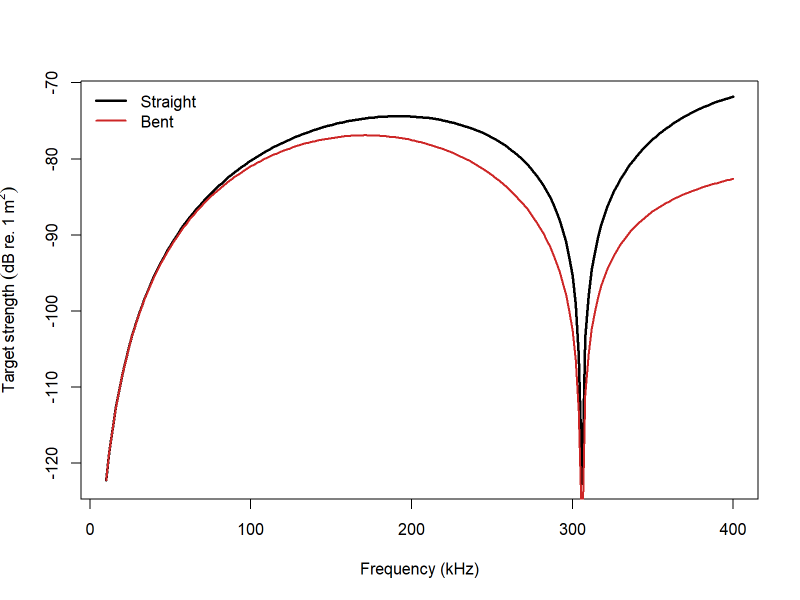

# acousticTS implementation

```{r model_family_header, echo=FALSE, results='asis'}
acousticTS:::.model_family_header(
  family = "trcm",
  pages = c(
    Overview = "index.html",
    Implementation = "trcm-implementation.html",
    Theory = "trcm-theory.html"
  )
)
```

The `acousticTS` package uses object-based scatterers so the same implementation pattern carries across models: create a scatterer, run `target_strength()`, inspect the stored model output, and then compare a small set of physically important inputs. For TRCM, the required object class is `FLS` with a cylindrical shape and fluid-like material properties.

TRCM should be read as a fast high-frequency interpretation tool, not as a general-purpose cylinder solver. The implementation assumes that the cross-sectional scattering is well summarized by the two retained rays described in the theory vignette, and it uses the body axis only to impose finite-length directivity and, when present, curvature-driven coherence loss. That means the most important implementation decisions are geometric and interpretive: whether the organism is locally cylindrical, whether the fluid-like boundary assumption is defensible, and whether the frequency range is high enough that a two-ray asymptotic model is credible.

::: {.caution data-title="Approximation regime"}
TRCM is a high-frequency asymptotic model. It is most useful when the target is well approximated by a locally cylindrical weakly scattering body and the scientific question is about broad interference/directivity structure rather than exact modal behavior.
:::

## Cylinder object generation

```{r}
library(acousticTS)

straight_cylinder_shape <- cylinder(
  length_body = 20e-3,
  radius_body = 1.5e-3,
  n_segments = 60
)

straight_cylinder <- fls_generate(
  shape = straight_cylinder_shape,
  density_body = 1045,
  sound_speed_body = 1520,
  theta_body = pi / 2
)

straight_cylinder
```

The basic TRCM target is therefore simple in appearance but still physically specific. The object declares a fluid-like elongated body, fixes the local cross-sectional radius that controls the two-ray interference term, and sets the broadside orientation that makes the model easiest to interpret. If the target is not well approximated by a locally cylindrical fluid body, it is better to change models than to force TRCM to explain spectral structure it was not built to represent.

## Calculating a TS-frequency spectrum

```{r}
frequency <- seq(10e3, 300e3, by = 10e3)

straight_cylinder <- target_strength(
  object = straight_cylinder,
  frequency = frequency,
  model = "trcm"
)
```

At this stage the model has fixed the fluid contrasts, the representative cylinder radius, the body orientation, and the high-frequency two-ray interference structure. The returned spectrum should therefore be read as the backscatter implied by those assumptions, not as a generic fluid-cylinder result valid outside the TRCM regime.

## Extracting model results

Model results can be extracted either visually or directly through `extract()`.

### Plotting results

```{r echo=FALSE, out.width=c('49%','49%'), fig.align='center', fig.alt='Pre-rendered TRCM example plots showing the straight-cylinder geometry and its stored target-strength spectrum.'}
knitr::include_graphics(c("trcm-shape-plot.png", "trcm-model-plot.png"))
```

These plots should be used as a first consistency check. The shape plot confirms that the body really is the simple cylindrical target the TRCM expects, while the model plot shows whether the interference oscillations and overall level look physically plausible for the chosen radius, contrasts, and frequency range.

### Accessing results

```{r}
trcm_results <- extract(straight_cylinder, "model")$TRCM
head(trcm_results)
```

The extracted result contains the scattering amplitude `f_bs`, the backscattering cross section `sigma_bs`, and target strength `TS`. In TRCM those quantities are especially worth checking together because an apparently minor change in phase can move the model between constructive and destructive interference. A smooth change in geometry can therefore produce a large local change in `TS`, even when the underlying contrasts have barely changed.

## Comparison workflows

### Straight versus bent cylinders

Curvature is one of the main practical controls in the TRCM workflow, so it is useful to compare a straight cylinder with a bent one that keeps the same length and local radius. That comparison is physically informative because the bent-body correction does not introduce a new reflection law. Instead, it changes the equivalent coherent length of the body axis. A straight-versus-bent comparison therefore isolates how much of the observed spectral structure is being supported by long-range axial coherence.

```{r echo=FALSE, out.width='85%', fig.align='center', fig.alt='Pre-rendered TRCM comparison between straight and bent cylinders over the same frequency sweep.'}

```

When `stationary_phase = TRUE`, the bent-cylinder correction uses the asymptotic equivalent-length approximation rather than numerically integrating the curvature-induced quadratic phase term along the axis. That option is fastest and is usually appropriate when the body is gently curved and acoustically large enough that the stationary-phase picture is already the right one. When the inferred bent-body effect seems to be carrying the whole answer, it is worth rerunning with `stationary_phase = FALSE` to check whether the simpler asymptotic branch is exaggerating or suppressing the coherence loss.

For ray-based use cases, the next parameters to revisit are curvature and body orientation, since those control the interference and directivity structure more strongly than small changes in the fluid contrasts. If a TRCM spectrum changes radically under modest orientation or curvature adjustments, that sensitivity is part of the model interpretation rather than a post-processing nuisance.

### Reference comparisons

TRCM spans two geometry regimes, so the implementation checks should do the same. The straight-cylinder branch can still be compared against the canonical weakly scattering cylinder reference curve. The bent-cylinder branch is compared against the broadside bent-cylinder construction implied by Stanton (1989, Eq. 25-26): the straight finite-cylinder modal coefficient sum is retained, and curvature enters through the exact Fresnel-type coherence integral along the bent axis. In the table below, that bent reference uses the uniformly bent weak-fluid cylinder setup discussed by Stanton (1989) and Stanton et al. (1993): `L/a = 10.5`, `rho_c/L = 1.5`, `g = 1.0357`, `h = 1.0279`, and `ka` spanning `0.1` to `10`.

| Geometry | Implementation branch | Reference family | Max abs. delta TS (dB) | Mean abs. delta TS (dB) | Elapsed (s) |
|:--|:--|:--|--:|--:|--:|
| Straight cylinder | Standard TRCM | Weakly scattering straight-cylinder benchmark | 23.76946 | 0.59807 | 0.00 |
| Bent cylinder | Fresnel-integral branch (`stationary_phase = FALSE`) | FCMS-derived bent-cylinder reference from Stanton (1989, Eq. 25-26) | 10.39341 | 0.73244 | 0.05 |
| Bent cylinder | Stationary-phase branch (`stationary_phase = TRUE`) | FCMS-derived bent-cylinder reference from Stanton (1989, Eq. 25-26) | 12.10080 | 1.41033 | 0.00 |

This split is much more faithful to the underlying approximation structure. The straight-cylinder row checks the ordinary two-ray reduction against the canonical constant-radius cylinder case. The two bent-cylinder rows then test the curvature bookkeeping separately: the full Fresnel-integral branch and the asymptotic stationary-phase shortcut are each evaluated against the same FCMS-derived bent-cylinder reference problem from Stanton's Eq. 25-26 construction.

The stationary-phase shortcut is therefore no longer being judged against a straight-cylinder benchmark that it was never meant to represent. Its remaining error should be read as the cost of using an asymptotic bent-body replacement for the full curvature integral, not as evidence that curvature itself is being mishandled.
