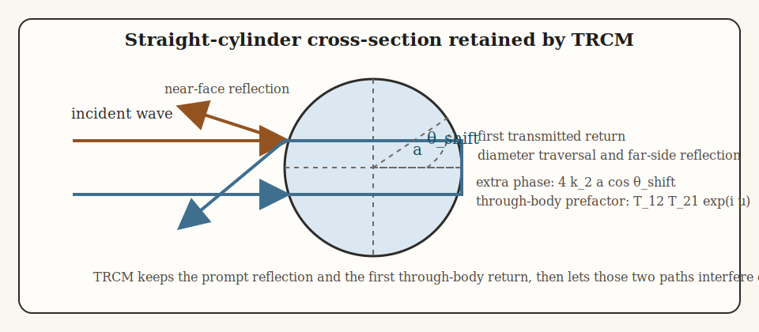
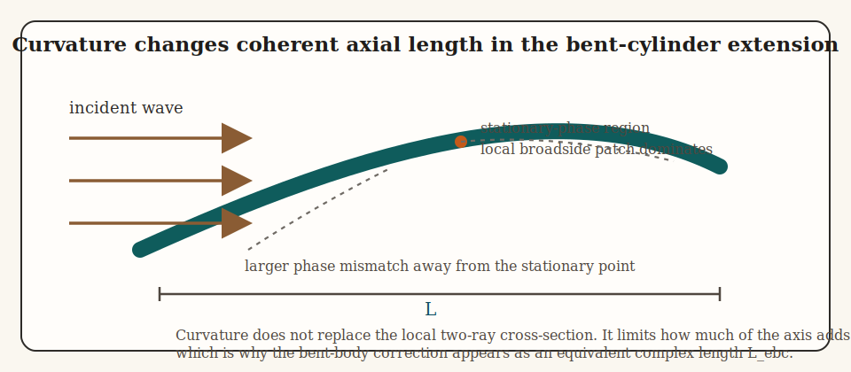

# Introduction

The two-ray cylinder model (TRCM) is a high-frequency approximation for elongated fluid-like bodies. It assumes that the dominant backscatter from a locally cylindrical body is produced by two coherent contributions: a prompt reflection from the near interface and a second contribution that enters the body, traverses the diameter, reflects from the far interface, and returns with additional phase.[^1][^2][^3] The model is therefore asymptotic from the outset. It does not attempt to represent low-order resonances or a full internal reverberation series. Instead, it keeps only the first two physically important specular paths and asks how they interfere.

The reflection and transmission factors entering the model come from ordinary fluid-fluid interface physics. Pressure is continuous across the boundary, normal particle velocity is continuous across the boundary, and the resulting impedance contrast determines how much of the incident field is reflected or transmitted. The TRCM does not solve that boundary-value problem exactly. It inserts those local interface coefficients into a high-frequency two-path reduction for an elongated body.

The model can be read as the product of four ingredients. The fluid interface supplies a reflection coefficient. The cross-section supplies a normalized two-ray interference factor. The finite body axis supplies a directivity factor. The high-frequency asymptotics supply the specular amplitude and phase scaling. Curvature then modifies only the coherent axial accumulation, not the local two-path cross-sectional physics.

# Physical basis of the TRCM

## High-frequency starting point

The TRCM begins from the same physical picture as other Kirchhoff-type high-frequency models: when a smooth fluid body is acoustically large, the scattered field is dominated by contributions from specular regions of the surface. For an elongated locally cylindrical body, the strongest backscatter comes from those parts of the cross-section for which the incident and scattered directions are symmetric about the local outward normal. The model then truncates the internal path bookkeeping very aggressively. It assumes that one prompt reflected path and one first traversing internal path carry most of the coherent backscatter.

This is the key reason the TRCM is useful and also the key reason it can fail. It is useful because the dominant oscillatory structure of many elongated weakly curved fluid-like bodies is often controlled by interference between those two contributions. It can fail when the body is not locally cylindrical, when the acoustic size is not large enough, or when neglected internal paths and resonance structure are no longer small corrections.

## From multiple internal paths to a two-ray interference factor

A more complete internal-reflection picture would contain a geometric series of transmitted paths with phases corresponding to repeated diameter traversals. After the prompt near-face reflection has been used as the reference contribution, the first retained through-body return has relative complex weight:

$$
	\mathcal{T}_{12} \mathcal{T}_{21}
	e^{i \mu}
	e^{4 i k_2 a \cos \hat{\theta}},
$$

where $\mathcal{T}_{12}$ and $\mathcal{T}_{21}$ are the pressure-transmission coefficients for entry into and exit from the cylinder, $\mu$ is an empirical phase correction, $k_2$ is the interior wavenumber, $a$ is the cylinder radius, and $\hat{\theta}$ is the broadside-referenced incidence angle. The normalized two-ray interference factor is then:

$$
	\mathcal{I}_{TR}
	=
	1
	-
	\mathcal{T}_{12} \mathcal{T}_{21}
	e^{i \mu}
	e^{4 i k_2 a \cos \hat{\theta}}.
$$

The leading $1$ does not represent a separate dimensional amplitude. It represents the prompt reflected path after the common reflection scaling has been factored outside the bracket. The second term represents the first transmitted return written relative to that reflected reference contribution.

# Straight-cylinder formulation

## Acoustic contrasts and interface coefficients

Let medium 1 denote the surrounding fluid and medium 2 denote the cylinder interior. Let $\rho_1$ and $c_1$ be the exterior density and sound speed, and let $\rho_2$ and $c_2$ be the corresponding interior quantities. Define the density and sound-speed contrasts by:

$$
	g = \frac{\rho_2}{\rho_1},
	\qquad
	h = \frac{c_2}{c_1},
$$

and define the corresponding acoustic impedances by:

$$
	Z_1 = \rho_1 c_1,
	\qquad
	Z_2 = \rho_2 c_2.
$$

The exterior and interior wavenumbers are then:

$$
	k_1 = \frac{\omega}{c_1},
	\qquad
	k_2 = \frac{\omega}{c_2},
$$

where $\omega$ is angular frequency. At normal incidence on a fluid-fluid interface, the pressure reflection coefficient is:

$$
	\mathcal{R}_{12}
	=
	\frac{Z_2 - Z_1}{Z_2 + Z_1}
	=
	\frac{g h - 1}{g h + 1}.
$$

This coefficient controls the prompt reflected contribution. The associated pressure-transmission coefficients for entry into and exit from the cylinder are:

$$
	\mathcal{T}_{12} = 1 + \mathcal{R}_{12},
	\qquad
	\mathcal{T}_{21} = 1 - \mathcal{R}_{12},
$$

so their product is:

$$
	\mathcal{T}_{12} \mathcal{T}_{21}
	=
	1 - \mathcal{R}_{12}^2.
$$

That product weights the path that enters the body, traverses it, and exits again.

## Geometry and shifted angle

Consider a locally straight cylinder of radius $a$ and length $L$. Let $\theta$ denote the incidence angle measured so that broadside occurs at $\theta = \pi / 2$. Define the broadside-referenced angle by:

$$
	\hat{\theta} = \theta - \frac{\pi}{2}.
$$

This shifted angle is the one that appears naturally in the straight-cylinder TRCM formulas. At $\hat{\theta} = 0$, the body is at broadside and the two-ray picture is most strongly expressed. As $|\hat{\theta}|$ increases, the axial directivity factor suppresses the response and the specular broadside interpretation becomes progressively less useful.

## Through-body phase and empirical correction

The direct ray reflects from the near face. The second ray penetrates the cylinder, traverses the projected diameter twice, and accumulates additional phase:

$$
	4 k_2 a \cos \hat{\theta}.
$$

The through-body contribution therefore carries the factor:

$$
	e^{4 i k_2 a \cos \hat{\theta}}.
$$

This is simply the two-way interior optical path associated with the first transmitted return. The model also introduces an empirical phase correction to shift that return away from the strict geometric-optics value at finite acoustic size:

$$
	\mu
	=
	-\frac{(\pi / 2) k_1 a}{k_1 a + 0.4}.
$$

The through-body contribution is therefore multiplied by:

$$
	e^{i \mu}.
$$

This term is an empirical phase adjustment rather than a separate ray path. Its role is to shift the phase of the through-body contribution so that the two-ray approximation better matches the finite-frequency behavior described in the Stanton-model literature.

## Interference factor

Combining transmission and phase accumulation yields the two-ray interference factor:

$$
	\mathcal{I}_{TR}
	=
	1
	-
	\mathcal{T}_{12} \mathcal{T}_{21}
	e^{i \mu}
	e^{4 i k_2 a \cos \hat{\theta}}.
$$

After the common reflection scaling has been factored outside the bracket, destructive or constructive interference is determined by the phase difference between the retained prompt reflection and the retained through-body return.

## Finite-length directivity

The straight cylinder also has a finite longitudinal extent $L$. If the scattered phase is integrated over a uniformly illuminated body axis, the axial phase increment is:

$$
	\Delta = k_1 L \sin \hat{\theta}.
$$

The resulting finite-length directivity factor is:

$$
	s = \frac{\sin \Delta}{\Delta}.
$$

This is the standard sinc directivity factor for coherent integration over a finite segment. It is the exact result of integrating a constant-amplitude phase factor along the axis, and it explains why the straight-cylinder response decays rapidly once the body rotates away from broadside.

## Straight-cylinder amplitude

Kirchhoff-type specular approximations for smooth convex surfaces produce an amplitude proportional to the square root of local acoustic size. For the TRCM straight-cylinder construction, the specular scaling factor is:

$$
	\sqrt{k_1 a \cos \hat{\theta}},
$$

The phase of the one-dimensional stationary-phase contribution contributes:

$$
	e^{i \pi / 4},
$$

The round-trip phase to the near interface contributes:

$$
	e^{-2 i k_1 a \cos \hat{\theta}}.
$$

Putting all of these ingredients together gives the straight-cylinder scattering amplitude:

$$
	\mathcal{f}_\text{bs}^{(straight)}
	=
	-\frac{i}{2 \sqrt{\pi}}
	e^{i \pi / 4}
	e^{-2 i k_1 a \cos \hat{\theta}}
	L \sqrt{k_1 a \cos \hat{\theta}}
	\, \mathcal{R}_{12} \, s \, \mathcal{I}_{TR}.
$$

Every factor in this expression has a separate meaning. The coefficient $\mathcal{R}_{12}$ comes from the fluid-fluid interface, the factor $s$ comes from axial phase integration, the square-root scale together with $e^{i \pi / 4}$ comes from high-frequency specular asymptotics, and the bracket $\mathcal{I}_{TR}$ comes from the coherent sum of the two retained cross-sectional rays.

For either the straight or curved form of the model, the associated backscattering cross-section is:

$$
	\sigma_\text{bs}
	=
	\left| \mathcal{f}_\text{bs} \right|^2,
$$

and the corresponding target strength is:

$$
	TS = 10 \log_{10} \sigma_\text{bs}.
$$

# Curved-cylinder extension

## Curvature as a coherence problem

If the cylinder is bent smoothly, contributions from different axial positions no longer share the same phase as in the straight case. The bent-body extension therefore modifies the coherent axial accumulation, not the local cross-sectional two-ray physics. The same local reflection coefficient, transmission coefficients, empirical phase correction, and diameter-traversal phase are retained, but the effective coherent length of the body is reduced by curvature-induced phase variation.

Treat the bent body as a circular arc of radius of curvature $\rho_c$ and total length $L$. The half-body tangent rotation is then:

$$
	\gamma_{max}
	=
	\frac{L}{2 \rho_c},
$$

and the maximum sag of the arc away from its chord is:

$$
	z_{max}
	=
	\rho_c
	\left(
		1 - \cos \gamma_{max}
	\right).
$$

Let $x$ denote axial coordinate measured from the body midpoint. The curvature-modified equivalent coherent length is then written as:

$$
	L_{ebc}(k_1)
	=
	\int_{-L/2}^{L/2}
	\exp \left[
		i \,
		\frac{8 k_1 z_{max}}{L^2}
		x^2
	\right]
	dx.
$$

This is still a quadratic-phase coherence correction. It states that curvature causes phase to vary quadratically away from the dominant specular region, so the bent body behaves like a shorter coherent radiator than the corresponding straight cylinder.

For gentle curvature, where $\gamma_{max}$ is small, one has:

$$
	z_{max} \approx \frac{L^2}{8 \rho_c},
$$

so the quadratic kernel reduces to:

$$
	\frac{8 k_1 z_{max}}{L^2} x^2
	\approx
	\frac{k_1}{\rho_c} x^2.
$$

That form makes the coherence penalty especially transparent: tighter curvature, meaning smaller $\rho_c$, produces more rapid phase variation across the body axis.

## Bent-body amplitude

The bent-cylinder backscatter is obtained by replacing the straight-cylinder coherent length $L$ by the curvature-modified equivalent length $L_{ebc}$:

$$
	\mathcal{f}_\text{bs}^{(curved)}
	=
	\frac{L_{ebc}}{L}
	\mathcal{f}_\text{bs}^{(straight)}.
$$

This expression states the main physical idea behind the curved TRCM: curvature does not replace the local two-ray interference law, but it does reduce the span of the axis over which those local contributions remain phase-aligned.

## Stationary-phase reduction

When the bent-body phase oscillates rapidly, a common asymptotic replacement for the equivalent coherent length is:

$$
	L_{ebc}
	\approx
	\sqrt{\frac{\rho_c L \lambda}{2}}
	e^{i \pi / 4},
$$

where $\lambda = 2 \pi / k_1$ is wavelength. This is the standard stationary-phase reduction of the bent-body coherence integral.

At exact broadside, this stationary-phase branch is centered on the dominant specular region of the bent body, so the local two-ray factor is evaluated at $\hat{\theta} = 0$. The resulting approximation may therefore be written as:

$$
	\mathcal{f}_\text{bs}^{(curved,\,sp)}
	\approx
	\frac{1}{L}
	\sqrt{\frac{\rho_c L \lambda}{2}}
	e^{i \pi / 4}
	\mathcal{f}_\text{bs}^{(straight)} \Big|_{\hat{\theta} = 0}.
$$

# Mathematical assumptions

The TRCM depends on the following assumptions:

1. The body is acoustically large enough that specular contributions dominate over low-order resonance structure.
2. A locally cylindrical geometry is adequate for the part of the target that controls the backscatter.
3. Two coherent paths dominate the cross-sectional return: the prompt reflection and the first through-body return.
4. The boundary is fluid-like, so fluid-fluid reflection and transmission are the right interface coefficients to use.
5. Curvature varies slowly enough that the bent-body phase correction can be represented by a quadratic coherence integral or its stationary-phase reduction.

Under these assumptions the TRCM captures the main oscillatory structure associated with two-ray interference, but it is not intended to reproduce a full modal or reverberant description of a finite fluid cylinder.

## References

[^1]: Stanton, T. K., Chu, D., Wiebe, P. H., and Clay, C. S. (1993). Average echoes from randomly oriented random-length finite cylinders: zooplankton models. *The Journal of the Acoustical Society of America*, 94, 3463-3472.

[^2]: Stanton, T. K., Chu, D., Wiebe, P. H., Martin, L. V., and Eastwood, R. L. (1998). Sound scattering by several zooplankton groups. I. Experimental determination of dominant scattering mechanisms. *The Journal of the Acoustical Society of America*, 103, 225-235.

[^3]: Stanton, T. K., Chu, D., and Wiebe, P. H. (1998). Sound scattering by several zooplankton groups. II. Scattering models. *The Journal of the Acoustical Society of America*, 103, 236-253.
