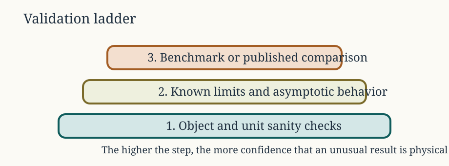

# What validation establishes

A function that runs without error is not necessarily correct. A physically
plausible curve is not validation either. Evidence must connect a defined model
case to an independent result within a stated geometry, boundary condition,
parameter range, numerical configuration, and output convention.



The order matters. Agreement with a published curve is difficult to interpret
until units, geometry, material properties, orientation, and normalization have
been matched. Regression tests then preserve an established result, but they do
not establish its correctness on their own.

# Distinguish the checks

## Input and object checks

Confirm that constructors, S4 slots, units, dimensions, component placement,
material ratios, exterior medium, boundary condition, frequency, and angle
describe the intended target. These checks belong close to the initializer and
should fail clearly when input is outside the model's supported domain.

## Numerical verification

Numerical verification asks whether the implemented equations are solved
consistently. The applicable checks depend on the method and can include:

- convergence with modal truncation, quadrature order, or geometric resolution,
- stability under tighter tolerances or higher precision,
- agreement between equivalent formulations,
- recovery of a simpler solution in a limiting geometry, and
- expected low- or high-frequency asymptotic behaviour.

A convergence check should vary one control at a time and report the quantity
being monitored. See [Numerical Methods and Special
Functions](../numerical-foundations/numerical-foundations.html) for the
numerical components used by the package.

## Benchmark reproduction

A benchmark reproduces a fully specified canonical calculation. The stored
cases in [`benchmark_ts`](../../reference/benchmark_ts.html) follow the sphere,
finite-cylinder, and prolate-spheroid comparisons assembled by @Jech_2015 and
the associated `echoSMs` resources [@echoSMs_software]. Benchmark agreement is
evidence only for the reproduced case and nearby conditions justified by the
model theory.

## Independent comparison

Independent software or experimental comparisons provide separation from the
package implementation. They are strongest when the codes do not share the
same derivation, numerical kernel, or stored output. Existing package evidence
includes comparisons with `echoSMs`, `ZooScatR`, and `SphereTS`
[@echoSMs_software; @ZooScatR_software; @SphereTS_software]. The comparison
record must state exactly which branch, boundary, and parameter range were
tested.

## Regression testing

A regression test detects later changes to an accepted result. Store regression
values only after the case has been tied to theory, a benchmark, or an
independent calculation. A test should use a tolerance supported by the
reference precision and numerical method, not one chosen only to make the test
pass.

# Package evidence registry

The model-library badges are generated from the family and evidence tables in
`R/validation-registry.R`. Their meanings are defined here:

```{r validation_policy, echo=FALSE, results='asis'}
acousticTS:::.validation_status_policy()
```

The current family-level claims are:

```{r validation_status_table, echo=FALSE}
knitr::kable(
  acousticTS:::.validation_family_status_table(),
  align = c("l", "l", "l")
)
```

<details>
<summary>Show the evidence registered for each family</summary>

```{r validation_evidence_table, echo=FALSE}
knitr::kable(
  acousticTS:::.validation_evidence_table(),
  align = c("l", "l", "l", "l", "l")
)
```

</details>

The registry is an index, not the evidence itself. Each row should point readers
to a model implementation page that records the comparison target, controls,
metric, tolerance, figure, and limitations. A family may be benchmarked while
some of its public branches remain unvalidated. The family badge must reflect
that narrower scope.

# Adding validation evidence

Use the following sequence when adding or changing a solver:

1. **Define the claim.** Name the geometry, boundary, frequency or angle range,
   material values, numerical branch, and output quantity being checked.
2. **Choose an independent reference.** Prefer a published table, archived
   dataset, separately implemented code, exact limit, or trusted canonical
   solution over a plot digitized without its full setup.
3. **Reconstruct the target explicitly.** Do not rely on session state or
   undocumented defaults. Record units and angle conventions.
4. **Compare in the correct domain.** Use `TS` for reported decibel agreement,
   `sigma_bs` for linear scattering strength, and complex amplitude when phase
   or coherent interference is part of the claim.
5. **Check nearby numerical stability.** Vary truncation, discretization,
   quadrature, precision, or tolerance as appropriate.
6. **Store a durable result.** Commit compact numeric data and the rendered
   figure when they are part of the public evidence.
7. **Add tests.** Test the result, output structure, invalid inputs, and relevant
   limiting behaviour.
8. **Update the registry last.** Change badges only after the supporting page,
   data, and tests are present.

Deep nulls deserve special care. A small absolute error in `sigma_bs` can become
a large difference in `TS`, while agreement in `TS` says nothing about complex
phase. Report the comparison domain beside the metric and tolerance.

# Reproduce a bundled case

The following code rebuilds the 10 mm-radius fixed-rigid sphere case. It is not
evaluated during site construction because the benchmark output is already
committed:

```{r eval=FALSE}
library(acousticTS)
data(benchmark_ts)

frequency <- benchmark_ts$frequency_spectra$index$frequency
reference <- benchmark_ts$frequency_spectra$sphere$fixed_rigid

sphere_obj <- gas_generate(
  shape = sphere(radius_body = 0.01, n_segments = 60)
)

sphere_obj <- target_strength(
  object = sphere_obj,
  frequency = frequency,
  model = "sphms",
  boundary = "fixed_rigid",
  density_sw = 1026.8,
  sound_speed_sw = 1477.3
)

predicted <- extract(sphere_obj, "model")$SPHMS$TS
delta_dB <- predicted - reference

c(
  max_abs_dB = max(abs(delta_dB)),
  rmse_dB = sqrt(mean(delta_dB^2))
)

all.equal(predicted, reference, tolerance = 1e-2)
```

The [SPHMS](../sphms/sphms-implementation.html),
[FCMS](../fcms/fcms-implementation.html), and
[PSMS](../psms/psms-implementation.html) implementation pages document their
model-specific comparisons and numerical controls.

# Generated evidence and provenance

Public implementation figures are committed outputs. Their builders live under
`tools/implementation-figures/`, which is excluded from the package bundle and
is not run during ordinary package installation or pkgdown rendering. The
manifest records each family, builder, package-code input, and expected output.

Run all builders from the repository root with:

```{r eval=FALSE}
source("tools/implementation-figures/run_all.R")
```

Set `ACOUSTICTS_IMPL_FAMILIES` to a comma-separated family list for a selected
rebuild. The runner uses one sequential R subprocess per family, validates
declared outputs, and writes commit, elapsed-time, size, and MD5 provenance to
`.tmp/implementation-figures/provenance.csv`. Pull requests rebuild affected
families and fail when committed outputs drift from their declared inputs.

A complete validation record should retain:

- the package version or commit and relevant input hashes,
- the reference source and citation,
- geometry, units, material values, exterior medium, and boundary condition,
- frequency and angle grids,
- numerical controls and software versions,
- the comparison domain, metric, tolerance, and result, and
- the code that generated committed tables or figures.

When a model is used outside this recorded scope, describe the calculation as
an application or extrapolation. Do not silently broaden the validation claim.
