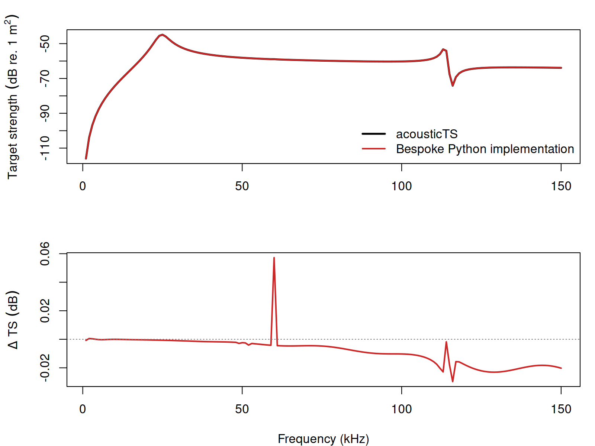

# Benchmarks

```{r model_family_header, echo=FALSE, results='asis'}
acousticTS:::.model_family_header(
  family = "vesm",
  pages = c(
    Overview = "index.html",
    Theory = "vesm-theory.html",
    Implementation = "vesm-implementation.html",
    Benchmarks = "vesm-benchmarks.html",
    Validation = "vesm-validation.html"
  )
)
```

VESM is benchmarked on a layered gas-core sphere with an elastic shell and a viscous outer layer. The comparison uses the same geometry, material constants, retained modal orders, and `1-150 kHz` frequency grid as the documented layered-sphere case.

::: {.note data-title="Benchmark case"}
The case uses gas-core radius `1.00 mm`, shell outer radius `1.02 mm`, shell density `1040 kg m^-3`, gas density `80 kg m^-3`, gas sound speed `325 m s^-1`, shell shear modulus `0.2 MPa`, shell Lame parameter `2.4 GPa`, viscous-layer density `1040 kg m^-3`, viscous-layer sound speed `1510 m s^-1`, and shear/bulk viscosities of `3 kg m^-1 s^-1`.
:::

## Summary

| Comparison | N frequency | Frequency range (kHz) | Max abs. $\Delta TS$ (dB) | Mean abs. $\Delta TS$ (dB) | Frequency at max $\Delta$ (kHz) | acousticTS elapsed (s) | Comparison elapsed (s) |
|:--|--:|:--|--:|--:|--:|--:|--:|
| Layered-sphere VESM | 150 | `1-150` | 0.05720 | 0.00886 | 60 | 0.05 | 1.10 |

```{r echo=FALSE, out.width='85%', fig.align='center', fig.alt='Pre-rendered VESM layered-sphere comparison.'}

```

## Checkpoints

| Frequency (Hz) | acousticTS TS (dB) | Comparison TS (dB) | $\Delta TS$ (dB) | Abs. $\Delta TS$ (dB) |
|--:|--:|--:|--:|--:|
| 1000 | -116.01044 | -116.00966 | -0.00078 | 0.00078 |
| 38000 | -55.81067 | -55.80907 | -0.00160 | 0.00160 |
| 60000 | -58.93634 | -58.99354 | 0.05720 | 0.05720 |
| 120000 | -65.27321 | -65.25513 | -0.01807 | 0.01807 |
| 150000 | -63.89102 | -63.87077 | -0.02025 | 0.02025 |

::: {.experiment data-title="Current scope"}
This benchmark is narrow: it covers the documented spherical layered target, not every layered-sphere material regime.
:::
