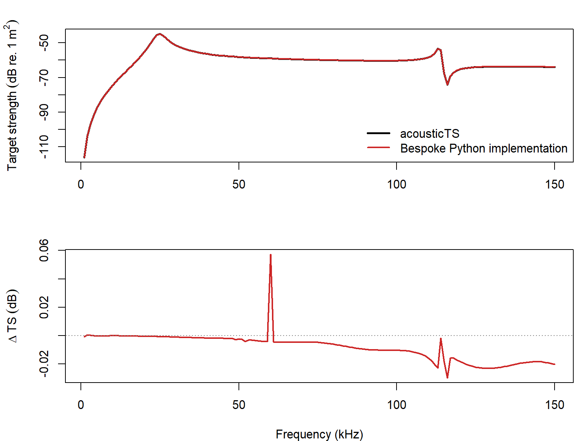

# acousticTS implementation

```{r model_family_header, echo=FALSE, results='asis'}
acousticTS:::.model_family_header(
  family = "vesm",
  pages = c(
    Overview = "index.html",
    Implementation = "vesm-implementation.html",
    Theory = "vesm-theory.html"
  )
)
```

The viscous-elastic spherical model is available through `target_strength(..., model = "vesms")`. The implementation is built on top of `ESS` objects so that the gas core and elastic shell are stored in the same object framework already used by the elastic-shelled sphere model. The additional viscous layer is then supplied through model arguments at run time.

This page focuses on a single reproducible reference case that mirrors the original Khodabandeloo et al. (2021) Python workflow bundled in the local `ViscousElasticModel` directory. The goal is not to restate that code line by line. It is to show how the same layered target is built in `acousticTS`, how the model is called, and how closely the resulting spectrum matches the original implementation over a broader frequency range.

::: {.experiment data-title="Validation scope"}
`VESMS` is benchmarked here against the original reference Python implementation over a dense frequency sweep. That is strong software-to-software validation for the documented spherical case, but it is still narrower than the older modal-series families with long-standing benchmark ladders.
:::

## Building the reference object

The reference case uses:

- gas-core radius `R4 = 1.00 mm`
- shell outer radius `R3 = 1.02 mm`
- shell density `1040 kg m^-3`
- gas density `80 kg m^-3`
- gas sound speed `325 m s^-1`
- shell shear modulus `0.2 MPa`
- shell bulk modulus implied by `lambda = 2.4 GPa`
- viscous-layer density `1040 kg m^-3`
- viscous-layer sound speed `1510 m s^-1`
- viscous-layer shear and bulk viscosity both set to `3 kg m^-1 s^-1`
- surrounding seawater density `1027 kg m^-3`
- surrounding seawater sound speed `1500 m s^-1`

The shell and gas core are stored in an `ESS` object:

```{r}
library(acousticTS)

radius_gas <- 1e-3
radius_shell <- radius_gas + 0.02e-3
shear_shell <- 0.2e6
lambda_shell <- 2.4e9
bulk_shell <- lambda_shell + 2 * shear_shell / 3
sphere_shape <- sphere(radius_body = radius_shell, n_segments = 80)

vesm_object <- ess_generate(
  shape = sphere_shape,
  radius_shell = radius_shell,
  shell_thickness = radius_shell - radius_gas,
  density_shell = 1040,
  density_fluid = 80,
  sound_speed_fluid = 325,
  G = shear_shell,
  K = bulk_shell
)
```

## Running the model

The original workflow retains the `m = 0, 1, 2` terms. In `acousticTS`, the corresponding setting is `m_limit = 2`. If no outer viscous radius is supplied, `VESMS` estimates it from the neutral-buoyancy relation described on the theory page.

```{r}
frequency <- seq(1e3, 150e3, by = 1e3)

vesm_object <- target_strength(
  object = vesm_object,
  frequency = frequency,
  model = "vesms",
  sound_speed_sw = 1500,
  density_sw = 1027,
  sound_speed_viscous = 1510,
  density_viscous = 1040,
  shear_viscosity_viscous = 3,
  bulk_viscosity_viscous = 3,
  m_limit = 2
)

head(extract(vesm_object, "model")$VESMS)
```

The stored output includes:

- `ka_viscous`, `ka_shell`, and `ka_gas`
- the complex backscattering amplitude `f_bs`
- the linear backscattering cross-section `sigma_bs`
- target strength `TS`

## Validation outputs
### Comparison to the original VESM implementation

For the implementation check below, the same reference geometry and material properties were run through:

- `acousticTS::VESMS`
- the original Python VESM implementation from the local `ViscousElasticModel` source

The comparison uses a shared `1-150 kHz` grid with `1 kHz` spacing and the same retained modal orders (`m = 0, 1, 2`).

After regenerating the benchmark against the current compiled `acousticTS` implementation, the reference case gives:

- max abs. delta TS = `0.05598 dB`
- mean abs. delta TS = `0.00885 dB`
- frequency at max abs. delta = `60 kHz`
- elapsed time = `0.79 s` for `acousticTS` and `0.98 s` for the original Python implementation

```{r echo = FALSE}
vesm_summary <- utils::read.csv(
  file.path(
    "..",
    "..",
    "tools",
    "implementation-figures",
    "data",
    "vesm_reference_compare_summary.csv"
  )
)

knitr::kable(
  vesm_summary,
  digits = 4,
  col.names = c(
    "Comparison",
    "N frequency",
    "f min (kHz)",
    "f max (kHz)",
    "Max abs. delta TS (dB)",
    "Mean abs. delta TS (dB)",
    "f at max delta (kHz)",
    "acousticTS elapsed (s)",
    "Original elapsed (s)"
  )
)
```

The largest mismatch on this grid remains well below `0.1 dB`, and the mean absolute difference stays below `0.01 dB`. That is strong agreement for a layered modal-series model with complex viscous wave numbers and near-singular higher-order solves at some frequencies.

### Spectrum overlay

```{r echo=FALSE, out.width='85%', fig.align='center', fig.alt='Pre-rendered VESM comparison showing the original reference spectrum, the acousticTS spectrum, and the residual across frequency.'}

```

The upper panel shows that the two spectra are visually superposed across the full comparison band. The lower panel makes the small residual drift easier to see. In this case the largest difference occurs near `60 kHz` and reaches `0.05598 dB`, which remains small relative to the scale of the full spectrum.

### A few explicit checkpoints

```{r echo = FALSE}
vesm_compare <- utils::read.csv(
  file.path(
    "..",
    "..",
    "tools",
    "implementation-figures",
    "data",
    "vesm_reference_compare.csv"
  )
)

checkpoint_df <- subset(
  vesm_compare,
  frequency %in% c(1000, 38000, 60000, 120000, 150000)
)

knitr::kable(
  checkpoint_df,
  digits = 5,
  col.names = c(
    "Frequency (Hz)",
    "acousticTS TS (dB)",
    "Original TS (dB)",
    "Delta TS (dB)",
    "Abs. delta TS (dB)"
  )
)
```

## Practical note on modal truncation

This comparison was run with `m_limit = 2` because that is the modal content retained by the original reference implementation used here. For exploratory work at larger acoustic size, `acousticTS` can retain more modes by increasing `m_limit` or by leaving it unspecified so the model uses its default frequency-dependent cutoff.

## Closing note

The implementation check is useful because the viscous-elastic model is numerically more delicate than the simpler spherical modal-series models in the package. The agreement shown here reflects the current `acousticTS` implementation after the compiled VESMS backend and shared complex spherical-Bessel updates, and it indicates that the model is reproducing the intended layered-reference behavior across a meaningful frequency range rather than only at a few isolated checkpoints.
