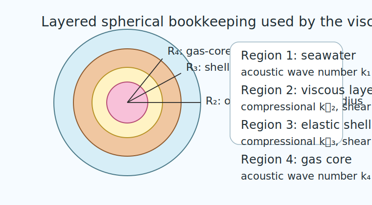

# Introduction

```{r model_family_header, echo=FALSE, results='asis'}
acousticTS:::.model_family_header(
  family = "vesm",
  pages = c(
    Overview = "index.html",
    Implementation = "vesm-implementation.html",
    Theory = "vesm-theory.html"
  )
)
```

The viscous-elastic spherical model describes a layered resonant target whose
gas core is surrounded first by an elastic shell and then by a viscous
biological layer before the whole target is embedded in seawater. In the
mesopelagic-fish setting of Khodabandeloo et al. (2021), those layers represent
gas, a mechanically stiffer shell-like inclusion, and soft tissue whose
viscosity damps and broadens the gas-driven resonance.[^1][^2]

This family is still spherical, so the angular dependence remains separable.
What makes it more intricate than `SPHMS`, `ESSMS`, or a simple bubble model is
that four regions must be matched simultaneously and two of those regions
support more than one wave family.

The notation here follows the shared package convention introduced in the
[acoustic scattering primer](../acoustic-scattering-primer/acoustic-scattering-primer.html)
and [notation guide](../notation-and-symbols/notation-and-symbols.html): medium
`1` is the surrounding seawater, medium `2` is the viscous outer layer, medium
`3` is the elastic shell, and medium `4` is the gas core.

[^1]: Khodabandeloo, B., Agersted, M.D., Klevjer, T., Macaulay, G.J., and Melle, W. (**2021**). *Estimating target strength and physical characteristics of gas-bearing mesopelagic fish from wideband in situ echoes using a viscous-elastic scattering model*. *The Journal of the Acoustical Society of America*, 149: 673-691.

[^2]: Feuillade, C., and Nero, R.W. (**1998**). *A viscous-elastic swimbladder model for describing enhanced-frequency resonance scattering from fish*. *The Journal of the Acoustical Society of America*, 103: 3245-3255.

# Layered geometry and medium indexing

## Nested spherical regions

The target consists of three nested interfaces:

$$
  R_2 > R_3 > R_4,
$$

Here $R_2$ is the outer radius of the viscous layer, $R_3$ is the outer radius
of the elastic shell, and $R_4$ is the radius of the gas core.

<!--  -->

The model therefore contains three interfaces:

1. seawater-viscous at $r = R_2$,
2. viscous-shell at $r = R_3$,
3. shell-gas at $r = R_4$.

## Neutral-buoyancy relation

In the motivating mesopelagic-fish formulation, the outer radius of the
viscous layer can be related to a neutral-buoyancy balance. Written in the
present medium indexing, that relation is:

$$
  R_2 =
    R_4
  \left(
  1 + \frac{\rho_1 - \rho_4}{\rho_2 - \rho_1}
  \right)^{1/3},
$$

where $\rho_1$, $\rho_2$, and $\rho_4$ are the densities of seawater, the
viscous layer, and the gas core, respectively. This is not part of the modal
solution itself; it is a physical closure used when the outer viscous radius is
estimated from a buoyancy argument rather than specified independently.

# Governing fields in the four regions

## Exterior seawater

In the surrounding fluid, the scattered and incident acoustic pressures satisfy
the exterior Helmholtz problem:

$$
  \nabla^2 p_1 + k_1^2 p_1 = 0,
  \qquad
  k_1 = \frac{\omega}{c_1},
$$

with $c_1$ the seawater sound speed and $\omega$ the angular frequency.

## Viscous layer

The outer tissue layer is modeled as a viscous compressible medium that
supports a damped compressional branch and a damped shear branch. Using
$\eta_2$ for shear viscosity and $\zeta_2$ for bulk viscosity, define the
effective compressional viscous combination:

$$
  f_2 = \zeta_2 + \frac{4}{3}\eta_2.
$$

The corresponding complex viscous-layer wavenumbers are:

$$
  k_{L,2} =
    \frac{\omega}{c_2}
  \left(
  1 - i\omega \frac{f_2}{\rho_2 c_2^2}
  \right)^{-1/2},
$$

and:

$$
  k_{T,2} =
    (1+i)\sqrt{\frac{\omega \rho_2}{2\eta_2}},
$$

where $c_2$ and $\rho_2$ are the compressional sound speed and density of the
viscous layer.

The essential point is that the outer tissue is not treated as a simple fluid
contrast. Its viscous properties give the compressional and shear branches
complex wavenumbers, which is how attenuation and resonance broadening enter
the model.

## Elastic shell

The shell is treated as a homogeneous isotropic elastic medium. Its
displacement field $\mathbf{u}_3$ satisfies the Navier equation:

$$
  (\lambda_3 + 2\mu_3)\nabla(\nabla\cdot\mathbf{u}_3) -
    \mu_3 \nabla\times(\nabla\times\mathbf{u}_3) +
    \rho_3 \omega^2 \mathbf{u}_3 =
    0,
$$

where $\lambda_3$ and $\mu_3$ are Lam\'e parameters and $\rho_3$ is shell
density.

The shell therefore supports longitudinal and transverse elastic waves with
wavenumbers:

$$
  k_{L,3} = \omega \sqrt{\frac{\rho_3}{\lambda_3 + 2\mu_3}},
  \qquad
  k_{T,3} = \omega \sqrt{\frac{\rho_3}{\mu_3}}.
$$

## Gas core

The gas core is treated as an acoustic fluid:

$$
  \nabla^2 p_4 + k_4^2 p_4 = 0,
  \qquad
  k_4 = \frac{\omega}{c_4},
$$

where $c_4$ is the gas-core sound speed.

# Spherical modal representation

Because every interface is spherical, the field equations separate by angular
order. The angular dependence is therefore carried by the Legendre polynomials
$P_m(\cos\theta)$, and each region can be expanded mode by mode.

## Exterior acoustic field

For an incident plane wave aligned with the polar axis, the exterior total
pressure is written as:

$$
  p_1(r,\theta) =
    \sum_{m=0}^{\infty}
  \left[
  A_m^{(\mathrm{inc})} j_m(k_1 r) +
    A_m^{(\mathrm{sca})} h_m^{(1)}(k_1 r)
  \right]
  P_m(\cos\theta),
$$

where $j_m$ is the spherical Bessel function, $h_m^{(1)}$ is the outgoing
spherical Hankel function, and $A_m^{(\mathrm{sca})}$ is the unknown scattered
coefficient of order $m$.

## Viscous-layer potentials

The viscous layer occupies an annulus $R_3 < r < R_2$, so both regular and
singular radial solutions are admissible there. A convenient representation is
to decompose the motion into compressional and shear potentials:

$$
  \Phi_2(r,\theta) =
    \sum_{m=0}^{\infty}
  \left[
  B_m j_m(k_{L,2} r) + C_m y_m(k_{L,2} r)
  \right]
  P_m(\cos\theta)
$$

$$
  \Psi_2(r,\theta) =
    \sum_{m=0}^{\infty}
  \left[
  D_m j_m(k_{T,2} r) + E_m y_m(k_{T,2} r)
  \right]
  P_m(\cos\theta),
$$

where $y_m$ is the spherical Neumann function. The viscous-layer displacement
and stresses are reconstructed from these potentials.

## Elastic-shell potentials

The shell also occupies an annulus, so it likewise uses longitudinal and
transverse potentials with both radial branches retained:

$$
  \Phi_3(r,\theta) =
    \sum_{m=0}^{\infty}
  \left[
  F_m j_m(k_{L,3} r) + G_m y_m(k_{L,3} r)
  \right]
  P_m(\cos\theta)
$$

$$
  \Psi_3(r,\theta) =
    \sum_{m=0}^{\infty}
  \left[
  H_m j_m(k_{T,3} r) + I_m y_m(k_{T,3} r)
  \right]
  P_m(\cos\theta).
$$

## Gas-core field

The gas core contains the origin, so only the regular branch is admissible:

$$
  p_4(r,\theta) =
    \sum_{m=0}^{\infty}
  J_m j_m(k_4 r) P_m(\cos\theta).
$$

This layered modal bookkeeping is why the spherical geometry remains tractable:
all angular coupling disappears, and each mode is solved independently.

# Interface conditions

## Seawater-viscous interface at $r = R_2$

At the outer interface, the exterior fluid can support only acoustic pressure
and normal fluid velocity, whereas the viscous layer can support normal and
tangential stresses. The interface therefore enforces:

1. continuity of normal traction,
2. continuity of normal velocity,
3. vanishing tangential traction on the seawater side.

In schematic form:

$$
  p_1 = -\sigma_{rr}^{(2)},
  \qquad
  v_{r,1} = v_{r,2},
  \qquad
  \sigma_{r\theta}^{(2)} = 0.
$$

## Viscous-shell interface at $r = R_3$

At the viscous-shell interface, both media can support normal and tangential
motion and both can support traction. The interface therefore enforces:

$$
  u_{r,2} = u_{r,3},
  \qquad
  u_{\theta,2} = u_{\theta,3},
  \qquad
  \sigma_{rr}^{(2)} = \sigma_{rr}^{(3)},
  \qquad
  \sigma_{r\theta}^{(2)} = \sigma_{r\theta}^{(3)}.
$$

This is the main coupling point between viscous damping and the shell's elastic
resonance structure.

## Shell-gas interface at $r = R_4$

At the inner interface, the gas cannot support shear traction. The shell-gas
conditions are therefore:

$$
  \sigma_{rr}^{(3)} = -p_4,
  \qquad
  v_{r,3} = v_{r,4},
  \qquad
  \sigma_{r\theta}^{(3)} = 0.
$$

The gas core is thus coupled to the shell only through pressure and radial
motion.

# Mode-wise linear systems

Substituting the modal expansions into the interface conditions yields one
independent linear system for each angular order $m$:

$$
  \mathbf{M}_m \mathbf{x}_m = \mathbf{F}_m.
$$

The structure of $\mathbf{x}_m$ depends on whether shear terms are active: for
the monopole term $m = 0$, the tangential and shear branch drops out and the
system reduces to a smaller $6\times 6$ problem, whereas for $m \ge 1$ the
coupled viscous and elastic shear branches are active and the system becomes a
$10\times 10$ problem.

This mode-wise reduction is one of the main advantages of the spherical
layering. The algebra per mode is more involved than for `SPHMS` or `ESSMS`,
but there is still no cross-coupling between distinct angular orders.

# Far-field backscatter

The exterior scattered field uses the outgoing spherical Hankel branch, so the
far-field amplitude depends only on the exterior coefficients
$A_m^{(\mathrm{sca})}$. Using the standard large-$r$ asymptotics:

$$
  f_{\mathrm{bs}} =
    -\frac{i}{k_1}
  \sum_{m=0}^{M}
  (2m+1)(-1)^m A_m^{(\mathrm{sca})},
$$

where the $(-1)^m$ factor comes from evaluating the Legendre polynomials in the
backscattering direction.

The backscattering cross-section and target strength are then:

$$
  \sigma_{\mathrm{bs}} = \left|f_{\mathrm{bs}}\right|^2,
  \qquad
  \mathrm{TS} = 10\log_{10}\left(\sigma_{\mathrm{bs}}\right).
$$

# Physical interpretation

The layered structure has a clear physical interpretation.

## Gas resonance

The gas core supplies the main low-frequency compressibility contrast and is
responsible for the strongest resonance tendency. In that sense, the gas plays
the same qualitative role as a bubble or pressure-release cavity, but it is no
longer isolated from the surrounding fluid directly.

## Shell stiffness

The shell adds mechanical stiffness and supports both longitudinal and shear
elastic motion. Those extra wave families shift the resonance frequencies and
introduce additional phase structure that a pure fluid model cannot reproduce.

## Viscous damping

The viscous outer layer broadens and damps the response. Instead of adding
another sharp resonance family, it mainly modifies the width, phase, and
strength of the resonant structure set by the gas core and shell.

# Mathematical assumptions and scope

The model rests on the following assumptions:

1. perfectly spherical concentric geometry,
2. homogeneous material properties within each region,
3. linear acoustics and linear elasticity,
4. time-harmonic steady-state forcing,
5. no nonspherical posture, taper, or internal asymmetry.

That combination makes `VESM` a layered spherical resonance model, not a
general fish-body solver. Its strength is that it retains the physics of gas
compression, shell elasticity, and viscous damping within one separable
spherical framework.
