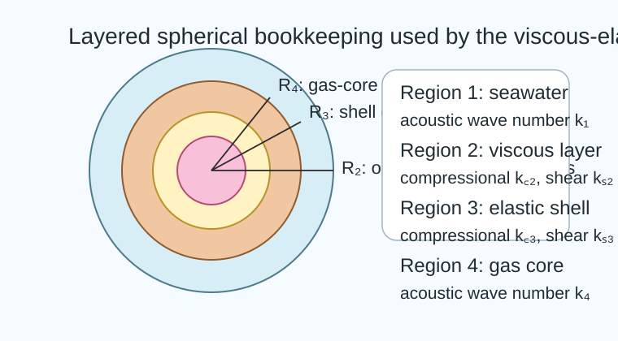

# Introduction

```{r model_family_header, echo=FALSE, results='asis'}
acousticTS:::.model_family_header(
  family = "vesm",
  pages = c(
    Overview = "index.html",
    Implementation = "vesm-implementation.html",
    Theory = "vesm-theory.html"
  )
)
```

The viscous-elastic spherical model (VESM) describes a gas core inside an
elastic shell, a viscous outer layer, and seawater. The gas supplies the main
compressibility resonance, the shell adds stiffness and elastic waves, and the
outer layer damps and broadens the response [@Feuillade_1998;
@Khodabandeloo_2021].

Concentric spherical symmetry keeps angular orders independent. The modal
system is larger because the viscous layer and elastic shell each support
compressional and shear motion.

::: {.note data-title="Shared conventions"}
Medium 1 is seawater, medium 2 is the viscous layer, medium 3 is the elastic
shell, and medium 4 is the gas core. Other symbols follow [Notation and
symbols](../notation-and-symbols/notation-and-symbols.html).
:::

# Layered geometry and medium indexing

## Nested spherical regions

The target consists of three nested interfaces:

$$
  R_2 > R_3 > R_4,
$$

Here $R_2$ is the outer radius of the viscous layer, $R_3$ is the outer radius
of the elastic shell, and $R_4$ is the radius of the gas core.

<!--  -->

The model therefore contains three interfaces:

1. seawater-viscous at $r = R_2$,
2. viscous-shell at $r = R_3$,
3. shell-gas at $r = R_4$.

## Neutral-buoyancy relation

In the motivating mesopelagic-fish formulation, the outer radius of the
viscous layer can be related to a neutral-buoyancy balance. Written in the
present medium indexing, that relation is:

$$
  R_2 =
    R_4
  \left(
  1 + \frac{\rho_1 - \rho_4}{\rho_2 - \rho_1}
  \right)^{1/3},
$$

where $\rho_1$, $\rho_2$, and $\rho_4$ are the densities of seawater, the
viscous layer, and the gas core. This is a closure for estimating $R_2$, not
part of the modal boundary solution [@Khodabandeloo_2021].

# Governing fields in the four regions

## Exterior seawater

In the surrounding fluid, the scattered and incident acoustic pressures satisfy
the exterior Helmholtz problem:

$$
  \nabla^2 p_1 + k_1^2 p_1 = 0,
  \qquad
  k_1 = \frac{\omega}{c_1},
$$

with $c_1$ the seawater sound speed and $\omega$ the angular frequency.

## Viscous layer

The outer tissue layer is modeled as a viscous compressible medium that
supports a damped compressional branch and a damped shear branch. Using
$\eta_2$ for shear viscosity and $\zeta_2$ for bulk viscosity, define the
effective compressional viscous combination:

$$
  f_2 = \zeta_2 + \frac{4}{3}\eta_2.
$$

The corresponding complex viscous-layer wavenumbers are:

$$
  k_{L,2} =
    \frac{\omega}{c_2}
  \left(
  1 - i\omega \frac{f_2}{\rho_2 c_2^2}
  \right)^{-1/2},
$$

and:

$$
  k_{T,2} =
    (1+i)\sqrt{\frac{\omega \rho_2}{2\eta_2}},
$$

where $c_2$ and $\rho_2$ are the compressional sound speed and density of the
viscous layer.

The complex wavenumbers introduce attenuation and phase dispersion in the
outer layer.

## Elastic shell

The shell is treated as a homogeneous isotropic elastic medium. Its
displacement field $\mathbf{u}_3$ satisfies the Navier equation:

$$
  (\lambda_3 + 2\mu_3)\nabla(\nabla\cdot\mathbf{u}_3) -
    \mu_3 \nabla\times(\nabla\times\mathbf{u}_3) +
    \rho_3 \omega^2 \mathbf{u}_3 =
    0,
$$

where $\lambda_3$ and $\mu_3$ are Lamé parameters and $\rho_3$ is shell
density.

The shell therefore supports longitudinal and transverse elastic waves with
wavenumbers:

$$
  k_{L,3} = \omega \sqrt{\frac{\rho_3}{\lambda_3 + 2\mu_3}},
  \qquad
  k_{T,3} = \omega \sqrt{\frac{\rho_3}{\mu_3}}.
$$

## Gas core

The gas core is treated as an acoustic fluid:

$$
  \nabla^2 p_4 + k_4^2 p_4 = 0,
  \qquad
  k_4 = \frac{\omega}{c_4},
$$

where $c_4$ is the gas-core sound speed.

# Spherical modal representation

Because every interface is spherical, the field equations separate by angular
order. The angular dependence is therefore carried by the Legendre polynomials
$P_m(\cos\theta)$, and each region can be expanded mode by mode.

## Exterior acoustic field

For an incident plane wave aligned with the polar axis, the exterior total
pressure is written as:

$$
  p_1(r,\theta) = P_0
    \sum_{m=0}^{\infty} i^m(2m+1)
  \left[j_m(k_1r)+b_m h_m^{(1)}(k_1r)\right]
  P_m(\cos\theta),
$$

where $j_m$ is regular, $h_m^{(1)}$ is outgoing, and $b_m$ is the normalized
scattering coefficient.

## Viscous-layer potentials

The viscous layer occupies an annulus $R_3 < r < R_2$, so both regular and
singular radial solutions are admissible there. A convenient representation is
to decompose the motion into compressional and shear potentials:

$$
  \Phi_2(r,\theta) =
    \sum_{m=0}^{\infty}
  \left[
  B_m j_m(k_{L,2} r) + C_m h_m^{(1)}(k_{L,2} r)
  \right]
  P_m(\cos\theta)
$$

The transverse potential is:

$$
  \Psi_2(r,\theta) =
    \sum_{m=0}^{\infty}
  \left[
  D_m j_m(k_{T,2} r) + E_m h_m^{(1)}(k_{T,2} r)
  \right]
  P_m(\cos\theta),
$$

Either $\{j_m,y_m\}$ or $\{j_m,h_m^{(1)}\}$ spans the annular radial solution.
The latter pair is written here. Displacement and viscous stress follow from
these potentials.

## Elastic-shell potentials

The shell also occupies an annulus, so it likewise uses longitudinal and
transverse potentials with both radial branches retained:

$$
  \Phi_3(r,\theta) =
    \sum_{m=0}^{\infty}
  \left[
  F_m j_m(k_{L,3} r) + G_m h_m^{(1)}(k_{L,3} r)
  \right]
  P_m(\cos\theta)
$$

The transverse elastic potential is:

$$
  \Psi_3(r,\theta) =
    \sum_{m=0}^{\infty}
  \left[
  H_m j_m(k_{T,3} r) + I_m h_m^{(1)}(k_{T,3} r)
  \right]
  P_m(\cos\theta).
$$

## Gas-core field

The gas core contains the origin, so only the regular branch is admissible:

$$
  p_4(r,\theta) =
    \sum_{m=0}^{\infty}
  J_m j_m(k_4 r) P_m(\cos\theta).
$$

Legendre orthogonality leaves one independent radial system for each $m$.

# Interface conditions

## Seawater-viscous interface at $r = R_2$

At the outer interface, the exterior fluid can support only acoustic pressure
and normal fluid velocity, whereas the viscous layer can support normal and
tangential stresses. The interface therefore enforces:

1. continuity of normal traction,
2. continuity of normal velocity,
3. vanishing tangential traction on the seawater side.

In schematic form:

$$
  p_1 = -\sigma_{rr}^{(2)},
  \qquad
  v_{r,1} = v_{r,2},
  \qquad
  \sigma_{r\theta}^{(2)} = 0.
$$

## Viscous-shell interface at $r = R_3$

At the viscous-shell interface, both media can support normal and tangential
motion and both can support traction. The interface therefore enforces:

$$
  u_{r,2} = u_{r,3},
  \qquad
  u_{\theta,2} = u_{\theta,3},
  \qquad
  \sigma_{rr}^{(2)} = \sigma_{rr}^{(3)},
  \qquad
  \sigma_{r\theta}^{(2)} = \sigma_{r\theta}^{(3)}.
$$

This interface couples viscous attenuation to elastic motion.

## Shell-gas interface at $r = R_4$

At the inner interface, the gas cannot support shear traction. The shell-gas
conditions are therefore:

$$
  \sigma_{rr}^{(3)} = -p_4,
  \qquad
  v_{r,3} = v_{r,4},
  \qquad
  \sigma_{r\theta}^{(3)} = 0.
$$

The gas core is thus coupled to the shell only through pressure and radial
motion.

# Mode-wise linear systems

Substituting the modal expansions into the interface conditions yields one
independent linear system for each angular order $m$:

$$
  \mathbf{M}_m \mathbf{x}_m = \mathbf{F}_m.
$$

The structure of $\mathbf{x}_m$ depends on whether shear terms are active. For
the monopole term $m = 0$, the tangential and shear branch drops out and the
system reduces to a smaller $6\times 6$ problem, whereas for $m \ge 1$ the
coupled viscous and elastic shear branches are active and the system becomes a
$10\times 10$ problem.

This mode-wise reduction is one of the main advantages of the spherical
layering. The algebra per mode is more involved than for `SPHMS` or `ESSMS`,
but there is still no cross-coupling between distinct angular orders.

# Far-field backscatter

Using the large-$r$ asymptotic form of $h_m^{(1)}$, the far-field backscatter
amplitude is:

$$
  f_{\mathrm{bs}} = -\frac{i}{k_1}
  \sum_{m=0}^{M}
  (2m+1)(-1)^m b_m,
$$

where the $(-1)^m$ factor comes from evaluating the Legendre polynomials in the
backscattering direction.

The backscattering cross-section and target strength are [@MacLennan_2002]:

$$
  \sigma_{\mathrm{bs}} = \left|f_{\mathrm{bs}}\right|^2,
  \qquad
  \mathrm{TS} = 10\log_{10}\left(
  \frac{\sigma_{\mathrm{bs}}}{1\ \mathrm{m}^2}\right).
$$

# Physical interpretation

The layered structure has a clear physical interpretation.

## Gas resonance

The gas core supplies the main low-frequency compressibility contrast and is
responsible for the strongest resonance tendency. In that sense, the gas plays
the same qualitative role as a bubble or pressure-release cavity, but it is no
longer isolated from the surrounding fluid directly.

## Shell stiffness

The shell adds mechanical stiffness and supports both longitudinal and shear
elastic motion. Those extra wave families shift the resonance frequencies and
introduce additional phase structure that a pure fluid model cannot reproduce.

## Viscous damping

The viscous outer layer broadens and damps the response. Instead of adding
another sharp resonance family, it mainly modifies the width, phase, and
strength of the resonant structure set by the gas core and shell.

# Mathematical assumptions and scope

The model rests on the following assumptions:

1. perfectly spherical concentric geometry,
2. homogeneous material properties within each region,
3. linear acoustics and linear elasticity,
4. time-harmonic steady-state forcing,
5. no nonspherical posture, taper, or internal asymmetry.

VESM is therefore a concentric layered-sphere model, not a general fish-body
solution.
